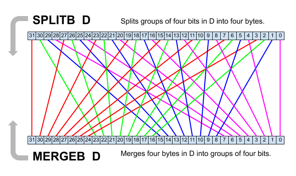
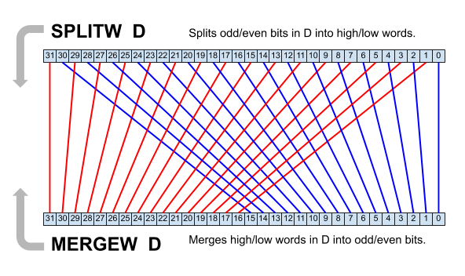

# Math and Logic Instructions

## Data movement
<%=p2instrinfo('mov')%>
MOV copies the **S**ource value into **D**estination.

If the **WC** or **WCZ** effect is specified, the C flag is updated to be **S**ource[31].

If the **WZ** or **WCZ** effect is specified, the Z flag is set (1) if the **D**estination result equals zero, or is cleared (0) if it is
non-zero.

<%=p2instrinfo('movbyts')%>
MOVBYTS swizzles the bytes of **D**estination based on bottom 8 bits in **S**ource. Each bit pair in **S**ource[7:0] corrosponds to one byte slot of the result and selects which of the input bytes will appear there. It is useful to use base-4 literals (`%%0123`) with MOVBYTS, since each digit corrosponds to one bit pair.

- `MOVBYTS D,#%%3210` leaves D as-is.
- `MOVBYTS D,#%%0123` reverses the bytes of D.
- `MOVBYTS D,#%%0000` will copy the lowest byte into all four slots

<%=p2instrinfo('loc')%>

---

<%=p2instrinfo('getnib')%>
<%=p2instrinfo('getbyte')%>
<%=p2instrinfo('getword')%>

---

<%=p2instrinfo('setnib')%>
<%=p2instrinfo('setbyte')%>
<%=p2instrinfo('setword')%>

---

<%=p2instrinfo('rolnib')%>
<%=p2instrinfo('rolbyte')%>
<%=p2instrinfo('rolword')%>

---

<%=p2instrinfo('sets')%>
<%=p2instrinfo('setd')%>
<%=p2instrinfo('setr')%>

## Arithmetic

<%=p2instrinfo('add')%>
Number go brr.
<%=p2instrinfo('adds')%>
<%=p2instrinfo('addx')%>
<%=p2instrinfo('addsx')%>

---

<%=p2instrinfo('sub')%>
<%=p2instrinfo('subs')%>
<%=p2instrinfo('subr')%>
<%=p2instrinfo('subx')%>
<%=p2instrinfo('subsx')%>

---

<%=p2instrinfo('cmp')%>
<%=p2instrinfo('cmps')%>
<%=p2instrinfo('cmpr')%>
<%=p2instrinfo('cmpm')%>
<%=p2instrinfo('cmpsub')%>
<%=p2instrinfo('cmpx')%>
<%=p2instrinfo('cmpsx')%>

---

<%=p2instrinfo('abs')%>
ABS determines the absolute value of **S**ource and writes the result into **D**estination.

If the **WC** or **WCZ** effect is specified, the C flag is set (1) if the original **S**ource value was negative, or is cleared
(0) if it was positive.

If the **WZ** or **WCZ** effect is specified, the Z flag is set (1) if the result is zero, or is cleared (0) if it is non-zero.

Literal **S**ource values are zero-extended, so ABS is really best used with register **S**ource (or augmented **S**ource) values.

<%=p2instrinfo('neg')%>
NEG negates **S**ource and stores the result in the **D**estination register. The negation flips the
value's sign; ex: 78 becomes -78, or -306 becomes 306.

If the **WC** or **WCZ** effect is specified, the C flag is set (1) if the result is negative, or is cleared (0) if positive.

If the **WZ** or **WCZ** effect is specified, the Z flag is set (1) if the result is zero, or is cleared (0) if it is non-zero.

<%=p2instrinfo('negc')%>
<%=p2instrinfo('negnc')%>
<%=p2instrinfo('negz')%>
<%=p2instrinfo('negnz')%>

---

<%=p2instrinfo('sumc')%>
<%=p2instrinfo('sumnc')%>
<%=p2instrinfo('sumz')%>
<%=p2instrinfo('sumnz')%>

---

<%=p2instrinfo('mul')%>
MUL multiplies the lower 16-bits of each of **D**estination and **S**ource together and stores the 32-bit product result into the **D**estination
register. This is a fast (2-clock) 16 x 16 bit multiplication operation - to multiply larger factors, use [the CORDIC Solver QMUL instruction](cordic.html#qmul).

If the **WZ** effect is specified, the Z flag is set (1) if either the **D**estination or **S**ource values are zero, or is cleared (0) if both are
non-zero. **TODO: is the entire register checked or just the bottom 16 bits?**

<%=p2instrinfo('muls')%>

MULS multiplies the signed lower 16-bits of each of **D**estination and **S**ource together and stores the 32-bit signed product
result into the **D**estination register. This is a fast (2-clock) signed 16 x 16 bit multiplication operation - to multiply larger factors, use [the CORDIC Solver QMUL instruction](cordic.html#qmul).

If the **WZ** effect is specified, the Z flag is set (1) if either the **D**estination or **S**ource values are zero, or is cleared (0) if both are
non-zero. **TODO: same question as MUL**

<%=p2instrinfo('sca')%>
SCA multiplies the lower 16-bits of each of **D**estination and **S**ource together, shifts the 32-bit product right by 16 (to scale
down the result), and substitutes this value as the next instruction's **S**ource value.

If the **WZ** effect is specified, the Z flag is set (1) if the product (before scaling down) is zero, or is cleared (0) if
non-zero.

<%=p2instrinfo('scas')%>
SCAS multiplies the lower, signed 16-bits of each of **D**estination and **S**ource together, right shifts the 32-bit product by 14 (to
scale down the result), and substitutes this value as the next instruction's **S**ource value.

If the **WZ** effect is specified, the Z flag is set (1) if the product (before scaling down) is zero, or is cleared (0) if
non-zero.

---

<%=p2instrinfo('incmod')%>
INCMOD compares **D**estination with **S**ource - if not equal, it increments **D**estination; otherwise it sets **D**estination to 0. If **D**estination begins in the range 0 to **S**ource, iterations of INCMOD will increment **D**estination repetitively from 0 to **S**ource.

If the **WC** or **WCZ** effect is specified, the C flag is set (1) if **D**estination was equal to **S**ource and subsequently reset to 0; or is
cleared (0) if not reset.

If the **WZ** or **WCZ** effect is specified, the Z flag is set (1) if the result is zero, or is cleared (0) if it is non-zero.

INCMOD does not limit **D**estination within the specified range - if **D**estination begins as greater than **S**ource, iterations of INCMOD
will continue to increment it through the 32-bit rollover point (back to 0) before it will effectively cycle from 0 to
**S**ource.

<%=p2instrinfo('decmod')%>
DECMOD compares **D**estination with 0 - if not equal, it decrements **D**estination; otherwise it sets **D**estination to **S**ource. If **D**estination begins in the range 0 to **S**ource, iterations of DECMOD will decrement **D**estination repetitively from **S**ource to 0.

If the **WC** or **WCZ** effect is specified, the C flag is set (1) if **D**estination was equal to 0 and subsequently reset to **S**ource; or is
cleared (0) if not reset.

If the **WZ** or **WCZ** effect is specified, the Z flag is set (1) if the result is zero, or is cleared (0) if it is non-zero.

DECMOD does not limit **D**estination within the specified range - if **D**estination begins as greater than **S**ource, iterations of DECMOD
will continue to decrement it down through **S**ource before it will effectively cycle from **S**ource to 0.

---

<%=p2instrinfo('fge')%>
FGE sets **D**estination to **S**ource if **D**estination is less than **S**ource by _unsigned_ comparsion. This is also known as a limit minimum function; preventing **D**estination from sinking below **S**ource.

If the **WC** or **WCZ** effect is specified, the C flag is set (1) if **D**estination was limited (**D**estination was less than **S**ource and now **D**estination is equal to **S**ource), or is cleared (0) if not limited.

If the **WZ** or **WCZ** effect is specified, the Z flag is set (1) if the result is zero, or is cleared (0) if it is non-zero.

<%=p2instrinfo('fges')%>
FGES sets **D**estination to **S**ource if **D**estination is less than **S**ource by _signed_ comparsion. This is also known as a limit minimum function; preventing **D**estination from sinking below **S**ource.

If the **WC** or **WCZ** effect is specified, the C flag is set (1) if **D**estination was limited (**D**estination was less than **S**ource and now **D**estination is equal to **S**ource), or is cleared (0) if not limited.

If the **WZ** or **WCZ** effect is specified, the Z flag is set (1) if the result is zero, or is cleared (0) if it is non-zero.

<%=p2instrinfo('fle')%>
FLE sets **D**estination to **S**ource if **D**estination is greater than **S**ource by _unsigned_ comparsion. This is also known as a limit maximum function; preventing **D**estination from rising above **S**ource.

If the **WC** or **WCZ** effect is specified, the C flag is set (1) if **D**estination was limited (**D**estination was greater than **S**ource and now **D**estination is equal to **S**ource), or is cleared (0) if not limited.

If the **WZ** or **WCZ** effect is specified, the Z flag is set (1) if the result is zero, or is cleared (0) if it is non-zero.

<%=p2instrinfo('fles')%>
FLES sets **D**estination to **S**ource if **D**estination is greater than **S**ource by _signed_ comparsion. This is also known as a limit maximum function; preventing **D**estination from rising above **S**ource.

If the **WC** or **WCZ** effect is specified, the C flag is set (1) if **D**estination was limited (**D**estination was greater than **S**ource and now **D**estination is equal to **S**ource), or is cleared (0) if not limited.

If the **WZ** or **WCZ** effect is specified, the Z flag is set (1) if the result is zero, or is cleared (0) if it is non-zero.

## Bit operations

<%=p2instrinfo('shl')%>
SHL shifts **D**estination's binary value left by **S**ource places (0–31 bits) and sets the new LSBs to 0. This is useful for
bit-stream manipulation as well as for swift multiplication; signed or unsigned 32-bit integer multiplication by a
power-of-two. Care must be taken for power-of-two multiplications since upper bits will shift through the MSB
(sign bit); mangling large signed values.

If the **WC** or **WCZ** effect is specified, the C flag is updated to the value of the last bit shifted out (effectively C =
result bit "32") if **S**ource is 1–31, or to **D**estination[31] if **S**ource is 0.

If the **WZ** or **WCZ** effect is specified, the Z flag is set (1) if the **D**estination result equals zero, or is cleared (0) if it is
non-zero.

<%=p2instrinfo('shr')%>
SHR shifts **D**estination's binary value right by **S**ource places (0–31 bits) and sets the new MSBs to 0. This is useful for
bit-stream manipulation as well as for swift division; unsigned 32-bit integer division by a power-of-two. For
similar division of a signed value, use [SAR](#sar) instead.

If the **WC** or **WCZ** effect is specified, the C flag is updated to the value of the last bit shifted out (effectively C =
result bit "-1") if **S**ource is 1–31, or to **D**estination[0] if **S**ource is 0.

If the **WZ** or **WCZ** effect is specified, the Z flag is set (1) if the **D**estination result equals zero, or is cleared (0) if it is
non-zero.

<%=p2instrinfo('sal')%>
SAL shifts **D**estination's binary value left by **S**ource places (0–31 bits) and sets the new LSBs to that of the original **D**estination[0].
SAL is the complement of [SAR](#sar) for bit streams but not for math operations - use [SHL](#shl) instead for swift 32-bit
integer multiplication by a power-of-two.

If the **WC** or **WCZ** effect is specified, the C flag is updated to the value of the last bit shifted out (effectively C =
result bit "32") if **S**ource is 1–31, or to **D**estination[31] if **S**ource is 0.

If the **WZ** or **WCZ** effect is specified, the Z flag is set (1) if the **D**estination result equals zero, or is cleared (0) if it is
non-zero.

<%=p2instrinfo('sar')%>
SAR shifts **D**estination's binary value right by **S**ource places (0–31 bits) and sets the new MSBs to that of the original
**D**estination[31]; preserving the sign of a signed integer. This is useful for bit stream manipulation and for swift division -
it is similar to [SHR](#shr) for swift division by a power-of-two, but is safe for both signed and unsigned integers. (Note that the rounding behaviour for negative numbers is different to a real division - **TODO: Describe this better**)

If the **WC** or **WCZ** effect is specified, the C flag is updated to the value of the last bit shifted out (effectively C =
result bit "-1") if **S**ource is 1–31, or to **D**estination[0] if **S**ource is 0.

If the **WZ** or **WCZ** effect is specified, the Z flag is set (1) if the **D**estination result equals zero, or is cleared (0) if it is
non-zero.

<%=p2instrinfo('rol')%>
ROL rotates **D**estination's binary value left by **S**ource places (0–31 bits). All MSBs rotated out are moved into the new LSBs.

If the **WC** or **WCZ** effect is specified, the C flag is updated to the value of the last bit rotated out (effectively C = result bit "0") if **S**ource is 1–31, or to **D**estination[31] if **S**ource is 0.

If the **WZ** or **WCZ** effect is specified, the Z flag is set (1) if the **D**estination result equals zero, or is cleared (0) if it is
non-zero. Since no bits are lost by this operation, the result will only be zero if **D**estination started at zero.

<%=p2instrinfo('ror')%>
ROR rotates **D**estination's binary value right by **S**ource places (0–31 bits). All LSBs rotated out are moved into the new MSBs.

If the **WC** or **WCZ** effect is specified, the C flag is updated to the value of the last bit rotated out (effectively C = result bit "31") if **S**ource is 1–31, or to **D**estination[0] if **S**ource is 0.

If the **WZ** or **WCZ** effect is specified, the Z flag is set (1) if the **D**estination result equals zero, or is cleared (0) if it is
non-zero. Since no bits are lost by this operation, the result will only be zero if **D**estination started at zero.

<%=p2instrinfo('rcl')%>
RCL shifts **D**estination's binary value left by **S**ource places (0–31 bits) and sets the new LSBs to C.

If the **WC** or **WCZ** effect is specified, the C flag is updated to the value of the last bit shifted out if **S**ource is 1–31, or to
**D**estination[31] if **S**ource is 0.

If the **WZ** or **WCZ** effect is specified, the Z flag is set (1) if the **D**estination result equals zero, or is cleared (0) if it is
non-zero.

<%=p2instrinfo('rcr')%>
RCR shifts **D**estination's binary value right by **S**ource places (0–31 bits) and sets the new MSBs to C.

If the **WC** or **WCZ** effect is specified, the C flag is updated to the value of the last bit shifted out if **S**ource is 1–31, or to
**D**estination[0] if **S**ource is 0.

If the **WZ** or **WCZ** effect is specified, the Z flag is set (1) if the **D**estination result equals zero, or is cleared (0) if it is
non-zero.

<%=p2instrinfo('rczl')%>
RCZL shifts **D**estination's binary value left by two places and sets **D**estination[1] to C and **D**estination[0] to Z.

If the **WC** or **WCZ** effect is specified, the C flag is updated to the original **D**estination[31] state.

If the **WZ** or **WCZ** effect is specified, the Z is flag is updated to the original **D**estination[30] state.

<%=p2instrinfo('rczr')%>
RCZR shifts **D**estination's binary value right by two places and sets **D**estination[31] to C and **D**estination[30] to Z.

If the **WC** or **WCZ** effect is specified, the C flag is updated to the original **D**estination[1] state.

If the **WZ** or **WCZ** effect is specified, the Z is flag is updated to the original **D**estination[0] state.

<%=p2instrinfo('signx')%>
SIGNX fills the bits of **D**estination, _above_ the bit indicated by **S**ource[4:0], with the value of that identified bit; i.e. sign-extending the value. This is handy when converting encoded or received signed values from a small bit width to a large bit with; i.e. 32 bits.

**Note:** To extend an N-bit value, **S**ource[4:0] has to be **N-1**. **(TODO: Clarify this in a less confusing way)**

If the **WC** or **WCZ** effect is specified, the C flag is set to the result's MSB value.

If the **WZ** or **WCZ** effect is specified, the Z flag is set (1) if the result is zero, or is cleared (0) if it is non-zero.

<%=p2instrinfo('zerox')%>
ZEROX fills the bits of **D**estination, _above_ the bit indicated by **S**ource[4:0], with zeroes; i.e. zero-extending the value. This is handy when converting encoded or received unsigned values from a small bit width to a large bit with; i.e. 32 bits.

**Note:** To extend an N-bit value, **S**ource[4:0] has to be **N-1**. **(TODO: Clarify this in a less confusing way)**

If the **WC** or **WCZ** effect is specified, the C flag is set to the result's MSB value. This is always zero unless **S**ource[4:0] == 31.

If the **WZ** or **WCZ** effect is specified, the Z flag is set (1) if the result is zero, or is cleared (0) if it is non-zero.

---

<%=p2instrinfo('not')%>
NOT performs a bitwise NOT (inverting all bits) of the value in **S**ource and stores the result into **D**estination.

If the **WC** or **WCZ** effect is specified, the C flag value is replaced by the inverse of either S[31].

If the **WZ** or **WCZ** effect is specified, the Z flag is set (1) if the result (of !**S**ource) equals zero, or is cleared (0) if it is non-zero.

<%=p2instrinfo('ones')%>
ONES tallies the number of high bits of **S**ource, or **D**estination, and stores the count into **D**estination. This is also known as a "Population Count" ("popcount") function.

If the **WC** or **WCZ** effect is specified, the C flag is set (1) if the count is odd, or is cleared (0) if it is even.

If the **WZ** or **WCZ** effect is specified, the Z flag is set (1) if the result equals zero, or is cleared (0) if not zero.

<%=p2instrinfo('encod')%>
ENCOD stores the bit position value (0—31) of the top-most high bit (1) of **S**ource into **D**estination. If the value to encode is all zeroes, the resulting **D**estination will be 0 - use the **WC** or **WCZ** effect and check the resulting C flag to distinguish between the cases of **S**ource == 1 vs. **S**ource == 0.

If the **WC** or **WCZ** effect is specified, the C flag is set (1) if **S**ource was not zero, or is cleared (0) if it was zero.

If the **WZ** or **WCZ** effect is specified, the Z flag is set (1) if the result equals zero, or is cleared (0) if not zero.

- A long of `%00000000_00000000_00000000_00000001` encodes to 0.
- A long of `%00000000_00000000_00000000_00100000` encodes to 5.
- A long of `%00000000_00000000_10000001_01000000` encodes to 15.
- A long of `%00000000_00000000_00000000_00000000` encodes to 0 with optional C cleared to 0.

ENCOD is the complement of [DECOD](#decod).

<%=p2instrinfo('decod')%>
DECOD generates a 32-bit value with just one bit high, corresponding to **S**ource[4:0] (0—31) and stores
that result in **D**estination.

In effect, **D**estination becomes `1 << value` via the DECOD instruction; where value is **S**ource[4:0].

- A value of 0 generates `%00000000_00000000_00000000_00000001`.
- A value of 5 generates `%00000000_00000000_00000000_00100000`.
- A value of 15 generates `%00000000_00000000_10000000_00000000`.

DECOD is the complement of [ENCOD](#encod)

<%=p2instrinfo('bmask')%>
BMASK generates an LSB-justified bit mask (all ones) of **S**ource[4:0]+1 bits and stores it in **D**estination. The size
value, specified by **S**ource[4:0], is in the range 0—31 to generate 1 to 32 bits of bit mask.

In effect, **D**estination becomes (%10 << size) - 1 via the BMASK instruction.

- A size value of 0 generates a bit mask of `%00000000_00000000_00000000_00000001`.
- A size value of 5 generates a bit mask of `%00000000_00000000_00000000_00111111`.
- A size value of 15 generates a bit mask of `%00000000_00000000_11111111_11111111`.

A bit mask is often useful in bitwise operations (AND, OR, XOR) to filter out or affect special groups of bits.

---

<%=p2instrinfo('rev')%>
REV performs a bitwise reverse (bits 31:0 -> bits 0:31) of the value in **D**estination and stores the result back into **D**estination.
This is useful for processing binary data in a different MSB/LSB order than it is transmitted with.

<%=p2instrinfo('splitb')%>

<%=p2instrinfo('mergeb')%>
<%=p2instrinfo('splitw')%>

<%=p2instrinfo('mergew')%>
<%=p2instrinfo('rgbsqz')%>
<%=p2instrinfo('rgbexp')%>
<%=p2instrinfo('seussf')%>

<%=p2instrinfo('seussr')%>

---

<%=p2instrinfo('test')%>
<%=p2instrinfo('testn')%>
<%=p2instrinfo('and')%>
<%=p2instrinfo('andn')%>
<%=p2instrinfo('or')%>
<%=p2instrinfo('xor')%>

---

<%=p2instrinfo('testb')%>
<%=p2instrinfo('testbn',joininstr:true)%>
<%=p2instrinfo('testb-and',joininstr:true)%>
<%=p2instrinfo('testbn-and',joininstr:true)%>
<%=p2instrinfo('testb-or',joininstr:true)%>
<%=p2instrinfo('testbn-or',joininstr:true)%>
<%=p2instrinfo('testb-xor',joininstr:true)%>
<%=p2instrinfo('testbn-xor',joininstr:true)%>
<%=p2instrinfo('bitl')%>
<%=p2instrinfo('bith')%>
<%=p2instrinfo('bitnot')%>
<%=p2instrinfo('bitrnd')%>
<%=p2instrinfo('bitc')%>
<%=p2instrinfo('bitnc')%>
<%=p2instrinfo('bitz')%>
<%=p2instrinfo('bitnz')%>

---

<%=p2instrinfo('muxc')%>
<%=p2instrinfo('muxnc')%>
<%=p2instrinfo('muxz')%>
<%=p2instrinfo('muxnz')%>

<%=p2instrinfo('muxq')%>
MUXQ copies all bits from **S**ource corresponding to high (1) bits of the [Q Register](cog.html#q-register) into the corresponding bits of **D**estination. All other **D**estination bits are left as-is.

The current Q value is always used, regardless of whether MUXQ is directly preceded by SETQ (i.e. whether the "SETQ Flag" is set) or not.

<%=p2instrinfo('muxnibs')%>
MUXNIBS copies any non-zero nibbles from **S**ource into the corresponding nibbles of **D**estination and leaves the rest of **D**estination's nibbles as-is.

<%=p2instrinfo('muxnits')%>
MUXNITS copies any non-zero bit pairs from **S**ource into the corresponding bit pairs of **D**estination and leaves the rest of **D**estination's bit pairs as-is.

## Flag manipulation

<%=p2instrinfo('modcz')%>

<%=p2instrinfo('wrc')%>
WRC writes the state of C (0 or 1) to **D**estination.

<%=p2instrinfo('wrnc')%>
WRNC writes the inverse state of C (0 or 1) to **D**estination.

<%=p2instrinfo('wrz')%>
WRZ writes the state of Z (0 or 1) to **D**estination.

<%=p2instrinfo('wrnz')%>
WRNZ writes the inverse state of Z (0 or 1) to **D**estination.

## Other

<%=p2instrinfo('crcbit')%>
<%=p2instrinfo('crcnib')%>

<%=p2instrinfo('xoro32')%>
XORO32 generates a pseudo-random number based on the seed value in **D**estination. The next seed value is written back into **D**estination and the generated pseudo-random number is substituted as the next instruction's **S**ource value.

**D**estination's value should never be zero, since that causes the seed to stay zero.

The algorithm used is xoroshiro32++, stepped twice to generate 2x16 bits of data. Due to this, some 32-bit numbers are never generated. Ideal properties are only guaranteed if only the top or bottom 16 bits of the generated number are used. Any subset of bits from either the upper or lower half are also equidistributed.

A software implementation of the algorithm in Spin2:

~~~
CON
    A = 13, B = 5, C = 10, D = 9
PUB xoro32_soft(seed) : state,val
  state, val.word[0] := xoro32_half(seed)
  state, val.word[1] := xoro32_half(state)

PRI xoro32_half(seed) : state,val
  val.word[0] := rol16(seed.word[0]+seed.word[1],D)+seed.word[0]
  state := seed
  state.word[1] ^= state.word[0]
  state.word[0] := rol16(state.word[0],A) ^ (state.word[1]<<B) ^ state.word[1]
  state.word[1] := rol16(state.word[1],C)

PRI rol16(val,amount) :r
  val.word[1] := val.word[0]
  return (val rol amount) zerox 15
~~~

<%p2instr_checkall :alu%>