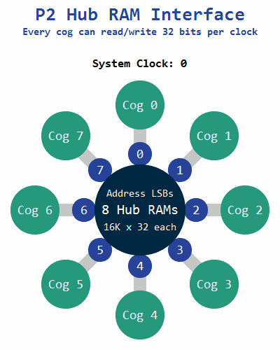

# Hub Memory

## Pointer Expressions

TODO: Say something

|Encoding |Syntax        |Used Address      |Post-Modify        |
|---------|--------------|------------------|-------------------|
|1x0000000|PTRx          |PTRx              |                   |
|1x0iiiiii|PTRx[INDEX6]  |PTRx + INDEX*SCALE|                   |
|1x1100001|PTRx++        |PTRx,             |PTRx += SCALE      |
|1x1111111|PTRx--        |PTRx,             |PTRx -= SCALE      |
|1x1000001|++PTRx        |PTRx + SCALE,     |PTRx += SCALE      |
|1x1011111|--PTRx        |PTRx - SCALE,     |PTRx -= SCALE      |
|1x110NNNN|PTRx++[INDEX5]|PTRx,             |PTRx += INDEX*SCALE|
|1x111nnnn|PTRx--[INDEX5]|PTRx,             |PTRx -= INDEX*SCALE|
|1x100NNNN|++PTRx[INDEX5]|PTRx + INDEX*SCALE|PTRx += INDEX*SCALE|
|1x101nnnn|--PTRx[INDEX5]|PTRx - INDEX*SCALE|PTRx -= INDEX*SCALE|

- `SCALE` is 1 for BYTE and LUT operations, 2 for WORD operations and 4 for LONG operations. When using an augmented operand (##/AUGS), SCALE is always 1.
- The index value for `PTRx[INDEX6]` (denoted `iiiiii`) is a 6-bit value and can thus can range from -32 to 31.
- The index value for inc/dec expressions (denoted `0NNNN` or `1nnnn`) is a 5-bit signed value with a special case wherein 0 means 16. It can thus range from 1 to 16 in either positive or negative direction.

<%=floatclear%>

## Instructions

<%=p2instrinfo('rdlong')%>
<%=p2instrinfo('rdword')%>
<%=p2instrinfo('rdbyte')%>
<%=p2instrinfo('wrlong')%>
<%=p2instrinfo('wrword')%>
<%=p2instrinfo('wrbyte')%>
<%=p2instrinfo('wmlong')%>
Very spicy!

<%p2instr_checkall :hubmem%>