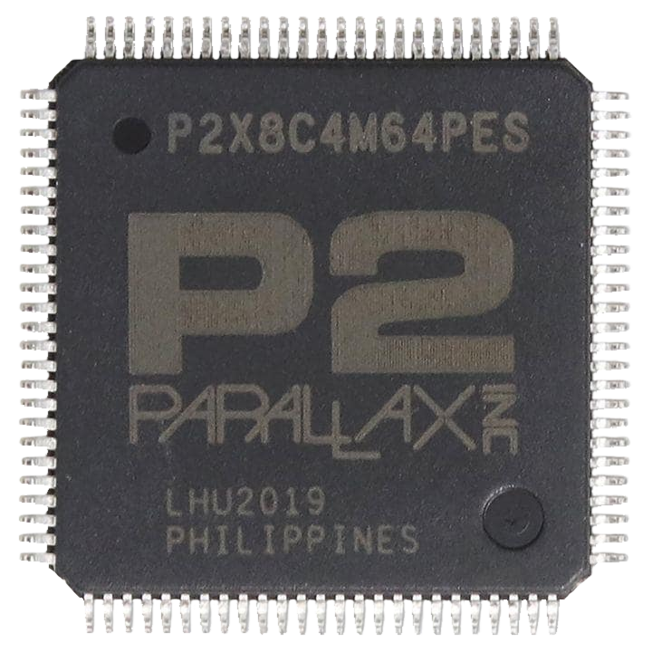

# IRQsoft Propeller 2 Docs

## This site uses _HyperJump!_ (Pat. ponding) technology!

Just start typing and be taken to the object of your intrigue! In theory, anyways; in practice a lot of the content isn't quite cooked yet.

But you can help! [Contribute on GitHub!](https://github.com/p2docs/p2docs.github.io) File an issue if you think something needs to be improved or try your own hand and file a PR.

(Also, the [Instruction Table](p2_optable.html) has entries for most of the instructions missing a detailed description)

## What's a Propeller 2?

The _Propeller 2_ is a high-performance microcontroller developed and sold by [Parallax Inc](https://www.parallax.com). It features 8 symmetric CPU+Memory+I/O cores (called "Cogs") connected to a common "Hub" memory and to 64 "Smart I/O Pins".

Short specs:

 - High Speed (180 MHz spec, 320+MHz overclock easily attainable)
 - 8 CPU cores
    - Custom RISC-ish architecture
    - 2 cycles for ALU instructions (including 16x16 multiply)
    - 512x32 bits of "Cog RAM" (used as register file)
    - 512x32 bits of "Lookup RAM" per Cog
    - Hardware accelerated custom bytecode executor
    - 3 prioritzed interrupts (mappable to many event sources)
 - 512Kx8 bits of shared Hub RAM
    - Fast transfer between Hub and Cog/Lookup RAM
 - 64 "Smart Pins" with individual DAC, ADC, pullup, pulldown, schmitt trigger, comparator, logic and much more
 - Fast streaming DMA between Hub memory and pins/DACs/ADCs
 - Built-in video signal encoders for TMDS (DVI/HDMI) and analog VGA, YPbPr, NTSC/PAL composite/s-video

## Overview

 - [Assembly Symbol List](asm_index.html)
 - [Instruction Table](p2_optable.html)
 - [Opcode Matrix](p2_opmatrix.html)
 - [Sitemap](sitemap.html)

## Pages

 - [Cog Resources](cog.html)
 - [LUT Memory](lutmem.html)
 - [Hub Memory](hubmem.html)
 - [Math and Logic Instructions](alu.html)
 - [CORDIC Coprocessor](cordic.html)
 - [Pixel Mixer](mixpix.html)
 - [Branching Instructions](branch.html)
 - [Register Indirection](indir.html)
 - [I/O Pins](pin.html) (Mostly TODO)
 - [Streamer](streamer.html) (TODO)
 - [Colorspace Converter](colorspace.html) (TODO)
 - [Events](event.html)
 - [Interrupts](irq.html) (TODO)
 - [Hub Control](hubctrl.html)
 - [Miscellaneous Instructions](misc.html)
 - [Bytecode Engine (XBYTE)](xbyte.html) (TODO)
 - [Boot Process](boot.html) (TODO)

### Auxillary Topics

 - [Assembler Syntax](asm_syntax.html) (TODO)
 - [Common Idioms and Tricks](idiom.html)
 - [External RAM](psram.html) (TODO)
 - [Useful Documents](documents.html)

## Recent changes

As per git commit history...

<%=recent_commits(6)%>

