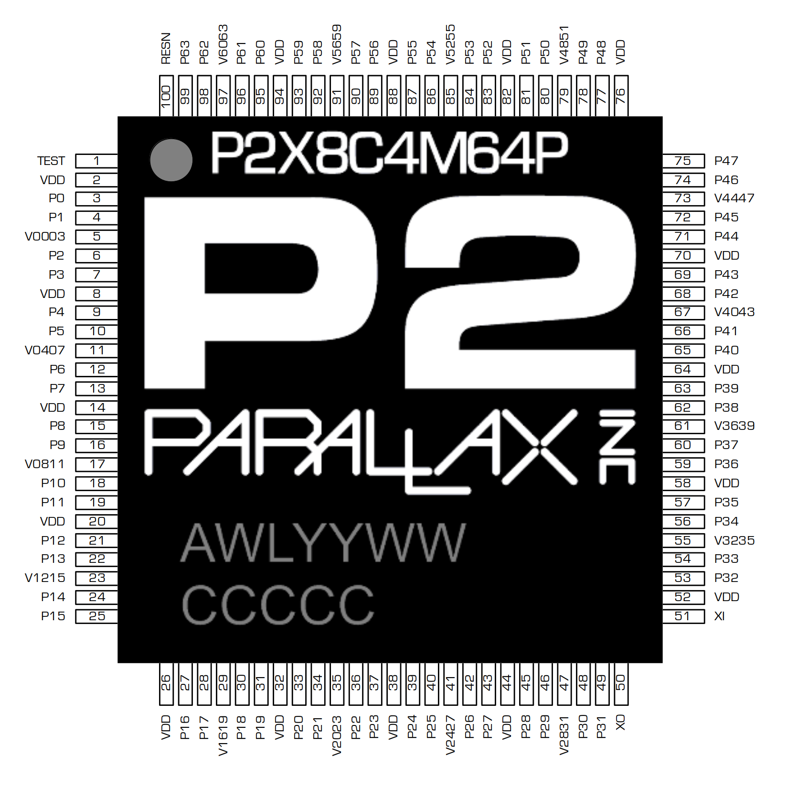
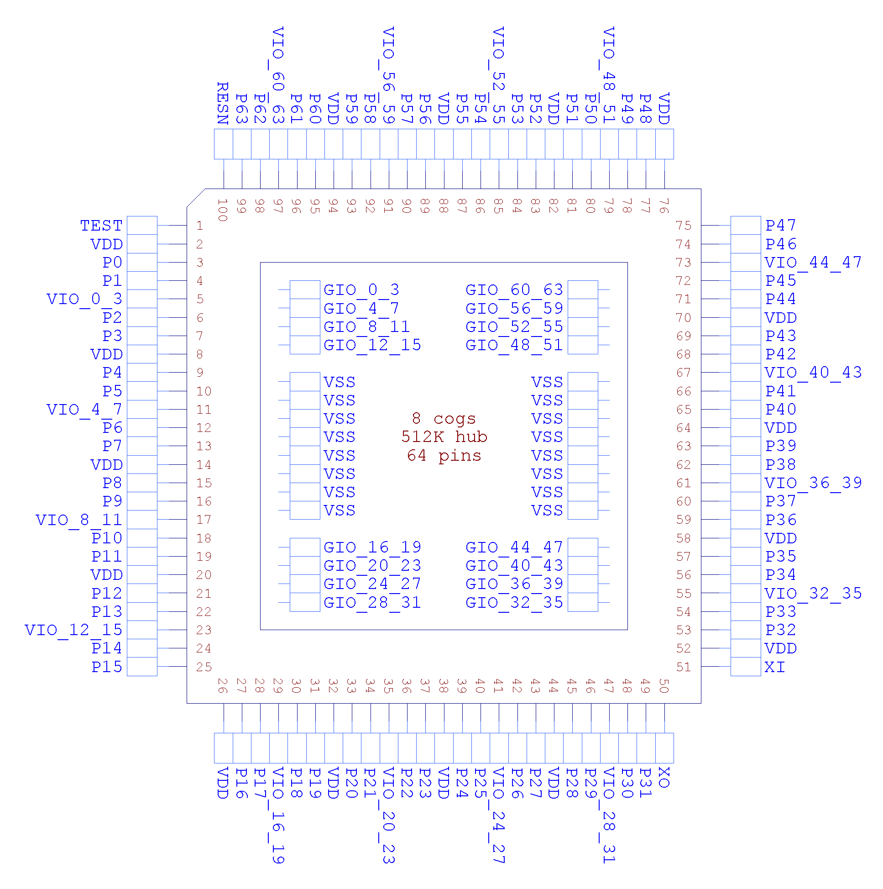
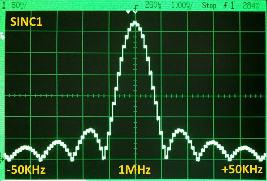
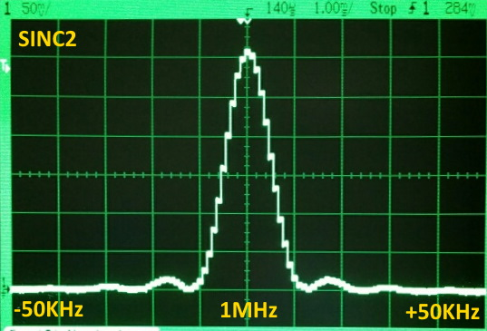
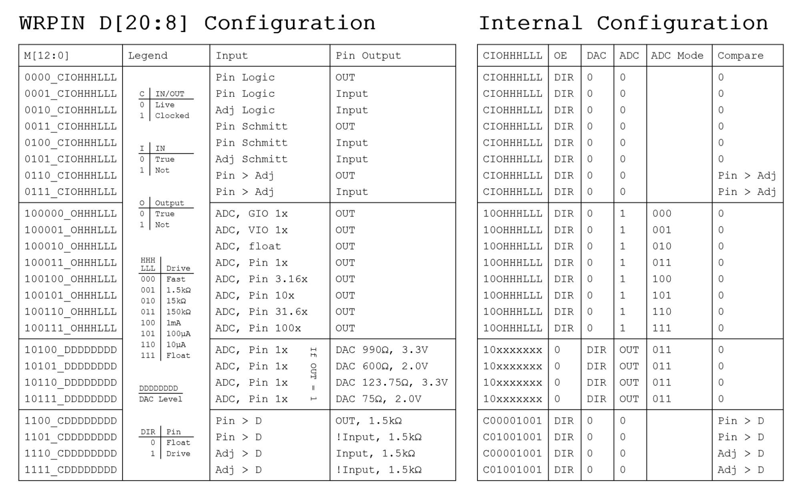
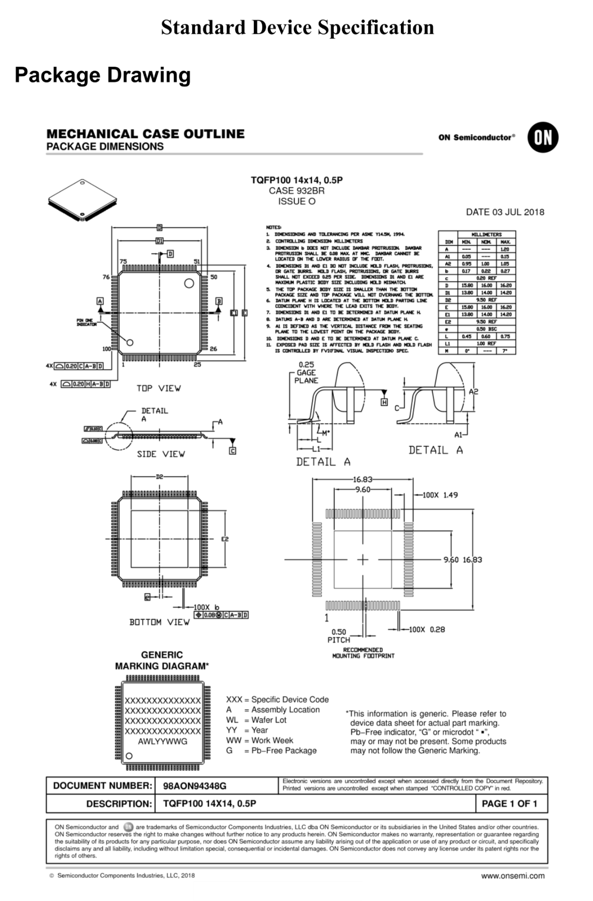

# Official P2 Silicon Doc Mirror
{:.no_toc}

**NOTICE: This Document is imported from the official Google Docs version and has been reformatted to fit your screen. We hope no errors have occured during this process. This version of the document should load quickly and be free of in-line Vandalism.**

**We hope to eventually make all information, plus more not covered here, available on [the main site](/) in more convenient form.**
  
{:.dark-invert}
**Parallax Propeller 2**  
**Documentation**  
**2021-05-18**  
**v35 (Rev B/C silicon)**  
**P2X8C4M64PES**  
**LPD1941 (Rev B) or LHU2019 (Rev C)**  
**PHILIPPINES**

**(not yet updated: Boot ROM)**

## Design Status

| Date | Progress |
| :---- | :---- |
| 2018\_04\_25 | Verilog design files sent to On Semi for Rev A silicon (8 cogs, 512KB hub, 64 smart pins) |
| 2018\_05\_29 | Final ROM data sent to On Semi |
| 2018\_07\_09 | Final Sign-off with On Semi, reticles being made |
| 2018\_09\_11 | Wafers done\! Only took 9 weeks, instead of 14\. |
| 2018\_09\_27 | Received 10 glob-top prototype chips from On Semi. Chips are functional, but sign-extension problems in Verilog source files caused the following problems: Cogs' IQ modulators' outputs are nonsensical. Smart pin measurement modes which are supposed to count by \+1/-1 are counting by \+1/+3. ALTx instructions aren't sign-extending S\[17:09\] before adding into D. These sign-extension problems have already been fixed in the Verilog source files and tested on the FPGA. There is also a low-glitch-on-high-to-float problem on some I/O pins due to a race condition between DIR and OUT signals. This will be fixed by timing constraints in the next silicon. A respin of the silicon is planned after more testing. |
| 2018\_11\_13 | Received 135 Amkor-packaged prototype chips from On Semi. These chips will have better heat dissipation than the glob-top prototypes. |
| 2019\_04\_11 | Rev B respin entered the fab and is due out July 15\. Ten glob-top prototypes should arrive on August 1, with 2,400 production chips to follow in a few weeks. The following improvements were made to the chip: All known prior bugs fixed. Clock-gating implemented, reduces power by \~40%. PLL filter modified to reduce jitter and improve lock. System counter extended to 64 bits. GETCT WC retrieves upper 32-bits. Streamer has many new modes with SINC1/SINC2 ADC conversions for Goertzel mode. HDMI mode added to streamer with ascending and descending pinouts for easy PCB layout. SINC2/SINC3 filters added to smart pins for improving ENOB in ADC conversions. Each cog has four 8-bit sample-per-clock ADC channels that feed from new smart pin 'SCOPE' modes. BITL/BITH/BITC/BITNC/BITZ/BITNZ/BITRND/BITNOT can now work on a span of bits (+S\[9:5\] bits). Prior SETQ overrides S\[9:5\]. DIRx/OUTx/FLTx/DRVx can now work on a span of pins (+D\[10:6\] pins). Prior SETQ overrides D\[10:6\]. WRPIN/WXPIN/WYPIN/AKPIN can now work on a span of pins (+S\[10:6\] pins). Prior SETQ overrides S\[10:6\]. BIT\_DAC output now has two 4-bit settings for low and high states, instead of one 8-bit high-state setting. RDxxxx/WRxxxx+PTRx expressions now index \-16..+16 with updating and \-32..+31 without updating. Sensible PTRx behavior implemented for 'SETQ(2) \+ RDLONG/WRLONG/WMLONG' operations. RDLUT/WRLUT can now handle PTRx expressions. Cog LUT sharing is now glitch-free. POP now returns Z=1 if result=0, used to return result\[30\]. XORO32 improved. Main PRNG upgraded to "Xoroshiro128\*\*". The core logic increased by a net 15%, even with significant logic reductions resulting from clock-gating. Fortunately, ON Semi was able to make it all fit within the original die area. |
| 2019\_07\_13 | Wafers out of fab. Packaging underway. |
| 2019\_08\_01 | Received 10 glob-top prototype chips from ON Semi. All bugs from prior silicon are fixed. All new features work as expected. PLL jitter is \<2ns @100us at all divide/multiply settings. Power is reduced by \~50%. The new silicon works much better than expected with the improved PLL filter and new clock gating. At room temperature, the silicon runs at 390MHz and is barely warm to the touch, with the PLL now being the speed limiter, instead of the logic. |
| 2019\_08\_19 | One of the six new wafers exhibits frequent VIO-to-GND shorts in the 5-20 ohm range. ON Semi is looking into the cause. We know that the design is good, so we are anxious to see ON Semi resume yield testing on the other wafers, in order to get as many Amkor-packaged parts as soon as possible. The new P2 Eval board is ready to be built. |
| 2019\_08\_29 | ON Semi has done failure analysis on the new chips which were exhibiting VIO shorts and it's been determined that there are latch-up problems originating from differently-biased N-wells that lie adjacent to each other. The relatively low resistivity of the new wafers caused this latent design defect to emerge. We will need to modify the full-custom pad ring to fix these N-well problems. We will soon discuss with ON Semi how many reticles this is going to involve. We will need another fab run, as well, to realize the changes. |
| 2019\_09\_13 | ON Semi recently discovered that a voltage-stress test had been applied to the new silicon which was driving the VDD and VIO pins to \+40% nominal voltages. The 4.62V on VIO was triggering the latch-up problem. The first two wafers which had been probed with this new test had developed many bad dies, as a result. ON Semi probed six remaining virgin wafers without the voltage-stress test and yielded over 1,000 good dies. These have been sent off to Amkor for packaging. From these chips, we will be able to build new P2 Eval boards and supply low volumes of chips. As for the latch-up problem, it was determined by ON Semi that latch-up was occurring as early as 4.3V on VIO. Rather than do a respin, we could lower the voltage-stress test from \+40% to \+25%, which would result in a peak VIO test voltage of 4.125V. Depending on what we see in the field with these new chips, we may do a respin to accommodate ON Semi's standard \+40% voltage-stress test, or just lower the voltage-stress test to \+25%. ON Semi's standard of \+40% is quite exceptional and some other vendors only guarantee \+20%. So, \+25% may be just fine. We need to get the new silicon out to customers and see if anyone experiences any trouble with VIO-triggered latch-up. ON Semi is also going to run a standard latch-up test on the new silicon to ensure there is no other latent problem. The silicon has already passed ESD tests with 4kV human body model and 2kV machine model. |
| 2019\_10\_16 | We will be receiving about 1,000 Rev B P2 chips on 10/22. Our plan is to build 191 more P2 Eval boards and supply small quantities of P2 chips to interested customers. |
| 2019\_10\_23 | We received 1,000 Rev B chips. Aside from building 191 more P2 Eval boards, we will offer 125 packs of four P2 chips for $100 to interested customers. If anyone needs more than four chips, please contact Ken Gracey (kgracey@parallax.com). |
| 2020\_02\_24 | Received 10 Rev C chips which fix the adjacent-pin ADC crosstalk problem on prior revisions. Smart pin mode %100010\_OHHHLLL no longer connects the ADC to the adjacent pin, but floats the ADC input. This mode is now useful for determining the floating bias point of the ADC. Several thousand Rev C chips will be arriving from ON Semi over the next two months. |
| 2020\_06\_01 | Received 7,000 Rev C chips from ON Semi. |

### KNOWN SILICON BUGS

(Editor's Note: Our list is more comprehensive: [Hardware Bugs & Errata](../errata.html))

Intervening ALTx/AUGS/AUGD instructions between SETQ/SETQ2 and RDLONG/WRLONG/WMLONG-PTRx instructions will cancel the special-case block-size PTRx deltas. The expected number of longs will transfer, but PTRx will only be modified according to normal PTRx expression behavior:

~~~
    SETQ    #16-1       'ready to load 16 longs
    ALTD    start_reg   'alter start register (ALTD cancels block-size PTRx deltas)
    RDLONG  0,ptra++    'ptra will only be incremented by 4 (1 long), not 16*4 as anticipated!!!
~~~

Intervening ALTx instructions with an immediate \#S operand, between AUGS and the AUGS' intended target instruction (which would have an immediate \#S operand), will use the AUGS value, but not cancel it. So, the intended AUGS target instruction will use and cancel the AUGS value, as expected, but the intervening ALTx instruction will also use the AUGS value (if it has an immediate \#S operand). To avoid problems in these circumstances, use a register for the S operand of the ALTx instruction, and not an immediate \#S operand.

~~~
    AUGS    #$FFFFF123  'This AUGS is intended for the ADD instruction.
    ALTD    index,#base 'Look out! AUGS will affect #base, too. Use a register, instead.
    ADD     0-0,#$123   '#$123 will be augmented by the AUGS and cancel the AUGS.
~~~

## OVERVIEW

The Propeller 2 is a microcontroller architecture consisting of 1, 2, 4, 8, or 16 identical 32-bit processors (called cogs), each with their own RAM, which connect to a common hub. The hub provides up to 1 MB of shared RAM, a CORDIC math solver, and housekeeping facilities. The architecture supports up to 64 smart I/O pins, each capable of many autonomous analog and digital functions.

The P2X8C4M64P silicon contains 8 cogs, 512 KB of hub RAM, and 64 smart I/O pins in an exposed-pad TQFP-100 package.

- placeholder
{:toc}

  
| P2X | 8C | 4M | 64P | ES |
| :---- | :---- | :---- | :---- | :---- |
| Propeller 2 | 8 cogs (processors) | 4 Mb hub RAM (512 KB) | 64 smart I/O pins | Engineering Sample |

Each cog has:

- Access to all I/O pins, plus four fast DAC output channels and four fast ADC input channels  
- 512 longs of dual-port register RAM for code and fast variables  
- 512 longs of dual-port lookup RAM for code, streamer lookup, and variables  
- Ability to execute code directly from register RAM, lookup RAM, and hub RAM  
- \~350 unique instructions for math, logic, timing, and control operations  
- 2-clock execution for all math and logic instructions, including 16 x 16 multiply  
- 6-clock custom-bytecode executor for interpreted languages  
- Ability to stream hub RAM and/or lookup RAM to DACs and pins or HDMI modulator  
- Ability to stream pins and/or ADCs to hub RAM  
- Live colorspace conversion using a 3 x 3 matrix with 8-bit signed/unsigned coefficients  
- Pixel blending instructions for 8:8:8:8 data  
- 16 unique event trackers that can be polled and waited upon  
- 3 prioritized interrupts that trigger on selectable events  
- Hidden debug interrupt for single-stepping, breakpoint, and polling  
- 8-level hardware stack for fastest subroutine calls/returns and push/pop operations  
- Carry and Zero flag

The hub provides the cogs with:  

- Up to 1 MB of contiguous RAM in a 20-bit address space (P2X8C4M64P contains 512 KB)  
  - 32-bits-per-clock sequential read/write for all cogs, simultaneously  
  - readable and writable as bytes, words, or longs in little-endian format  
  - last 16KB of RAM also appears at the end of the 1MB map and is write-protectable  
- 32-bit, pipelined CORDIC solver with scale-factor correction  
  - 32-bit x 32-bit unsigned multiply with 64-bit result  
  - 64-bit / 32-bit unsigned divide with 32-bit quotient and 32-bit remainder  
  - 64-bit → 32-bit square root  
  - Rotate (X32,Y32) by Theta32 → (X32,Y32)  
  - (Rho32,Theta32) → (X32,Y32) polar-to-cartesian  
  - (X32,Y32) → (Rho32,Theta32) cartesian-to-polar  
  - 32 → 5.27 unsigned-to-logarithm  
  - 5.27 → 32 logarithm-to-unsigned  
  - Cogs can start CORDIC operations every 1/2/4/8/16 (\#cogs) clocks and get results 55 clocks later  
- 16 semaphore bits with atomic read-modify-write operations  
- 64-bit free-running counter which increments every clock, cleared on reset  
- High-quality pseudo-random number generator (Xoroshiro128\*\*), true-random seeded at start-up, updates every clock, provides unique data to each cog and pin  
- Mechanisms for starting, polling, and stopping cogs  
- 16KB boot ROM  
  - Loads into last 16 KB of hub RAM on boot-up  
  - SPI loader for automatic startup from 8-pin flash or SD card  
  - Serial loader for startup from host  
    - Hex and Base64 download protocols  
    - Terminal monitor invocable via "\> " (greater than followed by a space) and then CTRL+D  
    - TAQOZ Forth invocable via "\> " (greater than followed by a space) and then ESC

Each smart I/O pin has the following functions:

- 8-bit, 120-ohm (3ns) and 1k-ohm DACs with 16-bit oversampling, noise, and high/low digital modes  
- Delta-sigma ADC with 5 ranges, 2 sources, and VIO/GIO calibration  
- Several ADC sampling modes: automatic 2n SINC2, adjustable SINC2/SINC3, oscilloscope  
- Logic, Schmitt, pin-to-pin-comparator, and 8-bit-level-comparator input modes  
- 2/3/5/8-bit-unanimous input filtering with selectable sample rate  
- Incorporation of inputs from relative pins, \-3 to \+3  
- Negative or positive local feedback, with or without clocking  
- Separate drive modes for high and low output: logic / 1.5 k / 15 k / 150 k / 1 mA / 100 µA / 10 µA / float  
- Programmable 32-bit clock output, transition output, NCO/duty output  
- Triangle/sawtooth/SMPS PWM output, 16-bit frame with 16-bit prescaler  
- Quadrature decoding with 32-bit counter, both position and velocity modes  
- 16 different 32-bit measurements involving one or two signals  
- USB full-speed and low-speed (via odd/even pin pairs)  
- Synchronous serial transmit and receive, 1 to 32 bits, up to clock/2 baud rate  
- Asynchronous serial transmit and receive, 1 to 32 bits, up to clock/3 baud rate

Six different clock modes, all under software control with glitch-free switching between sources:

- Internal 20+ MHz RC oscillator, nominally 24 MHz, used as initial clock source  
- Crystal oscillator with internal loading caps for 7.5 pF/15 pF crystals, can feed PLL  
- Clock input, can feed PLL  
- Fractional PLL with 1..64 crystal divider \--\> 1..1024 VCO multiplier \--\> optional (1..15)\*2 VCO post-divider  
- Internal \~20 kHz RC oscillator for low-power operation (130 µA)  
- Clock can be stopped for lowest power until reset (100 µA, due to leakage)

{:.dark-invert}

## PIN DESCRIPTIONS

| Pin Name | Direction | V(typ) | Description |
| :---- | :---: | :---: | :---- |
| TEST | I | 0 | Tied to ground |
| VDD | \- | 1.8 | Core power |
| VSS | \- | 0 | Ground |
| VIO\_{x}\_{y} | \- | 3.3 | Power for smart pins {x} through {y}  |
| GIO\_{x}\_{y} | \- | 0 | Ground for smart pins {x} through {y} and other related circuits |
| P0-63 | I/O | 0 to 3.3 | Smart pins P58-P63 Boot source(s). See [BOOT PROCESS](#boot-process-\(needs-more-editing\)).  |
| XI | I | \- | Crystal Input. Can be connected to output of crystal/oscillator pack (with XO left disconnected), or to one leg of crystal (with XO connected to other leg of crystal or resonator) depending on CLK Register settings. No external resistors or capacitors are required. |
| XO | O | \- | Crystal Output. Provides feedback for an external crystal, or may be left disconnected depending on CLK Register settings. No external resistors or capacitors are required. |
| RESn | I | 0 | Reset (active low). When low, resets the Propeller chip: all cogs disabled and I/O pins floating. Propeller restarts 3 ms after RESn transitions from low to high. |

## MEMORIES

There are three memory regions: cog RAM, lookup RAM, and hub RAM.  Each cog has its own cog RAM and lookup RAM, while the hub RAM is shared by all cogs.

|Memory Region|Memory Width|Memory Depth|Instruction D/S Address Ranges|Program Counter Address Ranges|
| :---- | :---- | :---- | :---- | :---- |
| COG | 32 bits | 512 | $000..$1FF | $00000..$001FF |
| LOOKUP | 32 bits | 512 | $000..$1FF | $00200..$003FF |
| HUB | 8 bits | 1,048,576 (\*) | $00000..$FFFFF | $00400..$FFFFF |

(\*) 1,048,576 bytes is the maximum size supported.  However, some variants may have less available.  See the Hub Memory section below for more details.

## COGS

The Propeller contains multiple processors, called "cogs".  Each cog  has its own RAM and can start, stop, and execute instructions independently of one another.  All active cogs share the same system clock, Hub RAM, and I/O pins.

Cogs employ a five-stage pipelined execution architecture.  When the execution pipeline is full, each instruction effectively takes as little as two clock cycles to execute.  If an instruction stalls for additional clock cycles, all following instructions in the pipeline are also stalled. Any instruction that is conditionally canceled will still move through the pipeline without stalling or executing, but taking two clock cycles.  Branch instructions cause the pipeline to be flushed, so the first instruction following the branch will take at least five clock cycles.

The available instruction set can be found at [Parallax Propeller 2 Instruction Set](https://docs.google.com/spreadsheets/d/1_vJk-Ad569UMwgXTKTdfJkHYHpc1rZwxB-DcIiAZNdk).  When reading the "Encoding" column, the following table may help:

| Key | Description |
| ----- | :---- |
| **EEEE** | Conditional test (see "Instruction Prefix" list at bottom of the instruction set spreadsheet) |
| **C** | 0: Do not update the "C" register 1: Update the "C" register. In the instruction syntax, this is denoted by "WC" or "WCZ". |
| **Z** | 0: Do not update the "Z" register 1: Update the "Z" register. In the instruction syntax, this is denoted by "WZ" or "WCZ". |
| **I** | 0: Source field is a register address 1: Source field is a literal value. In the instruction syntax, this is denoted by the "\#" character. |
| **L** | 0: Destination field is a register address 1: Destination field is a literal value.  In the instruction syntax, this is denoted by the "\#" character. |
| **R** | 0: 20-bit Address field is relative to current PC. 1: 20-bit Address field is absolute. |
| **WW** | Index of special register (PA, PB, PTRA, or PTRB) to write. |
| **DDDDDDDDD** | Destination field |
| **SSSSSSSSS** | Source field |
| **AAAAAAA...** | 20-bit Address field |
| **nnnnnn...** | 23-bit augment number field |
| **N,NN,NNN** | Index number. This is only used for instructions with a third operand to specify word, byte, or nibble. |
| **cccc** | conditional test used to update C (%0000=clear, %1111=set, all others per EEEE) |
| **zzzz** | conditional test used to update Z (%0000=clear, %1111=set, all others per EEEE) |

### INSTRUCTION MODES

Cogs use 20-bit addresses for program counters (PC). This affords an execution space of up to 1MB.  Depending on the value of a cog's PC, an instruction will be fetched from either its register RAM, its lookup RAM, or the hub RAM.

| PC Address | Instruction Source | Memory Width | PC Increment |
| :---- | :---- | ----- | ----- |
| $00000..$001FF | cog register RAM | 32 bits | 1 |
| $00200..$003FF | cog lookup RAM | 32 bits | 1 |
| $00400..$FFFFF | hub RAM | 8 bits | 4 |

#### REGISTER EXECUTION

When the PC is in the range of $00000 and $001FF, the cog is fetching instructions from cog register RAM.  This is commonly referred to as "cog execution mode."  There is no special consideration when taking branches to a cog register address.

#### LOOKUP EXECUTION

When the PC is in the range of $00200 and $003FF, the cog is fetching instructions from cog lookup RAM.  This is commonly referred to as "LUT execution mode."  There is no special consideration when taking branches to a cog lookup address,

#### HUB EXECUTION

When the PC is in the range of $00400 and $FFFFF, the cog is fetching instructions from hub RAM.  This is commonly referred to as "hub execution mode."  When executing from hub RAM, the cog employs the FIFO hardware to spool up instructions so that a stream of instructions will be available for continuous execution. Branching to a hub address takes a minimum of 13 clock cycles.  If the instruction being branched to is not long-aligned, one additional clock cycle is required. A branch must occur to get from cog to hub, since rolling from $3FF to $400 will not initiate hub execution.

While in hub execution mode, the FIFO cannot be used for anything else. So, during hub execution these instructions cannot be used:

~~~
    RDFAST / WRFAST / FBLOCK  
    RFBYTE / RFWORD / RFLONG / RFVAR / RFVARS  
    WFBYTE / WFWORD / WFLONG  
    XINIT / XZERO / XCONT - when the streamer mode engages the FIFO
~~~

It is usually not possible to execute code from hub addresses $00000 through $003FF, as the cog will instead read instructions from the cog register or lookup RAM as indicated above.

### STARTING AND STOPPING COGS

Any cog can start or stop any other cog, or restart or stop itself. Each of the eight cogs has a unique three-bit ID which can be used to start or stop it. It's also possible to start free (stopped or never started) cogs, without needing to know their ID's. This way, entire applications can be written which simply start free cogs, as needed, and as those cogs retire by stopping themselves or getting stopped by others, they return to the pool of free cogs and become available, again, for restarting.

The COGINIT instruction is used to start cogs:

~~~
COGINIT D/#,S/# {WC}

D/# =   %0_x_xxxx   The target cog loads its own registers $000..$1F7 from the hub,  
                    starting at address S/#, then begins execution at register address $000.

        %1_x_xxxx   The target cog begins execution at register/LUT/hub address S/#.

        %x_0_CCCC   The target cog's ID is %CCCC.

        %x_1_xxx0   If a cog is free (stopped), then start it.  
                    To know if this succeeded, D must be a register and WC must be  
                    used. If successful, C will be cleared and D will be over-  
                    written with the target cog's ID. Otherwise, C will be set and D will be overwritten with $F.

        %x_1_xxx1   If an even/odd cog pair is free (stopped), then start them.  
                    To know if this succeeded, D must be a register and WC must be  
                    used. If successful, C will be cleared and D will be over-  
                    written with the even/lower target cog's ID. Otherwise, C will be set  
                    and D will be overwritten with $F.

S/# = address       This value is either the hub address from which the target cog will  
                    load from, or it is the cog/hub address from which the target cog  
                    will begin executing at, depending on D[5]. This 32-bit value will be  
                    written into the target cog's PTRB register.
~~~

If COGINIT is preceded by SETQ, the SETQ value will be written into the target cog's PTRA register. This is intended as a convenient means of pointing the target cog's program to some runtime data structure or passing it a 32-bit parameter. If no SETQ is used, the target cog's PTRA register will be cleared to zero.

~~~
    COGINIT #1,#$100        'load and start cog 1 from $100

    COGINIT #%1_0_0101,PTRA 'start cog 5 at PTRA

    SETQ    ptra_val        'ptra_val will go into target cog's PTRA register  
    COGINIT #%0_1_0000,addr 'load and start a free cog at addr

    COGINIT #%1_1_0001,addr 'start a pair of free cogs at addr (lookup RAM sharing)

    COGINIT id,addr WC      '(id=$30) start a free cog at addr, C=0 and id=cog if okay

    COGID   myID            'reload and restart me at PTRB  
    COGINIT myID,PTRB
~~~

The COGSTOP instruction is used to stop cogs. The 4 LSB's of the D/\# operand supply the target cog ID.

~~~
    COGSTOP #0              'stop cog 0

    COGID   myID            'stop me 
    COGSTOP myID
~~~

A cog can discover its own ID by doing a COGID instruction, which will return its ID into D\[3:0\], with upper bits cleared. This is useful, in case the cog wants to restart or stop itself, as shown above.

If COGID is used with WC, it will not overwrite D, but will return the status of cog D/\# into C, where C=0 indicates the cog is free (stopped or never started) and C=1 indicates the cog is busy (started).

~~~
    COGID   ThatCog  WC     'C=1 if ThatCog is busy
~~~

### COG RAM

Each cog has a primary 512 x 32-bit dual-port RAM, which can be used in multiple ways:

* Direct/Register access  
* As a source of program instructions (see [COGS \> INSTRUCTION MODES \> REGISTER EXECUTION](#register-execution))

#### GENERAL PURPOSE REGISTERS

RAM registers $000 through $1EF are general-purpose registers for code and data usage.

#### DUAL-PURPOSE REGISTERS

RAM registers $1F0 through $1F7 may either be used as general-purpose registers, or may be used as special-purpose registers if their associated functions are enabled.

~~~
$1F0        RAM / IJMP3     interrupt call   address for INT3  
$1F1        RAM / IRET3     interrupt return address for INT3  
$1F2        RAM / IJMP2     interrupt call   address for INT2  
$1F3        RAM / IRET2     interrupt return address for INT2  
$1F4        RAM / IJMP1     interrupt call   address for INT1  
$1F5        RAM / IRET1     interrupt return address for INT1  
$1F6        RAM / PA        CALLD-imm return, CALLPA parameter, or LOC address  
$1F7        RAM / PB        CALLD-imm return, CALLPB parameter, or LOC address
~~~

#### SPECIAL-PURPOSE REGISTERS

Each cog contains 8 special-purpose registers that are mapped into the RAM register address space from $1F8 to $1FF.  In general, when specifying an address between $1F8 and $1FF, the instruction is accessing a special-purpose register, *not* just the underlying RAM.

~~~
$1F8        PTRA            pointer A to hub RAM  
$1F9        PTRB            pointer B to hub RAM  
$1FA        DIRA            output enables for P31..P0  
$1FB        DIRB            output enables for P63..P32  
$1FC        OUTA            output states for P31..P0  
$1FD        OUTB            output states for P63..P32  
$1FE        INA *           input states for P31..P0  
$1FF        INB **          input states for P63..P32

 * also debug interrupt call address  
** also debug interrupt return address
~~~

### LOOKUP RAM

Each cog has a secondary 512 x 32-bit dual-port RAM, which can be used in multiple  ways:

* Load/Store access  
* As a source or destination for the streamer hardware  
* As a lookup table for bytecode execution  
* As a data source for smart pins  
* As a "RAM sharing" mechanism between paired cogs  
* As a source of program instructions (see [COGS \> INSTRUCTION MODES \> LOOKUP EXECUTION](#lookup-execution))

  NOTE: The term "lookup" (and "LUT", which is short for "look-up table") is due to historical usage in the original Propeller microcontroller.  This RAM can still be used in a "lookup" context, but can also be used for many other purposes, as indicated above.

#### LOAD/STORE ACCESS

Unlike cog RAM, the cog cannot directly use the lookup RAM in the majority of its instructions. 

So please tell me which instructions can use Lookup RAM.  I do not want to dig throught he docs to find it.   
And some palces you call it LUTRAM, other places lookup ram.  Please be consistent.   
 Instead, lookup RAM must be read into cog RAM using the RDLUT instruction and cog RAM must be written into the lookup RAM using the WRLUT instruction.  In other hardware architectures, these instructions would be synonymous with "LOAD" and "STORE" instructions, respectively.  When using the RDLUT and WRLUT instructions, the 32-bit words are addressible from $000 to $1FF.

#### STREAMER ACCESS

(to be completed.)

#### BYTECODE EXECUTION LOOKUP TABLE

(to be completed.)

#### RAM SHARING BETWEEN PAIRED COGS

Adjacent cogs whose ID numbers differ by only the LSB (cogs 0 and 1, 2 and 3, 4 and 5, etc.) can each allow their lookup RAMs to be written by the other cog via its local lookup RAM writes. This allows adjacent cogs to share data very quickly through their lookup RAMs.

The 'SETLUTS D/\#' instruction is used to enable the lookup RAM to receive writes from the adjacent cog:

~~~
    SETLUTS #0              'disallow writes from other cog (default)
    SETLUTS #1              'allow writes from other cog
~~~

Lookup-RAM writes from the adjacent cog are implemented on the 2nd port of the lookup RAM. The 2nd port is also shared by the streamer in DDS/LUT modes. If an external write occurs on the same clock as a streamer read, the external write gets priority. It is not intended that external writes would be enabled at the same time the streamer is in DDS/LUT mode.

In order to find and start two adjacent cogs with which this write-sharing scheme can be used, the COGINIT instruction has a mechanism for finding an even/odd pair and then starting them both with the same parameters. It will be necessary for the program to differentiate between even and odd cogs and possibly restart one, or both, with the final, intended program. To have COGINIT find and start two adjacent cogs, use %x\_1\_xxx1 for the D/\# operand.

To facilitate handshaking between cogs sharing lookup RAM, the SETSE1...4 instructions can be used to set up lookup RAM read and write events.

### REGISTER INDIRECTION

Cog registers can be accessed indirectly most easily by using the ALTS/ALTD/ALTR instructions. These instructions sum their D\[8:0\] and S/\#\[8:0\] values to compute an address that is directly substituted into the next instruction's S field, D field, or result register address (normally, this is the same as the D field). This all happens within the pipeline and does not affect the actual program code. The idea is that S/\# can serve as a register base address and D can be used as an index.

Additionally, S\[17:9\] is always sign-extended and added to the D register for index updating. Normally, a nine-bit \#address will be used for S, causing S\[17:9\] to be zero, so that D is unaffected:

~~~
    ALTS    index,#table    'set next S field to table+index  
    MOV     OUTA,0          'output register[table+index] to OUTA

    ALTD    index,#table    'set next D field to table+index  
    MOV     0,INA           'write INA to register[table+index]

    ALTR    index,#table    'set next write to table+index  
    XOR     INA,INB         'write INA^INB to register[table+index]
~~~

For cases where base+index is not required, and a register holds the desired address, the S/\# field can be omitted and it will be set to '\#0' by the assembler:

~~~
    ALTS    pointer         'set next S field to pointer
    MOV     OUTA,0          'output register[pointer] to OUTA

    ALTD    pointer         'set next D field to pointer
    MOV     0,INA           'write INA to register[pointer]

    ALTR    pointer         'set next write to pointer
    XOR     INA,INB         'write INA^INB to register[pointer]
~~~

For accessing bit fields that span multiple registers, there is the ALTB instruction which sums D\[13:5\] and S/\#\[8:0\] values to compute an address which is substituted into the next instruction's D field. It can be used with and without S/\#:

~~~
    ALTB    bitindex,#base  'set next D field to base+bitindex[13:5]
    BITC    0,bitindex      'write C to bit[bitindex[4:0]]
    
    ALTB    bitindex        'set next D field to bitindex[13:5]
    TESTB   0,bitindex  WC  'read bit[bitindex[4:0]] into C
~~~

There are also ALTxx instructions for facilitating nibble (4-bit), byte (8-bit), and word (16-bit) sub-addressing of registers. They modify either the S or D field, as well as the N field of their associated and subsequent nibble, byte, or word instruction. Like the other ALTx instructions, they can be used with or without S/\#. Note that the associated nibble, byte, or word instruction can be a shortened-syntax alias of the full instruction, since two of its three fields will be filled in by the ALTxx instruction.

Nibble addressing:

~~~
    ALTSN   index,#base     'set next D field to base+index[11:3], next N to index[2:0]  
    SETNIB  value           'set nibble to value ('SETNIB S/#' = 'SETNIB 0,S/#,#0')

    ALTGN   index,#base     'set next S field to base+index[11:3], next N to index[2:0]  
    GETNIB  value           'get nibble into value ('GETNIB D' = 'GETNIB D,0,#0')

    ALTGN   index,#base     'set next S field to base+index[11:3], next N to index[2:0]  
    ROLNIB  value           'ROL nibble into value ('ROLNIB D' = 'ROLNIB D,0,#0')
~~~

Byte addressing:

~~~
    ALTSB   index,#base     'set next D field to base+index[10:2], next N to index[1:0]  
    SETBYTE value           'set byte to value ('SETBYTE S/#' = 'SETBYTE 0,S/#,#0')

    ALTGB   index,#base     'set next S field to base+index[10:2], next N to index[1:0]  
    GETBYTE value           'get byte into value ('GETBYTE D' = 'GETBYTE D,0,#0')

    ALTGB   index,#base     'set next S field to base+index[10:2], next N to index[1:0]  
    ROLBYTE value           'ROL byte into value ('ROLBYTE D' = 'ROLBYTE D,0,#0')
~~~

Word addressing:

~~~
    ALTSW   index,#base     'set next D field to base+index[9:1], next N to index[0]  
    SETWORD value           'set word to value ('SETWORD S/#' = 'SETWORD 0,S/#,#0')

    ALTGW   index,#base     'set next S field to base+index[9:1], next N to index[0]  
    GETWORD value           'get word into value ('GETWORD D' = 'GETWORD D,0,#0')

    ALTGW   index,#base     'set next S field to base+index[9:1], next N to index[0]  
    ROLWORD value           'ROL word into value ('ROLWORD D' = 'ROLWORD D,0,#0')
~~~

For more complex S field, D field, and result register substitutions, there is the ALTI instruction. ALTI actually does a few different things. First, ALTI can be used to individually increment or decrement three different nine-bit fields within a register. Second, ALTI can substitute each of those fields (before incrementing or decrementing) into the next instruction's S field, D field, or result register address, in the same way ALTS, ALTD, and ALTR do. Lastly, ALTI can substitute D\[31..18\] into the next instruction's upper bits \[31..18\] to enable full instruction substitution with a register's contents.

~~~
        ALTI    D,S/#           'modify D and/or next instruction's fields according to S/#

S/# = %rrr_ddd_sss_RRR_DDD_SSS

%rrr        Result register field D[27..19] increment/decrement masking  
%ddd        D register field D[17..9] increment/decrement masking  
%sss        S register field D[8..0] increment/decrement masking

%rrr/%ddd/%sss:  
            000 = 9 bits increment/decrement (default, full span)  
            001 = 8 LSBs increment/decrement (256-register looped buffer)  
            010 = 7 LSBs increment/decrement (128-register looped buffer)  
            011 = 6 LSBs increment/decrement (64-register looped buffer)  
            100 = 5 LSBs increment/decrement (32-register looped buffer)  
            101 = 4 LSBs increment/decrement (16-register looped buffer)  
            110 = 3 LSBs increment/decrement (8-register looped buffer)  
            111 = 2 LSBs increment/decrement (4-register looped buffer)

%RRR        result register / instruction modification:  
            000 = D[27..19] stays same, no result register substitution  
            001 = D[27..19] stays same, but result register writing is canceled  
            010 = D[27..19] decrements per %rrr, no result register substitution  
            011 = D[27..19] increments per %rrr, no result register substitution  
            100 = D[27..19] sets next instruction's result register, stays same  
            101 = D[31..18] substitutes into next instruction's [31..18] (execute D)  
            110 = D[27..19] sets next instruction's result register, decrements per %rrr  
            111 = D[27..19] sets next instruction's result register, increments per %rrr

%DDD        D field modification:  
            x0x = D[17..9] stays same  
            x10 = D[17..9] decrements per %ddd  
            x11 = D[17..9] increments per %ddd  
            0xx = no D field substitution  
            1xx = D[17..9] substitutes into next instruction's D field [17..9]

%SSS        S field modification:  
            x0x = D[8..0] stays same  
            x10 = D[8..0] decrements per %sss  
            x11 = D[8..0] increments per %sss  
            0xx = no S field substitution  
            1xx = D[8..0] substitutes into next instruction's S field [8..0]
~~~

Here are some examples of ALTI usage:

~~~
        ALTI    ptrs,#%111_111      'set next D and S fields, increment ptrs[17:9] and ptrs[8:0]  
        ADD     0,0                 'add registers

        ALTI    inst,#%101_100_100  'execute inst (same as 'ALTI inst')  
        NOP                         'NOP becomes inst
~~~

The SETS/SETD/SETR instructions allow you to write the S field, D field and instruction field of a register without affecting other bits. They copy the lower 9 bits of S/# into their respective 9-bit field within D. These instructions are useful for establishing the fields that will be used by ALTI:

~~~
        SETS    D,S/#           'set D[8:0] to S/#[8:0]  
        SETD    D,S/#           'set D[17:9] to S/#[8:0]  
        SETR    D,S/#           'set D[27:19] to S/#[8:0]
~~~

SETS/SETD/SETR can also be used in self-modifying cog-register code. After modifying a cog register, It is necessary to elapse two instructions before executing the modified register, due to pipelining:

~~~
        SETR    inst,op         'set register[27:19] to op[8:0]  
        NOP                     'first spacer instruction, could be anything  
        NOP                     'second spacer instruction, could be anything  
inst    MOV     x,y             'operate on x using y, MOV can become AND/OR/XOR/etc.
~~~

### BRANCH ADDRESSING

The following are branch instructions which use D\[19:0\] as an absolute address:

~~~
EEEE 1101011 CZ0 DDDDDDDDD 000101100        JMP     D  
EEEE 1101011 CZ0 DDDDDDDDD 000101101        CALL    D  
EEEE 1101011 CZ0 DDDDDDDDD 000101110        CALLA   D  
EEEE 1101011 CZ0 DDDDDDDDD 000101111        CALLB   D
~~~

The JMPREL instruction uses D as a relative address that steps whole instructions. In cog mode, D\[19:0\] is added to the program counter and in hub mode, D\[17:0\] \<\< 2 is added to the program counter. This instruction is unique in its ability to make a relative jump (as opposed to an absolute jump) based on a register value. If \#D is used, the relative address will be a positive 9-bit value:

~~~
EEEE 1101011 00L DDDDDDDDD 000110000        JMPREL  {\#}D
~~~

These next branch instructions use S\[19:0\] as an absolute address, or, if S is immediate, they sign-extend the 9-bit S field and use that value as a relative address that steps whole instructions (in hub mode, the value gets shifted left two bits before being added to the program counter). This means that their immediate range is \-256 to \+255 instructions, relative to the instruction following the branch:

~~~
EEEE 1011010 0LI DDDDDDDDD SSSSSSSSS        CALLPA  {#}D,{#}S  
EEEE 1011010 1LI DDDDDDDDD SSSSSSSSS        CALLPB  {#}D,{#}S  
EEEE 1011001 CZI DDDDDDDDD SSSSSSSSS        CALLD   D,{#}S  
EEEE 1011011 00I DDDDDDDDD SSSSSSSSS        DJZ     D,{#}S  
EEEE 1011011 01I DDDDDDDDD SSSSSSSSS        DJNZ    D,{#}S  
EEEE 1011011 10I DDDDDDDDD SSSSSSSSS        DJF     D,{#}S  
EEEE 1011011 11I DDDDDDDDD SSSSSSSSS        DJNF    D,{#}S  
EEEE 1011100 00I DDDDDDDDD SSSSSSSSS        IJZ     D,{#}S  
EEEE 1011100 01I DDDDDDDDD SSSSSSSSS        IJNZ    D,{#}S  
EEEE 1011100 10I DDDDDDDDD SSSSSSSSS        TJZ     D,{#}S  
EEEE 1011100 11I DDDDDDDDD SSSSSSSSS        TJNZ    D,{#}S  
EEEE 1011101 00I DDDDDDDDD SSSSSSSSS        TJF     D,{#}S  
EEEE 1011101 01I DDDDDDDDD SSSSSSSSS        TJNF    D,{#}S  
EEEE 1011101 10I DDDDDDDDD SSSSSSSSS        TJS     D,{#}S  
EEEE 1011101 11I DDDDDDDDD SSSSSSSSS        TJNS    D,{#}S  
EEEE 1011110 00I DDDDDDDDD SSSSSSSSS        TJV     D,{#}S  
EEEE 1011110 01I 00000VVVV SSSSSSSSS        Jevent  {#}S  
EEEE 1011110 01I 00001VVVV SSSSSSSSS        JNevent {#}S
~~~

There are five branch instructions and one 'locate' instruction which involve 20-bit immediate addresses. Their addresses can be either relative to the program counter (R=1) or absolute (R=0):

~~~
EEEE 1101100 RAA AAAAAAAAA AAAAAAAAA        JMP     #{\}A
EEEE 1101101 RAA AAAAAAAAA AAAAAAAAA        CALL    #{\}A
EEEE 1101110 RAA AAAAAAAAA AAAAAAAAA        CALLA   #{\}A
EEEE 1101111 RAA AAAAAAAAA AAAAAAAAA        CALLB   #{\}A
EEEE 11100WW RAA AAAAAAAAA AAAAAAAAA        CALLD   PA/PB/PTRA/PTRB,#{\}A
EEEE 11101WW RAA AAAAAAAAA AAAAAAAAA        LOC     PA/PB/PTRA/PTRB,#{\}A
~~~

Relative addressing is convenient for relocatable code, or code which can run from either cog RAM or hub RAM. Relative addressing is the default when cog code references cog labels or hub code references hub labels. On the other hand, absolute addressing is highly recommended, and forced by the assembler, when crossing between cog and hub domains.

Absolute addressing can be forced by the use of "\\" after the "\#".

The "@" operator can be used before an address label to return the hub address of that label, in case it was defined under an ORG directive to generate cog code, and the label would normally return the cog address..

The cases below illustrate use of the 20-bit immediate-address instructions and "\\" and "@":

~~~
        ORGH    $01000  
        ORG     0       'cog code

cog     JMP     #cog    '$FD9FFFFC      cog to cog, relative  
        JMP     #\cog   '$FD800000      cog to cog, force absolute  
        JMP     #@cog   '$FD801000      cog to hub, always absolute  
        JMP     #\@cog  '$FD801000      cog to hub, always absolute

        JMP     #hub    '$FD802000      cog to hub, always absolute  
        JMP     #\hub   '$FD802000      cog to hub, always absolute  
        JMP     #@hub   '$FD802000      cog to hub, always absolute  
        JMP     #\@hub  '$FD802000      cog to hub, always absolute

        ORGH    $02000  'hub code

hub     JMP     #cog    '$FD800000      hub to cog, always absolute  
        JMP     #\cog   '$FD800000      hub to cog, always absolute  
        JMP     #@cog   '$FD9FEFF4      hub to hub, relative  
        JMP     #\@cog  '$FD801000      hub to hub, force absolute

        JMP     #hub    '$FD9FFFEC      hub to hub, relative  
        JMP     #\hub   '$FD802000      hub to hub, force absolute  
        JMP     #@hub   '$FD9FFFE4      hub to hub, relative  
        JMP     #\@hub  '$FD802000      hub to hub, force absolute
~~~

### INSTRUCTION REPEATING

Single or multiple instructions can be repeated without branching delays in cog/LUT memory using the REP instruction:

~~~
        REP     {#}D,{#}S       'execute {#}D[8:0] instructions {#}S[31:0] times
~~~

If D\[8:0\] \= 0, nothing will be repeated. If D\[8:0\] \> 0 and S\[31:0\] \= 0 then D\[8:0\] instructions will be repeated indefinitely.

By changing the \#1000 to \#0, the DRVNOT instruction would be repeated indefinitely:

~~~
        REP     #1,##1000       'toggle pin 0 1000 times (1 instruction x 1000)  
        DRVNOT  #0              'output and toggle pin 0 (2 clocks per toggle)
~~~

In cases where you'd rather have the assembler keep track of the number of instructions, @label can be used:

~~~
        REP     @.end,reps      'repeat instruction block 'reps' times  
        WFBYTE  x               'write x to next byte in hub  
        ADD     x,#1            'increment x  
.end
~~~

REP works in hub memory, as well, but executes a hidden jump to get back to the top of the repeated instructions.

Any branch within the repeating instruction block will cancel REP activity. Interrupts will be ignored during REP looping.

### INSTRUCTION SKIPPING

Cogs can initiate skipping sequences to selectively skip any of the next 32 instructions encountered. Skipping is accomplished by either canceling instructions as they come through the pipeline from hub or cog/LUT memory (effectively turning them into 2-clock NOP instructions) or by leaping over them in cog/LUT memory (no clock penalty). Skipping only works outside of interrupt service routines; i.e. in main code.

There are three instructions that initiate skipping:

~~~
        SKIP    {#}D            'skip by cancelling instructions sequentially per D[0]..D[31]
        SKIPF   {#}D            'like SKIP, but fast due to PC steps of 1..8 - cog/LUT only!
        EXECF   {#}D            'jump to D[9:0] in cog/LUT and initiate SKIPF using D[31:10]
~~~

In each case, D provides a bit pattern which is used LSB-first to determine whether the next instruction is cancelled/skipped (bit=1) or executed (bit=0). The D bit pattern is initially captured and subsequently shifted right by one bit for each instruction encountered.

Within a skipping sequence, a CALL/CALLPA/CALLPB that is not skipped will execute all its nested subroutines normally, with the skipping sequence resuming after the returning RET/\_RET\_. This allows subroutines to be skipped or entirely executed without affecting the top-level skip sequence. As well, an interrupt service routine will execute normally during a skipping sequence, with the skipping sequence resuming upon its completion.

While SKIP-initiated skipping can take place in both hub and cog/LUT memory, SKIPF-initiated and EXECF-initiated skipping can only take place in cog/LUT memory. This is because the PC can be randomly stepped in cog/LUT memory, whereas the hub memory FIFO can only provide the next instruction, unless a full branch takes place, triggering a FIFO reload.

Here is a simplistic example of SKIP:

~~~
        SKIP    #%010110    'initiate skip sequence (skip 2nd, 3rd, 5th instruction)
        DRVN    #0          'drive and invert pin 0 (executes)
        DRVN    #1          'drive and invert pin 1 (NOP)
        DRVN    #2          'drive and invert pin 2 (NOP)
        DRVN    #3          'drive and invert pin 3 (executes)
        DRVN    #4          'drive and invert pin 4 (NOP)
        DRVN    #5          'drive and invert pin 5 (executes)
~~~

Skipping is very useful for getting increased functionality out of an otherwise-static sequence of instructions. Consider this sequence, which contains all the instructions needed to realize 36 different address calculations:

~~~
addr    RFBYTE  m           'offset - one of these three (3 possibilities)  
        RFWORD  m  
        RFLONG  m

        ADD     m,pbase     'base - one of these three (3 possibilities)  
        ADD     m,vbase  
        ADD     m,dbase

        SHL     i,#1        'index - zero to two of these three (4 possibilities)  
        SHL     i,#2  
        ADD     m,i
~~~

In the above sequence, the intention is to compute an address using an offset, a base, and an optional index. There are 3 x 3 x 4, or 36, useful permutations. If you wanted to use a byte offset, pbase, and a long index, you would want to execute only these four instructions from the 'addr' sequence:

~~~
        RFBYTE  m           'offset  
        ADD     m,pbase     'base  
        SHL     i,#2        'index  
        ADD     m,i
~~~

The skip pattern for just those four instructions would be %001_110_110. Assuming 'pat' holds that pattern, here is what the execution would look like using SKIP. Note that the 'addr' instruction sequence, shown above, follows the SKIP instruction and skipped instructions in the 'addr' sequence are now shown as NOPs:

~~~
        SKIP    pat         'initiate skip sequence (%001_110_110 in this case)

addr    RFBYTE  m           'offset  
        NOP  
        NOP

        ADD     m,pbase     'base  
        NOP  
        NOP

        NOP                 'index  
        SHL     i,#2  
        ADD     m,i
~~~

If this code were located in cog/LUT memory, SKIPF could be used to speed things up by stepping over skipped instructions, instead of canceling them in the pipeline. Here is what the execution would look like using SKIPF:

~~~
        SKIPF   pat         'initiate skip sequence (%001_110_110 in this case)

addr    RFBYTE  m           'offset  
        ADD     m,pbase     'base  
        SHL     i,#2        'index  
        ADD     m,i
~~~

Now things are very efficient, with no cycles being wasted on NOPs. If SKIPF is used in hub exec, it will revert to SKIP behavior, canceling instructions in the pipeline, instead of stepping over them.

Both SKIP and SKIPF can be preceded by _RET_ for an automatic branch before skipping commences:

~~~
        PUSH    #addr       'point to the addr routine  
_RET_   SKIPF   pat         'jump to addr and begin skipping fast using pat
~~~

The EXECF instruction performs a JMP and a SKIPF at the same time, getting a 10-bit branch address from D\[9:0\] and a 22-bit skip pattern from D\[31:10\]. Here is the heart of a simple bytecode interpreter which uses EXECF:

~~~
        REP #1,#8           'pre-stuff 8-level hardware stack with 'loop' address  
        PUSH    #loop       'all RETs without CALLs will branch to 'loop'

loop    RFBYTE  i           'get a bytecode  
        RDLUT   e,i         'lookup long in LUT  
        EXECF   e           'jump to e[9:0] and SKIPF e[31:10], RETs branch to 'loop'
~~~

That bytecode interpreter takes only 2+3+4, or 9, clocks to get the next bytecode, look it up, then execute that bytecode's routine in cog/LUT memory with a custom 22-bit SKIPF pattern. If that bytecode's routine is just a 2-clock instruction preceded by a \_RET\_, it will take 4 clocks, due to the \_RET\_, for a total of 13 clocks, looping. Those 13 clocks can be reduced to only 8 clocks by using XBYTE, which is explained in the next section.

While SKIPF and EXECF normally step over skipped instructions in cog/LUT memory, there are some circumstances where they must cancel an instruction, instead, since it is already in the pipeline:

1) The first instruction is being skipped after the SKIPF/EXECF instruction (the LSB of the skip pattern is '1')  
2) The 8th instruction in a row is being skipped (only 7 instructions can be stepped over at once)

 Each of these cancellations results in a 2-clock NOP instruction.

SKIP is fully compatible with REP, since SKIP only cancels instructions, allowing REP to maintain accurate instruction counts.

SKIPF would only work with REP if all SKIPF patterns resulted in the same instruction counts, which REP would have to be initiated with, as opposed to just length-of-code.

#### Special SKIPF Branching Rules

Within SKIPF sequences where CALL/CALLPA/CALLPB are used to execute subroutines in which skipping will be suspended until after RET, all CALL/CALLPA/CALLPB immediate (\#) branch addresses must be absolute in cases where the instruction after the CALL/CALLPA/CALLPB might be skipped. This is not possible for CALLPA/CALLPB but CALL can use '\#\\address' syntax to achieve absolute immediate addressing. CALL/CALLPA/CALLPB can all use registers as branch addresses, since they are absolute.

For non-CALL\\CALLPA\\CALLPB branches within SKIPF sequences, SKIPF will work through all immediate-relative branches, which are the default for immediate branches within cog/LUT memory. If an absolute-address branch is being used (\#\\label, register, or RET, for example), you must not skip the first instruction after the branch. This is not a problem with immediate-relative branches, however, since the variable PC stepping works to advantage, by landing the PC at the first instruction of interest at, or beyond, the branch address.

### BYTECODE EXECUTION (XBYTE)

Cogs can execute custom bytecodes from hub RAM using XBYTE. XBYTE is like a phantom instruction and it executes on a hardware stack return (RET/\_RET\_) to $1FF. Such a return does not pop the stack, so that each additional RET/\_RET\_ causes another bytecode to be fetched and executed. This process has a total overhead of only 6 clocks, excluding the bytecode routine. The bytecode routine could be as short as a single 2-clock instruction with a \_RET\_ prefix, making the total XBYTE loop take only 8 clocks.

XBYTE performs the following steps to make a complete bytecode executor:

| Clock | Phase | XBYTE Activity | Description |
| :---: | :---: | :---- | :---- |
| 1 | go | RFBYTE bytecode SKIPF \#0 | *Last clock of the RET/\_RET\_ to $1FF* **Fetch bytecode from FIFO (initialized via prior RDFAST). Cancel any SKIPF pattern in progress (from prior bytecode).** |
| 2 | get | MOV PA,bytecode RDLUT (per bytecode) | *1st clock of 1st canceled instruction* **Write bytecode to PA ($1F6). Read lookup-table RAM according to bytecode and mode.** |
| 3 | go | RDLUT (data → D) | *2nd clock of 1st canceled instruction* **Get lookup RAM long into D for EXECF.** |
| 4 | get | EXECF D (begin) | *1st clock of 2nd canceled instruction* **Execute EXECF.** |
| 5 | go | MOV PB,(GETPTR) MODCZ bit1,bit0 {WCZ} EXECF D (branch) | *2nd clock of 2nd canceled instruction* **Write FIFO pointer to PB ($1F7). Write C,Z with bit1,bit0 of RDLUT address, if enabled. Do EXECF branch.** |
| 6 | get | flush pipeline | *1st clock of 3rd canceled instruction* |
| 7 | go | reload pipeline | *2nd clock of 3rd canceled instruction* |
| 8 | get | \<none\> | *1st clock of 1st instruction of bytecode routine* **Loop to clock 1 if \_RET\_ or RET** |

The bytecode translation table in LUT memory must consist of long data which EXECF would use, where the 10 LSBs are an address to jump to in cog/LUT RAM and the 22 MSBs are a SKIPF pattern to be applied.

Starting XBYTE and establishing its operating mode is done all at once by a  '\_RET\_ SETQ {\#}D' instruction, with the top of the hardware stack holding $1FF.

Additional '\_RET\_ SETQ {\#}D' instructions can be executed to alter the XBYTE mode for subsequent bytecodes.

To alter the XBYTE mode for the next bytecode, only, a '\_RET\_ SETQ2 {\#}D' instruction can be executed. This is useful for engaging singular bytecodes from alternate sets, without having to restore the original XBYTE mode afterwards		.

| Bits | SETQ/SETQ2 {\#}D value | LUT base address | LUT index b \= bytecode | LUT EXECF address |
| :---: | :---: | :---: | ----- | :---: |
| 8 | %A000000xF | %A00000000 | I \= b\[7:0\] | AIIIIIIII |
| 8 | %ABBBB00xF %BBBB \> 0 | %A00000000 | if b\[7:4\] \<  %BBBB then I \= b\[7:0\] if b\[7:4\] \>= %BBBB then I \= b\[7:4\] \- %BBBB | %AIIIIIIII %ABBBBIIII |
| 7 | %AAxx0010F | %AA0000000 | I \= b\[6:0\] | %AAIIIIIII |
| 7 | %AAxx0011F | %AA0000000 | I \= b\[7:1\] | %AAIIIIIII |
| 6 | %AAAx1010F | %AAA000000 | I \= b\[5:0\] | %AAAIIIIII |
| 6 | %AAAx1011F | %AAA000000 | I \= b\[7:2\] | %AAAIIIIII |
| 5 | %AAAAx100F | %AAAA00000 | I \= b\[4:0\] | %AAAAIIIII |
| 5 | %AAAAx101F | %AAAA00000 | I \= b\[7:3\] | %AAAAIIIII |
| 4 | %AAAAA110F | %AAAAA0000 | I \= b\[3:0\] | %AAAAAIIII |
| 4 | %AAAAA111F | %AAAAA0000 | I \= b\[7:4\] | %AAAAAIIII |

The %ABBBB00xF setting allows sets of 16 bytecodes, which would use identical LUT values, to be represented by a single LUT value, effectively compressing blocks of 16 LUT values into single LUT values. This is useful when the bytecode, which is always written to PA, is used as an operand within the bytecode routine.

The %F bit of the SETQ/SETQ2 {\#}D value enables C and Z to receive bits 1 and 0 of the index field of the bytecode. This is useful for having the flags differentiate behavior within a bytecode routine, especially in cases of conditional looping, where a SKIPF pattern would have been insufficient, on its own:

| SETQ/SETQ2 {\#}D value | Flag Writing |
| :---: | ----- |
| %xxxxxxxx0 | Do not affect flags on XBYTE |
| %xxxxxxxx1 | Write the bytecode's index LSBs to C and Z |

To start executing bytecodes, use the following instruction sequence, but with the appropriate SETQ operand:

~~~
            PUSH    #$1FF       'push #$1FF onto the hardware stack  
    _RET_   SETQ    #$100       '256-long EXECF table at LUT $100, start XBYTE
~~~

~~~
con _clkfreq = 10_000_000
'
' ** XBYTE Demo **
' Automatically executes bytecodes via RET/_RET_ to $1FF.
' Overhead is 6 clocks, including _RET_ at the end of each bytecode routine.
'
dat             org

                asmclk                  'set clock up

                setq2   #$FF            'load bytecode table into LUT $100..$1FF
                rdlong  $100,#bytetable

                rdfast  #0,#bytecodes   'init fifo read at start of bytecodes

                push    #$1FF           'push $1FF for xbyte
        _ret_   setq    #$100           'start xbyte with LUT base = $100, no stack pop
'
' Bytecode routines
'
r0      _ret_   drvnot  #0              'toggle pin 0

r1      _ret_   drvnot  #1              'toggle pin 1

r2      _ret_   drvnot  #2              'toggle pin 2

r3      _ret_   drvnot  #3              'toggle pin 3

r4              rfvars  pa              'get offset
                add     pb,pa           'add offset
        _ret_   rdfast  #0,pb           'init fifo read at new address
'
' Bytecodes that form the XBYTE program in hub
'
                orgh

bytecodes       byte    0                       'toggle pin 0
                byte    1                       'toggle pin 1
                byte    2                       'toggle pin 2
                byte    3                       'toggle pin 3
                byte    4,(bytecodes-$) & $7F   'relative branch, loop to bytecodes
'
' Bytecode EXECF data, moved into lut $100..$1FF (no SKIPF patterns are used in this example)
'
bytetable       long    r0                      '#0     toggle pin 0
                long    r1                      '#1     toggle pin 1
                long    r2                      '#2     toggle pin 2
                long    r3                      '#3     toggle pin 3
                long    r4                      '#4     relative branch

{
clock   phase   hidden                          description
-------------------------------------------------------------------------------------------------
1       go      RFBYTE byte                     last clock of instruction which is executing a
                                                RET/_RET_ to $1FF

2       get     RDLUT @byte, write byte to PA   1st clock of 1st canceled instruction
3       go      LUT long --> next D             2nd clock of 1st canceled instruction
4       get     EXECF D,                        1st clock of 2nd canceled instruction
5       go      EXECF D, write GETPTR to PB     2nd clock of 2nd canceled instruction
6       get     flush pipe                      1st clock of 3rd canceled instruction
7       go      flush pipe                      2nd clock of 3rd canceled instruction

8       get                                     1st clock of 1st instruction of bytecode routine,
                                                loop to (clock) 1 if _RET_
}
~~~

While developing XBYTE code, you may want to single-step the bytecode execution, in order to inspect what is happening. To do this, you must simulate normal XBYTE operation using a small program. Below is an example of how to do this for the simplest case of the full-8-bit mode which doesn't write the LSBs of the LUT address to C and Z. 

~~~
' Normal XBYTE or single-step bytecode executor (must run from registers or LUT)

          rdfast    #0,bytecodes  'start FIFO read at bytecodes

'          push      #$1FF         'start xbyte                      UNCOMMENT FOR NORMAL XBYTE
'   _ret_  setq      #$000         '(full 8-bit lookup at LUT $000)  UNCOMMENT FOR NORMAL XBYTE

          rep       @.r,#8        'prepare to single-step by stuffing stack with byteloop address
          push      ##byteloop    '(bottom stack value gets copied each _RET_ / RET)
.r
byteloop  nop                     '21-NOP landing strip for any trailing skip pattern
          nop                     'that XBYTE would have canceled on _RET_ / RET
          nop
          nop
          nop
          nop
          nop
          nop
          nop
          nop
          nop
          nop
          nop
          nop
          nop
          nop
          nop
          nop
          nop
          nop
          nop
          rfbyte    pa                         'get next bytecode into pa
          getptr    pb                         'get next bytecode address into pb
          debug(uhex_byte(pa),uhex_long(pb))   'show bytecode and next bytecode address
          rdlut     temp,pa                    'lookup EXECF long from LUT
          execf     temp                       'do EXECF to execute bytecode, returns to byteloop

~~~

### SETQ CONSIDERATIONS

The SETQ and SETQ2 instructions write to the Q register and are intended to precede a companion instruction. The value written to the Q register by SETQ/SETQ2 will persist until any of these events occur:

* XORO32 executes \- Q is set to the XORO32 result.  
* RDLUT executes \- Q is set to the data read from the lookup RAM.  
* GETXACC executes \- Q is set to the Goertzel sine accumulator value.  
* CRCNIB executes \- Q gets shifted left by four bits.  
* COGINIT/QDIV/QFRAC/QROTATE executes without a preceding SETQ instruction \- Q is set to zero.

CRCNIB is the only instruction which both inputs Q and outputs Q, requiring it to not be disrupted between the initial SETQ and subsequent CRCNIB(s). For that reason, CRCNIB sequences should be protected from interrupts by STALLI/ALLOWI instructions or by being placed within a REP block, which is automatically shielded from interrupts, including non-stallable debug interrupts.

It is possible to retrieve the current Q value by the following sequence:

~~~
        MOV     qval,#0             'reset qval
        MUXQ    qval,##$FFFFFFFF    'for each '1' bit in Q, set the same bit in qval
~~~

SETQ/SETQ2 shields the next instruction from interruption to prevent an interrupt service routine from inadvertently altering Q before the intended instruction can utilize its value.

### PIXEL OPERATIONS

Each cog has a pixel mixer which can combine one pixel with another pixel in many different ways. A pixel consists of four byte fields within a 32-bit cog register. Pixel operations occur between each pair of D and S bytes, and they take seven clock cycles to complete:

~~~
    ADDPIX  D,S/#           'add bytes with saturation  
    MULPIX  D,S/#           'multiply bytes ($FF = 1.0)  
    BLNPIX  D,S/#           'alpha-blend bytes according to SETPIV value  
    MIXPIX  D,S/#           'mix bytes according to SETPIX/SETPIV value
~~~

There are two pixel mixer setup instructions:

~~~
    SETPIV  D/#         'set blend factor V[7:0] to D/#[7:0]  
    SETPIX  D/#         'set MIXPIX mode M[5:0] to D/#[5:0]
~~~

When a pixel mixer instruction executes, a sum-of-products-with-saturation computation is performed on each D and S byte pair:

~~~
    D[31:24] = ((D[31:24] * DMIX + S[31:24] * SMIX + $FF) >> 8) max $FF  
    D[23:16] = ((D[23:16] * DMIX + S[23:16] * SMIX + $FF) >> 8) max $FF  
    D[15:08] = ((D[15:08] * DMIX + S[15:08] * SMIX + $FF) >> 8) max $FF  
    D[07:00] = ((D[07:00] * DMIX + S[07:00] * SMIX + $FF) >> 8) max $FF
~~~

Here are the DMIX and SMIX terms, according to each instruction:

|  | DMIX | SMIX |
| :---- | :---- | :---- |
| ADDPIX | $FF | $FF |
| MULPIX | S\[byte\] | $00 |
| BLNPIX | \!V | V |
| MIXPIX |M\[5:3\] \= %000 → $00 M\[5:3\] \= %001 → $FF M\[5:3\] \= %010 → V M\[5:3\] \= %011 → \!V M\[5:3\] \= %100 → S\[byte\] M\[5:3\] \= %101 → \!S\[byte\] M\[5:3\] \= %110 → D\[byte\] M\[5:3\] \= %111 → \!D\[byte\] |M\[2:0\] \= %000 → $00 M\[2:0\] \= %001 → $FF M\[2:0\] \= %010 → V M\[2:0\] \= %011 → \!V M\[2:0\] \= %100 → S\[byte\] M\[2:0\] \= %101 → \!S\[byte\] M\[2:0\] \= %110 → D\[byte\] M\[2:0\] \= %111 → \!D\[byte\] |

### DACs

Each cog outputs four 8-bit DAC channels that can directly drive the DACs within the pins. For this to work, the pins of interest will need to be configured for DAC-channel output.

~~~
    DAC0 can drive the DAC's of all pins numbered %XXXX00.  
    DAC1 can drive the DAC's of all pins numbered %XXXX01.  
    DAC2 can drive the DAC's of all pins numbered %XXXX10.  
    DAC3 can drive the DAC's of all pins numbered %XXXX11.
~~~

The background state of these four 8-bit channels can be established by SETDACS:

~~~
    SETDACS D/#         - Write bytes 3/2/1/0 of D/# to DAC3/DAC2/DAC1/DAC0
~~~

The DAC values established by SETDACS will be constantly output, except at times when the streamer and/or colorspace converter override them.

### STREAMER

Each cog has a streamer which can automatically output timed state sequences to pins and DACs. It can also capture pin and ADC readings to hub RAM and perform Goertzel computations from smart pins configured as ADC's.

There are five instructions directly associated with the streamer:

~~~
    SETXFRQ D/#         - Set NCO frequency
    XINIT   D/#,S/#     - Issue command immediately, zeroing phase
    XZERO   D/#,S/#     - Issue command on final NCO rollover (waits), zeroing phase
    XCONT   D/#,S/#     - Issue command on final NCO rollover (waits), continuing phase
    GETXACC D           - Get Goertzel X into D and Y into next S, clear X and Y
~~~

The streamer uses a numerically-controlled oscillator (NCO) to time its operation. On every clock while the streamer is active, it adds a 32-bit frequency value into a 32-bit phase accumulator, while masking the MSB of the original phase. The NCO can be understood as such:

~~~
    phase = (phase & $7FFF_FFFF) + frequency
~~~

The MSB of the resultant phase value indicates NCO rollover and is used as a trigger to advance the state of the streamer. This is true for every mode except DDS/Goertzel, in which case the streamer runs continuously.

The frequency of the streamer's NCO rollover is set by the 'SETXFRQ D/\#' instruction, where D/\# expresses a fractional 0-to-1 multiplier for the system clock, which value must be multiplied by $8000\_0000. Here are some system clock multipliers and the D/\# values that realize them:

~~~
    1           $8000_0000  (default value on cog start)
    1 / 2       $4000_0000
    1 / 3       $2AAA_AAAA+1 *  
    1 / 4       $2000_0000
    1 / 5       $1999_9999+1 *
    1 / 6       $1555_5555+1 *
    1 / 7       $1249_2492+1 *
    1 / 8       $1000_0000
~~~

\* For fractions with remainders, the computed D/\# value should be incremented, in order to produce proper initial rollover behavior.

The NCO frequency may also be set/changed via a 'SETQ D/\#' instruction immediately preceding an XINIT/XZERO/XCONT instruction. When the streamer command executes, the new frequency will be set during the first clock of the command. If no SETQ is used before the instruction, the frequency will remain the same when the command executes.

The streamer may be activated by a command from an XINIT/XZERO/XCONT instruction. For these instructions, D/\# expresses the streamer mode and duration, while S/\# supplies various data, or is ignored, depending upon the mode expressed in D/\#.

There is a single-level command buffer in the streamer, enabling you to give it two initial commands before it makes you wait for the first command to finish before accepting another. This command buffer enables you to coordinate streamer activity with smart pin activity. By executing an XINIT and then an XCONT, you get time during the XINIT command to instantiate a smart pin to perform some operation which will then correlate with the queued XCONT command. Think of tossing a ball up gently, so that you can then hit it with a bat.

For the XINIT/XZERO/XCONT instructions, D/\#\[31:16\] conveys the command, while D/\#\[15:0\] conveys the number of NCO rollovers that the command will be active for. S/\# is used to select sub-modes for some commands:

~~~
D/#[31:16]  
Mode DACs Pins Misc   S/#      Description                      Pins     DAC Channels $X3_X2_X1_X0           

                               Immediate ⇢ LUT ⇢ Pins/DACs

0000 dddd eppp bbbb   <long>   imm -> 32 x 1-bit LUT            32 out   %PONMLKJI_HGFEDCBA_ponmlkji_hgfedcba  
0001 dddd eppp bbbb   <long>   imm -> 16 x 2-bit LUT            32 out   %PONMLKJI_HGFEDCBA_ponmlkji_hgfedcba  
0010 dddd eppp bbbb   <long>   imm ->  8 x 4-bit LUT            32 out   %PONMLKJI_HGFEDCBA_ponmlkji_hgfedcba  
0011 dddd eppp bbbb   <long>   imm ->  4 x 8-bit LUT            32 out   %PONMLKJI_HGFEDCBA_ponmlkji_hgfedcba

                               Immediate ⇢ Pins/DACs

0100 dddd eppp pppa   <long>   imm 32 x 1  ->  1-pin + 1-DAC1    1 out   %00000000_00000000_00000000_aaaaaaaa  
0101 dddd eppp pp0a   <long>   imm 16 x 2  ->  2-pin + 2-DAC1    2 out   %00000000_00000000_bbbbbbbb_aaaaaaaa  
0101 dddd eppp pp1a   <long>   imm 16 x 2  ->  2-pin + 1-DAC2    2 out   %00000000_00000000_00000000_babababa  
0110 dddd eppp p00a   <long>   imm  8 x 4  ->  4-pin + 4-DAC1    4 out   %dddddddd_cccccccc_bbbbbbbb_aaaaaaaa  
0110 dddd eppp p01a   <long>   imm  8 x 4  ->  4-pin + 2-DAC2    4 out   %00000000_00000000_dcdcdcdc_babababa  
0110 dddd eppp p10a   <long>   imm  8 x 4  ->  4-pin + 1-DAC4    4 out   %00000000_00000000_00000000_dcbadcba  
0110 dddd eppp 0110   <long>   imm  4 x 8  ->  8-pin + 4-DAC2    8 out   %hghghghg_fefefefe_dcdcdcdc_babababa  
0110 dddd eppp 0111   <long>   imm  4 x 8  ->  8-pin + 2-DAC4    8 out   %00000000_00000000_hgfehgfe_dcbadcba  
0110 dddd eppp 1110   <long>   imm  4 x 8  ->  8-pin + 1-DAC8    8 out   %00000000_00000000_00000000_hgfedcba  
0110 dddd eppp 1111   <long>   imm  2 x 16 -> 16-pin + 4-DAC4   16 out   %ponmponm_lkjilkji_hgfehgfe_dcbadcba  
0111 dddd eppp 0000   <long>   imm  2 x 16 -> 16-pin + 2-DAC8   16 out   %00000000_00000000_ponmlkji_hgfedcba  
0111 dddd eppp 0001   <long>   imm  1 x 32 -> 32-pin + 4-DAC8   32 out   %PONMLKJI_HGFEDCBA_ponmlkji_hgfedcba

                               RDFAST ⇢ LUT ⇢ Pins/DACs

0111 dddd eppp 001a   bbbb     RFLONG -> 32 x 1-bit LUT         32 out   %PONMLKJI_HGFEDCBA_ponmlkji_hgfedcba  
0111 dddd eppp 010a   bbbb     RFLONG -> 16 x 2-bit LUT         32 out   %PONMLKJI_HGFEDCBA_ponmlkji_hgfedcba  
0111 dddd eppp 011a   bbbb     RFLONG ->  8 x 4-bit LUT         32 out   %PONMLKJI_HGFEDCBA_ponmlkji_hgfedcba  
0111 dddd eppp 1000   bbbb     RFLONG ->  4 x 8-bit LUT         32 out   %PONMLKJI_HGFEDCBA_ponmlkji_hgfedcba

                               RDFAST ⇢ Pins/DACs

1000 dddd eppp pppa   -    1/8 RFBYTE ->  1-pin + 1-DAC1         1 out   %00000000_00000000_00000000_aaaaaaaa  
1001 dddd eppp pp0a   -    1/4 RFBYTE ->  2-pin + 2-DAC1         2 out   %00000000_00000000_bbbbbbbb_aaaaaaaa  
1001 dddd eppp pp1a   -    1/4 RFBYTE ->  2-pin + 1-DAC2         2 out   %00000000_00000000_00000000_babababa  
1010 dddd eppp p00a   -    1/2 RFBYTE ->  4-pin + 4-DAC1         4 out   %dddddddd_cccccccc_bbbbbbbb_aaaaaaaa  
1010 dddd eppp p01a   -    1/2 RFBYTE ->  4-pin + 2-DAC2         4 out   %00000000_00000000_dcdcdcdc_babababa  
1010 dddd eppp p10a   -    1/2 RFBYTE ->  4-pin + 1-DAC4         4 out   %00000000_00000000_00000000_dcbadcba  
1010 dddd eppp 0110   -        RFBYTE ->  8-pin + 4-DAC2         8 out   %hghghghg_fefefefe_dcdcdcdc_babababa  
1010 dddd eppp 0111   -        RFBYTE ->  8-pin + 2-DAC4         8 out   %00000000_00000000_hgfehgfe_dcbadcba  
1010 dddd eppp 1110   -        RFBYTE ->  8-pin + 1-DAC8         8 out   %00000000_00000000_00000000_hgfedcba  
1010 dddd eppp 1111   -        RFWORD -> 16-pin + 4-DAC4        16 out   %ponmponm_lkjilkji_hgfehgfe_dcbadcba  
1011 dddd eppp 0000   -        RFWORD -> 16-pin + 2-DAC8        16 out   %00000000_00000000_ponmlkji_hgfedcba  
1011 dddd eppp 0001   -        RFLONG -> 32-pin + 4-DAC8        32 out   %PONMLKJI_HGFEDCBA_ponmlkji_hgfedcba

                               RDFAST ⇢ RGB ⇢ Pins/DACs

1011 dddd eppp 0010   rgb      RFBYTE -> 24-pin + LUMA8         32 out   %rrrrrrrr_gggggggg_bbbbbbbb_00000000  
1011 dddd eppp 0011   -        RFBYTE -> 24-pin + RGBI8         32 out   %rrrrrrrr_gggggggg_bbbbbbbb_00000000  
1011 dddd eppp 0100   -        RFBYTE -> 24-pin + RGB8  (3:3:2) 32 out   %rrrrrrrr_gggggggg_bbbbbbbb_00000000  
1011 dddd eppp 0101   -        RFWORD -> 24-pin + RGB16 (5:6:5) 32 out   %rrrrrrrr_gggggggg_bbbbbbbb_00000000  
1011 dddd eppp 0110   -        RFLONG -> 24-pin + RGB24 (8:8:8) 32 out   %rrrrrrrr_gggggggg_bbbbbbbb_00000000

                               Pins ⇢ DACs/WRFAST

1100 dddd wppp pppa   -         1-pin -> 1-DAC1 + 1/8 WFBYTE     1 in    %00000000_00000000_00000000_aaaaaaaa  
1101 dddd wppp pp0a   -         2-pin -> 2-DAC1 + 1/4 WFBYTE     2 in    %00000000_00000000_bbbbbbbb_aaaaaaaa  
1101 dddd wppp pp1a   -         2-pin -> 1-DAC2 + 1/4 WFBYTE     2 in    %00000000_00000000_00000000_babababa  
1110 dddd wppp p00a   -         4-pin -> 4-DAC1 + 1/2 WFBYTE     4 in    %dddddddd_cccccccc_bbbbbbbb_aaaaaaaa  
1110 dddd wppp p01a   -         4-pin -> 2-DAC2 + 1/2 WFBYTE     4 in    %00000000_00000000_dcdcdcdc_babababa  
1110 dddd wppp p10a   -         4-pin -> 1-DAC4 + 1/2 WFBYTE     4 in    %00000000_00000000_00000000_dcbadcba  
1110 dddd wppp 0110   -         8-pin -> 4-DAC2 + WFBYTE         8 in    %hghghghg_fefefefe_dcdcdcdc_babababa  
1110 dddd wppp 0111   -         8-pin -> 2-DAC4 + WFBYTE         8 in    %00000000_00000000_hgfehgfe_dcbadcba  
1110 dddd wppp 1110   -         8-pin -> 1-DAC8 + WFBYTE         8 in    %00000000_00000000_00000000_hgfedcba  
1110 dddd wppp 1111   -        16-pin -> 4-DAC4 + WFWORD        16 in    %ponmponm_lkjilkji_hgfehgfe_dcbadcba  
1111 dddd wppp 0000   -        16-pin -> 2-DAC8 + WFWORD        16 in    %00000000_00000000_ponmlkji_hgfedcba  
1111 dddd wppp 0001   -        32-pin -> 4-DAC8 + WFLONG        32 in    %PONMLKJI_HGFEDCBA_ponmlkji_hgfedcba  
   
                               ADCs/Pins ⇢ DACs/WRFAST

1111 dddd w--- 0010   ss           1-ADC8 -> 1-DAC8 + WFBYTE     8 in    %00000000_00000000_00000000_hgfedcba  
1111 dddd wppp 0011   ss   1-ADC8 + 8-pin -> 2-DAC8 + WFWORD    16 in    %00000000_00000000_ponmlkji_hgfedcba  
1111 dddd w--- 0100   s-           2-ADC8 -> 2-DAC8 + WFWORD    16 in    %00000000_00000000_ponmlkji_hgfedcba  
1111 dddd wppp 0101   s-  2-ADC8 + 16-pin -> 4-DAC8 + WFLONG    32 in    %PONMLKJI_HGFEDCBA_ponmlkji_hgfedcba  
1111 dddd w--- 0110   --           4-ADC8 -> 4-DAC8 + WFLONG    32 in    %PONMLKJI_HGFEDCBA_ponmlkji_hgfedcba

                               DDS/Goertzel

1111 dddd 0ppp p111   <config>     DDS/Goertzel LUT SINC1 *   4 in ADC   %PONMLKJI_HGFEDCBA_ponmlkji_hgfedcba  
1111 dddd 1ppp p111   <config>     DDS/Goertzel LUT SINC2 *   4 in ADC   %PONMLKJI_HGFEDCBA_ponmlkji_hgfedcba
~~~

Each of these modes requires explanation, but there are some overlapping matters that can be covered first.

The 16-bit D\[15:0\] field expresses an initial counter value which will be decremented on each subsequent NCO rollover, with each rollover causing new streamer data to be output or input. When the counter equals 1 and the NCO is rolling over for the last time for the current command, a new command may be seamlessly begun by a buffered XZERO/XCONT instruction. If no XZERO/XCONT instruction is buffered, the counter goes to 0\. When the counter reaches 0, or is set to 0, streamer operation stops and all streamer DAC overrides and streamer pin outputs cease.

By setting the D\[15:0\] count to its maximal value of $FFFF, a streamer command will run perpetually.

XINIT (re)starts the streamer, no matter what state it is in. 'XINIT \#0,\#0' will always stop the streamer immediately. XSTOP (no operands) is an alias for 'XINIT \#0,\#0'.

XZERO and XCONT are used to maintain seamless streamer I/O, from command to command. They wait for the prior command's last clock cycle. If the streamer count has already run down to 0, there is no waiting. Also, if the prior command used $FFFF for its initial count, in which case the streamer is running perpetually without decrementing its counter, a new XZERO/XCONT command will only wait for the next NCO rollover, at which point the streamer will begin executing the new command.

XZERO clears out the phase accumulator when it executes. This clearing is desirable when, say, pixels are being output at 1/3 Fclk and and you don't want a 1-clock delay (glitch) every \~30 seconds, due to imperfect fractions like %5555\_5555 \= \~1/3. In such a case, it would be good to use XZERO to initiate the horizontal sync pulse, while using XCONT everywhere else. It may also be desirable to increment such frequency values by 1, so that the initial NCO rollover occurs on the Nth clock, and not on the Nth+1 clock.

XCONT is like XZERO, but does not affect the phase accumulator. XCONT is useful in cases where NCO phase and frequency should be strictly maintained and streamer activity should ride along with it.

The streamer has four DAC output channels, X0, X1, X2 and X3, which can selectively override the four SETDACS values on a per-DAC basis. To bring out the data as a voltage on a pin, that pin must be set to DAC mode with the COGID embedded, via WRPIN, and DIR must be set high.

The %dddd field in D\[27:24\] selects which streamer DAC channels will override which SETDACS values during active streamer operation. In the table below, "--" indicates no-override and "\!" indicates one's-complement:

~~~
             DAC Channel  
    dddd     3   2   1   0      description                                          

    0000     --  --  --  --     no streamer DAC output  
    0001     X0  X0  X0  X0     output X0 on all four DAC channels  
    0010     --  --  X0  X0     output X0 on DAC channels 1 and 0  
    0011     X0  X0  --  --     output X0 on DAC channels 3 and 2  
    0100     --  --  --  X0     output X0 on DAC channel 0  
    0101     --  --  X0  --     output X0 on DAC channel 1  
    0110     --  X0  --  --     output X0 on DAC channel 2  
    0111     X0  --  --  --     output X0 on DAC channel 3  
    1000    !X0  X0 !X0  X0     output X0 diff pairs on all four DAC channels  
    1001     --  -- !X0  X0     output X0 diff pairs on DAC channels 1 and 0  
    1010    !X0  X0  --  --     output X0 diff pairs on DAC channels 3 and 2  
    1011     X1  X0  X1  X0     output X1, X0 pairs on all four DAC channels  
    1100     --  --  X1  X0     output X1, X0 on DAC channels 1 and 0  
    1101     X1  X0  --  --     output X1, X0 on DAC channels 3 and 2  
    1110    !X1  X1 !X0  X0     output X1, X0 diff pairs on all four DAC channels  
    1111     X3  X2  X1  X0     output X3, X2, X1, X0 on all four DAC channels
~~~

Modes which can output to pins OR the streamer pin-output bus with {OUTB, OUTA} to produce the final 64 pin output states on each clock for the cog. For these modes, %e in D\[23\] must be '1' to enable pin output.

Modes which input from pins read {INB, INA} and can optionally write the pin data to hub RAM. For these modes, %w in D\[23\] must be '1' to enable automatic WFBYTE/WFWORD/WFLONG operations.

In every mode, the three %ppp bits in D\[22:20\] select the pin group, in 8-pin increments, which will be used as outputs or inputs, for up to 32-pin transfers. The selection wraps around:

~~~
     %ppp : 000 = select pins 31..0  
            001 = select pins 39..8  
            010 = select pins 47..16  
            011 = select pins 55..24  
            100 = select pins 63..32  
            101 = select pins 7..0, 63..40  
            110 = select pins 15..0, 63..48  
            111 = select pins 23..0, 63..56
~~~

For modes which involve less than 8 pins, lower-order %p bit(s) in D\[19:19..17\] are used to further resolve the pin number(s).

Modes which shift data use bits bottom-first, by default. Some of these modes have the %a bit in D\[16\] to reorder the data sequence within the individual bytes to top-first when %a \= 1\.

For RDFAST modes, it is necessary to do a RDFAST sometime beforehand, to ensure that the hub RAM FIFO is ready to deliver data.

For WRFAST modes, it is necessary to do a WRFAST sometime beforehand, to ensure that the hub RAM FIFO is ready to receive data.

#### Immediate ⇢ LUT ⇢ Pins/DACs

S/\# supplies 32 bits of data which form a set of 1/2/4/8-bit values that are shifted by 1/2/4/8 bits on each subsequent NCO rollover, with the last value repeating. Each value gets used as an offset address into lookup RAM, with the %bbbb bits in D\[19:16\] furnishing the base address of %bbbb00000. The resulting 32 bits of data read from lookup RAM (at %bbbb00000 \+ 1/2/4/8-bit value) are output.

#### Immediate ⇢ Pins/DACs

S/\# supplies 32 bits of data which form a set of 1/2/4/8/16-bit values that are shifted by 1/2/4/8/16/32 bits on each subsequent NCO rollover, with the last value repeating. Each value is output in sequence.

#### RDFAST ⇢ LUT ⇢ Pins/DACs

Automatic RFLONG operations are done to read 32 bits at a time from hub RAM. The data are treated as a set of 1/2/4/8-bit values that are shifted by 1/2/4/8 bits on each subsequent NCO rollover, with the last value triggering a new RFLONG. Each value gets used as an offset address into lookup RAM, with the %bbbb bits in S\[3:0\] furnishing the base address of %bbbb00000. The resultant 32 bits of data read from lookup RAM (at %bbbb00000 \+ 1/2/4/8-bit value) are output.

#### RDFAST ⇢ Pins/DACs

Automatic RFBYTE/RFWORD/RFLONG operations are done to read 8/16/32 bits at a time from hub RAM. The data are treated as a set of 1/2/4/8/16/32-bit values that are shifted by 1/2/4/8/16/32 bits on each subsequent NCO rollover, with the last value triggering a new RFBYTE/RFWORD/RFLONG. Each value is output in sequence.

#### RDFAST ⇢ RGB ⇢ Pins/DACs

RFBYTE/RFWORD/RFLONG operations, done initially and on each subsequent NCO rollover, read 8/16/32-bit pixel values from hub RAM. The pixel values P\[31/15/7:0\] are translated into {R\[7:0\], G\[7:0\], B\[7:0\], 8'b0} values and output to X3, X2, X1, and X0.

LUMA8 mode uses three bits in S\[2:0\] as colors and the 8-bit pixels as luminance values:

| S\[2:0\] | Color | X3 | X2 | X1 | X0 |
| :---: | :---: | :---: | :---: | :---: | :---: |
| %000 | Orange | P\[7:0\] | %0, P\[7:1\] | $00 | $00 |
| %001 | Blue | $00 | $00 | P\[7:0\] | $00 |
| %010 | Green | $00 | P\[7:0\] | $00 | $00 |
| %011 | Cyan | $00 | P\[7:0\] | P\[7:0\] | $00 |
| %100 | Red | P\[7:0\] | $00 | $00 | $00 |
| %101 | Magenta | P\[7:0\] | $00 | P\[7:0\] | $00 |
| %110 | Yellow | P\[7:0\] | P\[7:0\] | $00 | $00 |
| %111 | White | P\[7:0\] | P\[7:0\] | P\[7:0\] | $00 |

RGBI8 mode uses the top three bits of the 8-bit pixel values as colors and the bottom 5 bits as luminance values:

| P\[7:5\] | Color | X3 | X2 | X1 | X0 |
| :---: | :---: | :---: | :---: | :---: | :---: |
| %000 | Orange | P\[4,3,2,1,0,4,3,2\] | %0, P\[4,3,2,1,0,4,3\] | $00 | $00 |
| %001 | Blue | $00 | $00 | P\[4,3,2,1,0,4,3,2\] | $00 |
| %010 | Green | $00 | P\[4,3,2,1,0,4,3,2\] | $00 | $00 |
| %011 | Cyan | $00 | P\[4,3,2,1,0,4,3,2\] | P\[4,3,2,1,0,4,3,2\] | $00 |
| %100 | Red | P\[4,3,2,1,0,4,3,2\] | $00 | $00 | $00 |
| %101 | Magenta | P\[4,3,2,1,0,4,3,2\] | $00 | P\[4,3,2,1,0,4,3,2\] | $00 |
| %110 | Yellow | P\[4,3,2,1,0,4,3,2\] | P\[4,3,2,1,0,4,3,2\] | $00 | $00 |
| %111 | White | P\[4,3,2,1,0,4,3,2\] | P\[4,3,2,1,0,4,3,2\] | P\[4,3,2,1,0,4,3,2\] | $00 |

RGB8 mode uses the top three bits of the 8-bit pixel values for red, the next three for green, and the last two for blue:

| X3 | X2 | X1 | X0 |
| :---: | :---: | :---: | :---: |
| P\[7,6,5,7,6,5,7,6\] | P\[4,3,2,4,3,2,4,3\] | P\[1,0,1,0,1,0,1,0\] | $00 |

RGB16 mode uses the top five bits of the 16-bit pixel values for red, the next six for green, and the last five for blue:

| X3 | X2 | X1 | X0 |
| :---: | :---: | :---: | :---: |
| P\[15:11\], P\[15:13\] | P\[10:5\], P\[10:9\] | P\[4:0\], P\[4:2\] | $00 |

RGB24 mode uses the top three bytes of the 32-bit pixel values for red, green, and blue:

| X3 | X2 | X1 | X0 |
| :---: | :---: | :---: | :---: |
| P\[31:24\] | P\[23:16\] | P\[15:8\] | $00 |

#### Pins ⇢ DACs/WRFAST

Initially, and on each subsequent NCO rollover, 1/2/4/8/16/32 pins are read from {INB, INA} and X3, X2, X1, and X0 are updated using the read data. If the %w bit in D\[23\] is high, WFBYTE/WFWORD/WFLONG operations will be done automatically to record the pin data. In the case of 1/2/4-pin modes, a WFBYTE will be done each time 8 bits of pin data accrue.

#### ADCs/Pins ⇢ DACs/WRFAST

This mode captures SCOPE channel data, along with optional pin data from {INB, INA}.

It will be necessary to use the SETSCP instruction beforehand to select the block of four pins which will feed the four 8-bit SCOPE channels. Any pins, within that block of four, that will be used as the ADC8 input(s) for this mode, must be put into "ADC sample" or "ADC scope" smart pin mode and enabled.

For the 1-ADC8 modes, where one of four SCOPE channels will be captured, the %ss bits in S\[1:0\] select the channel.

For the 2-ADC8 modes, where two of four SCOPE channels will be captured, the %s bit in S\[1\] selects the upper two or lower two channels.

For the 4-ADC8 mode, all four SCOPE channels will be captured.

For modes which also capture pin data, the lower 8 or 16 pins of the 32 pins selected by the %ppp bits in D\[22:20\] will be captured and placed into the lower half of the word/long, while the one or two SCOPE channels will be placed into the upper half.

Initially, and on each subsequent NCO rollover, SCOPE channel data and optional pin data are read and X3, X2, X1, and X0 are updated. If the %w bit in D\[23\] is high, WFBYTE/WFWORD/WFLONG operations will be done automatically to record the ADC and optional pin data.

#### DDS/Goertzel

This mode is unique, in that it outputs and inputs on every clock in which the command is active. Its purpose is to perform direct digital synthesis (DDS) on up to four DAC channels and/or to perform simultaneous Goertzel analysis on up to four ADC bit streams summed together.

On each clock, the upper bits of the NCO are used as an index to read a long containing four signed bytes from lookup RAM. The four bytes are output to X3, X2, X1, and X0 with their MSBs inverted, so that they may drive the unsigned DACs. The top two bytes from lookup RAM are also used as sine and cosine inputs to the Goertzel analyzer, where they are each multiplied by the sum of up to four ADC bitstreams and then separately accumulated.

Goertzel analysis can be thought of as a single slice of a Fourier transform, in which energy of a single frequency is measured amid potential noise for some number of NCO cycles. Goertzel analysis returns sine and cosine accumulations which can be converted into polar coordinates using the QVECTOR instruction, yielding power and phase information.

By incorporating DDS output with simultaneous Goertzel input, many interactive real-world measurements can be made to determine things like time-of-flight and resonance.

The four-pin input block is selected by the %pppp bits in D/\#\[22:19\], where %pppp\*4 is the base pin. One to four of these pins should be configured for ADC mode, so that their IN signals are raw delta-sigma bit streams, with no smart pin mode selected. For IN bitstream summation, '0' values are treated as \-1 and '1' values are treated as \+1. For cases of two or four input channels summed together, the sum is always even, so it is shifted right by one bit to conserve multiplication and accumulator resources.

S\[19:0\] supplies a 20-bit value which is used to configure the DDS/Goertzel mode. S\[19:16\] selects which of the four input pins are to be inverted, allowing for both addition and subtraction of particular input channels, while S\[15:12\] selects which of the four pins are to be included in the summation:

~~~
    S\[19:12\]      Effect

    %xxxx_xxx0      Base pin +0 is ignored  
    %xxx0_xxx1      Base pin +0 is summed                (0 ⇢ -1, 1 ⇢ +1)  
    %xxx1_xxx1      Base pin +0 is inverted and summed   (0 ⇢ +1, 1 ⇢ -1)

    %xxxx_xx0x      Base pin +1 is ignored  
    %xx0x_xx1x      Base pin +1 is summed  
    %xx1x_xx1x      Base pin +1 is inverted and summed

    %xxxx_x0xx      Base pin +2 is ignored  
    %x0xx_x1xx      Base pin +2 is summed  
    %x1xx_x1xx      Base pin +2 is inverted and summed

    %xxxx_0xxx      Base pin +3 is ignored  
    %0xxx_1xxx      Base pin +3 is summed  
    %1xxx_1xxx      Base pin +3 is inverted and summed
~~~

S\[11:0\] selects how much and what part of the lookup RAM will be used, along with an offset:

~~~
    S[11:0]             Loop Size   NCO Bits    LUT Range

    %000_TTTTTTTTT      512         30..22      %000000000..%111111111  
    %001_ATTTTTTTT      256         30..23      %A00000000..%A11111111  
    %010_AATTTTTTT      128         30..24      %AA0000000..%AA1111111  
    %011_AAATTTTTT      64          30..25      %AAA000000..%AAA111111  
    %100_AAAATTTTT      32          30..26      %AAAA00000..%AAAA11111  
    %101_AAAAATTTT      16          30..27      %AAAAA0000..%AAAAA1111  
    %110_AAAAAATTT      8           30..28      %AAAAAA000..%AAAAAA111  
    %111_AAAAAAATT      4           30..29      %AAAAAAA00..%AAAAAAA11
~~~

On each clock, the lookup RAM is read at the 9-bit location bound by the %A bits, with the lower bits being the sum of the %T bits and the topmost NCO bits. This allows you to set bounded areas within the LUT and to shift or modulate the phase of playback.

The 8-bit sine (byte 3\) and cosine (byte 2\) values from the lookup RAM will each be multiplied by the bitstream sum (an integer from \-3 to \+3) and then added into their respective 32-bit accumulators.

After some number of complete NCO cycles, both accumulators can be simultaneously captured into holding registers and cleared using the GETXACC instruction. GETXACC writes the captured cosine accumulation into D and places the captured sine accumulation into the next instruction's S value. Subsequent GETXACC instructions will return the same values until a new streamer command executes. 

D[23] selects between SINC1 and SINC2 accumulation modes:

|D[23]	|Mode		|Accumulations (SIN_ACC/COS_ACC are read and cleared by GETXACC)|
|:------|:----------|:-|
|%0     |SINC1      |SIN_MUL \= bitstream\_sum \* lookup\_sin COS\_MUL \= bitstream\_sum \* lookup\_cos SIN\_ACC \+= SIN\_MUL COS\_ACC \+= COS\_MUL|
|%1     |SINC2      |SIN\_MUL \+= bitstream\_sum \* lookup\_sin COS\_MUL \+= bitstream\_sum \* lookup\_cos SIN\_ACC \+= SIN\_MUL COS\_ACC \+= COS\_MUL|

The program below demonstrates both SINC1 and SINC2 modes in a looped Goertzel measurement of 100 cycles of 1MHz, taking 100us per measurement. The 4th line of the program must be changed to "sinc2 \= 1" to select SINC2 mode:

~~~
' Goertzel input and display

con             adcpin  = 0
                dacpin  = 1
                cycles  = 100                   'number of cycles to measure
                sinc2   = 0                     '0 for SINC1, 1 for SINC2
                ampl    = sinc2 ? 10 : 127      'small sin/cos amplitude for SINC2
                shifts  = sinc2 ? 23 : 12       'more right-shifts for SINC2 acc's
               _clkfreq = 256_000_000

' Setup

dat             org

                wrpin   adcmode,#adcpin         'init ADC pin
                dirh    #dacpin                 'enable DAC pin

                setxfrq freq                    'set streamer NCO frequency

' Make sine and cosine tables in LUT bytes 3 and 2

                mov     z,#$1FF                 'make 512-sample sin/cos table in LUT
sincos          shl     z,#32-9                 'get angle into top 9 bits of z
                qrotate #ampl,z                 'rotate (ampl,0) by z
                shr     z,#32-9                 'restore z
                getqy   y                       'get y
                getqx   x                       'get x
                shl     y,#24                   'y into byte3
                setbyte y,x,#2                  'x into byte2
                wrlut   y,z                     'write sin:cos:0:0 into LUT
                djnf    z,#sincos               'loop until 512 samples

' Input Goertzel measurements from adcpin and output power level to dacpin

loop            xcont   dds_d,dds_s             'issue Goertzel command
                getxacc x                       'get prior Goertzel acc's, cos first
                mov     y,0                     '..then sin

                modc    sinc2 * %1111   wc      'if SINC2, get differences
        if_c    sub     x,xdiff
        if_c    add     xdiff,x
        if_c    sub     y,ydiff
        if_c    add     ydiff,y

                qvector x,y                     'convert (x,y) to (rho,theta)
                getqx   x                       'get rho (power measurement)

                shr     x,#shifts               'shift power down to byte
                setbyte dacmode,x,#1            'insert into dacmode
                wrpin   dacmode,#dacpin         'update DAC pin

                jmp     #loop                   'loop

'Data

adcmode         long    %0000_0000_000_100011_0000000_00_00000_0        'ADC mode
dacmode         long    %0000_0000_000_10110_00000000_00_00000_0        'DAC mode

freq            long    round(1_000_000.0/256_000_000.0 * 65536.0 * 32768.0)    '1.000000 MHz

dds_d           long    %1111_0000_0000_0111<<16 + sinc2<<23 + cycles   'Goertzel mode, pin 0..3 in
dds_s           long    %0000_0001_000_000000000                        'input on pin +0, 512 table

x               res     1
y               res     1
z               res     1
xdiff           res     1
ydiff           res     1
~~~

In the pictures that follow, you can see the program's DAC output pin while a function generator drives a 0-3.3V frequency-swept sine wave into the ADC input pin, going from 950-1050KHz over 12ms, while the program measures the energy level at 1MHz:

You can see that SINC2 mode has a higher Q than SINC1 mode. Due to rapid (X,Y) accumulator growth, SINC2 may require the sine/cosine table to be reduced in amplitude to avoid (X,Y) accumulator overflow. This was done in the example program above, where it was reduced from ±127 for SINC1 to ±10 for SINC2.

NOTE ABOUT GOERTZEL SINC2 MODE (2024.12.16)  
It has just been discovered that the Goertzel SINC2 mode generates periodic problematic GETXACC readings when the number of iterations in a Goertzel cycle varies, due to SETXFREQ's D being a non-power-of-two value. The example code above was modified so that the clock frequency is now 256 MHz, instead of 250 MHz, so that the 1MHz being listened to will always take 256 clocks per Goertzel cycle. This causes the double-integrating accumulators in SINC2 mode to always have the same number of iterations before a GETXACC instruction executes and captures the double accumulations. Being off by a single clock cycle will corrupt the current and next samples.

#### Digital Video Output (DVI/HDMI)

The streamer can serialize its internal 32 pin output data P\[31:0\] into 8-pin/10-bit digital video format, where the 32-pin output becomes $000000xx with $xx being a reversible pattern of RED, GRN, BLU, and CLK differential pairs.

The SETCMOD instruction is used to write bits 8:7 of the CMOD register to set digital video mode:

| CMOD\[8:7\] | Mode | Pin \+31:8 | Pin \+7 | Pin \+6 | Pin \+5 | Pin \+4 | Pin \+3 | Pin \+2 | Pin \+1 | Pin \+0 |
| :---: | :---: | :---: | :---: | :---: | :---: | :---: | :---: | :---: | :---: | :---: |
| **%0x** | Normal | P\[31:8\] | P\[7\] | P\[6\] | P\[5\] | P\[4\] | P\[3\] | P\[2\] | P\[1\] | P\[0\] |
| **%10** | DVI fwd | $000000 | RED+ | RED- | GRN+ | GRN- | BLU+ | BLU- | CLK+ | CLK- |
| **%11** | DVI rev | $000000 | CLK- | CLK+ | BLU- | BLU+ | GRN- | GRN+ | RED- | RED+ |

Eight-bit red, green, and blue pixel data are encoded into 10-bit TMDS patterns for transmission, while control data, such as horizontal and vertical syncs, are transmitted literally. P\[1\] in the internal pin output data selects whether data will be TMDS-encoded or sent out literally:

| P\[31:0\] | RED+/- serial | GRN+/- serial | BLU+/- serial |
| :---: | :---: | :---: | :---: |
| **%RRRRRRRR\_GGGGGGGG\_BBBBBBBB\_xxxxxx0x** | **%RRRRRRRR** gets encoded | **%GGGGGGGG** gets encoded | **%BBBBBBBB** gets encoded |
| **%rrrrrrrrrr\_gggggggggg\_bbbbbbbbbb\_1x** | **%rrrrrrrrrr** is sent literally | **%gggggggggg** is sent literally | **%bbbbbbbbbb** is sent literally |

Digital video output mode requires that the P2 clock frequency be 10x the pixel rate. For standard-compliant 640x480 digital video, which has a pixel rate of 25MHz, the P2 chip should be clocked at 250MHz.

The NCO frequency must be set to 1/10 of the main clock using the value $0CCCCCCC+1, where the \+1 forces initial NCO rollover on the 10th clock.

The following program displays a 16bpp image in 640x480 HDMI mode:

~~~
'********************************************
'*  VGA 640 x 480 x 16bpp 5:6:5 RGB - HDMI  *
'********************************************

CON             hdmi_base = 16          'must be a multiple of 8

DAT             org
'
'
' Setup
'
                hubset  ##%1_000001_0000011000_1111_10_00       'config PLL, 20MHz/2*25*1 = 250MHz
                waitx   ##20_000_000 / 200                      'allow crystal+PLL 5ms to stabilize
                hubset  ##%1_000001_0000011000_1111_10_11       'switch to PLL

                rdfast  ##640*350*2/64,##$1000  'set rdfast to wrap on bitmap

                setxfrq ##$0CCCCCCC+1           'set streamer freq to 1/10th clk

                setcmod #$100                   'enable HDMI mode

                drvl    #7<<6 + hdmi_base       'enable HDMI pins

                wrpin   ##%100100_00_00000_0,#7<<6 + hdmi_base  'set 1mA drive on HDMI pins
'
'
' Field loop
'
fieldloop       mov     hsync0,sync_000         'vsync off
                mov     hsync1,sync_001

                callpa  #90,#blank              'top blanks

                mov     x,#350                  'set visible lines
line            call    #hsync                  'do horizontal sync
                xcont   m_rf,#0                 'do visible line
                djnz    x,#line                 'another line?

                callpa  #83,#blank              'bottom blanks

                mov     hsync0,sync_222         'vsync on
                mov     hsync1,sync_223

                callpa  #2,#blank               'vertical sync blanks

                jmp     #fieldloop              'loop
'
'
' Subroutines
'
blank           call    #hsync                  'blank lines
                xcont   m_vi,hsync0
        _ret_   djnz    pa,#blank

hsync           xcont   m_bs,hsync0             'horizontal sync
                xzero   m_sn,hsync1
        _ret_   xcont   m_bv,hsync0
'
'
' Initialized data
'
sync_000        long    %1101010100_1101010100_1101010100_10    '
sync_001        long    %1101010100_1101010100_0010101011_10    '        hsync
sync_222        long    %0101010100_0101010100_0101010100_10    'vsync
sync_223        long    %0101010100_0101010100_1010101011_10    'vsync + hsync

m_bs            long    $70810000 + hdmi_base<<17 + 16          'before sync
m_sn            long    $70810000 + hdmi_base<<17 + 96          'sync
m_bv            long    $70810000 + hdmi_base<<17 + 48          'before visible
m_vi            long    $70810000 + hdmi_base<<17 + 640         'visible

m_rf            long    $B0850000 + hdmi_base<<17 + 640         'visible rfword rgb16 (5:6:5)
'
'
' Uninitialized data
'
x               res     1

hsync0          res     1
hsync1          res     1
'
'
' Bitmap
'
                orgh    $1000 - 70              'justify pixels at $1000
                file    "birds_16bpp.bmp"       'rayman's picture (640 x 350)
~~~

### COLORSPACE CONVERTER

Each cog has a colorspace converter which can perform ongoing matrix transformations and modulation of the cog's 8-bit DAC channels. The colorspace converter is intended primarily for baseband video modulation, but it can also be used as a general-purpose RF modulator.

The colorspace converter is configured via the following instructions:

~~~
    SETCY   {#}D        - Set colorspace converter CY parameter to D[31:0]  
    SETCI   {#}D        - Set colorspace converter CI parameter to D[31:0]  
    SETCQ   {#}D        - Set colorspace converter CQ parameter to D[31:0]  
    SETCFRQ {#}D        - Set colorspace converter CFRQ parameter to D[31:0]  
    SETCMOD {#}D        - Set colorspace converter CMOD parameter to D[8:0]
~~~

It is intended that DAC3/DAC2/DAC1 serve as R/G/B channels. On each clock, new matrix and modulation calculations are performed through a pipeline. There is a group delay of five clocks from DAC-channel inputs to outputs when the colorspace converter is in use.

For the following signed multiply-accumulate computations, CMOD\[4\] determines whether the CY/CI/CQ terms will be sign-extended (CMOD\[4\] \= 1\) or zero-extended (CMOD\[4\] \= 0). If zero-extended, using 128 for a CY/CI/CQ term will result in no attenuation of the related DAC term:

~~~
    Y[7:0]      = (DAC3 * CY[31:24] + DAC2 * CY[23:16] + DAC1 * CY[15:8]) / 128  
    I[7:0]      = (DAC3 * CI[31:24] + DAC2 * CI[23:16] + DAC1 * CI[15:8]) / 128  
    Q[7:0]      = (DAC3 * CQ[31:24] + DAC2 * CQ[23:16] + DAC1 * CQ[15:8]) / 128
~~~

The modulator works by subtracting CFRQ from PHS on each clock cycle, in order to get a clockwise angle rotation in the upper bits of PHS. PHS\[31:24\] is then used to rotate the coordinate pair (I, Q). The rotated Q coordinate becomes IQ. Because a 5-stage CORDIC rotator is used to perform the rotation, IQ gets scaled by 1.646. When using the modulator, this scaling will need to be taken into account when computing your CI/CQ terms, in order to avoid IQ overflow:

~~~
    PHS[31:0]   = PHS[31:0] - CFRQ[31:0]  
    IQ[7:0]     = Q of (I,Q) after being rotated by PHS and multiplied by 1.646
~~~

The formula for computing CFRQ for a desired modulation frequency is: $1\_0000\_0000 \* desired\_frequency / clock\_frequency. For example, if you wanted 3.579545 MHz and your clock frequency was 80 MHz, you would compute: $1\_0000\_0000 \* 3\_579\_545 / 80\_000\_000 \= $0B74\_5CFE, which you would set using the SETCFRQ instruction.

The preliminary output terms are computed as follows:

~~~
    FY[7:0]     = CY[7:0] + (DAC0 & {8{CMOD[3]}}) + Y[7:0]  (VGA R / HDTV Y)
    FI[7:0]     = CI[7:0] + (DAC0 & {8{CMOD[2]}}) + I[7:0]  (VGA G / HDTV Pb) 
    FQ[7:0]     = CQ[7:0] + (DAC0 & {8{CMOD[1]}}) + Q[7:0]  (VGA B / HDTV Pr)

    FS[7:0]     = {8{DAC0[0] ^ CMOD[0]}}                    (VGA H-Sync)

    FIQ[7:0]    = CQ[7:0] + IQ[7:0]                         (Chroma)

    FYS[7:0]    = DAC0[1]   ?   8'b0                        (1x = Luma Sync)  
                : DAC0[0]   ?   CI[7:0]                     (01 = Luma Blank/Burst)  
                            :   CY[7:0] + Y[7:0]            (00 = Luma Visible)

    FYC[7:0]    = FYS[7:0] + IQ[7:0]                        (Composite Luma+Chroma)
~~~    

The final output terms are selected by CMOD\[6:5\]:

| CMOD\[6:5\] | Mode | DAC3 | DAC2 | DAC1 | DAC0 |
| :---: | :---- | :---: | :---: | :---: | :---: |
| 00 | \<off\> | DAC3 (bypass) | DAC2 (bypass) | DAC1 (bypass) | DAC0 (bypass) |
| 01 | VGA (R-G-B) / HDTV (Y-Pb-Pr) | FY (R / Y) | FI (G / Pb) | FQ (B / Pr) | FS (H-Sync) |
| 10 | NTSC/PAL Composite \+ S-Video | FYC(Composite) | FYC(Composite) | FIQ (Chroma) | FYS (Luma) |
| 11 | NTSC/PAL Composite | FYC(Composite) | FYC(Composite) | FYC(Composite) | FYC(Composite) |

### I/O PIN TIMING

I/O pins are controlled by cogs via the following cog registers:

~~~
    DIRA    - output enable bits for P0..P31 (active high)  
    DIRB    - output enable bits for P32..P63 (active high)  
    OUTA    - output state bits for P0..P31 (corresponding DIRA bit must be high to enable output)  
    OUTB    - output state bits for P32..P63 (corresponding DIRB bit must be high to enable output)
~~~

I/O pins are read by cogs via the following cog registers:

~~~
    INA - input state bits for P0..P31  
    INB - input state bits for P32..P63
~~~

Aside from general-purpose instructions which may operate on DIRA/DIRB/OUTA/OUTB, there are special pin instructions which operate on singular bits within these registers:

~~~
    DIRL/DIRH/DIRC/DIRNC/DIRZ/DIRNZ/DIRRND/DIRNOT {#}D  - affect pin D bit in DIRx  
    OUTL/OUTH/OUTC/OUTNC/OUTZ/OUTNZ/OUTRND/OUTNOT {#}D  - affect pin D bit in OUTx  
    FLTL/FLTH/FLTC/FLTNC/FLTZ/FLTNZ/FLTRND/FLTNOT {#}D  - affect pin D bit in OUTx, clear bit in DIRx  
    DRVL/DRVH/DRVC/DRVNC/DRVZ/DRVNZ/DRVRND/DRVNOT {#}D  - affect pin D bit in OUTx, set bit in DIRx
~~~

As well, aside from general-purpose instructions which may read INA/INB, there are special pin instructions which can read singular bits within these registers:

~~~
    TESTP {#}D WC/WZ/ANDC/ANDZ/ORC/ORZ/XORC/XORZ        - read pin D bit in INx and affect C or Z  
    TESTPN {#}D WC/WZ/ANDC/ANDZ/ORC/ORZ/XORC/XORZ       - read pin D bit in !INx and affect C or Z
~~~

When a DIRx/OUTx bit is changed by any instruction, it takes THREE additional clocks after the instruction before the pin starts transitioning to the new state. Here this delay is demonstrated using DRVH:

~~~
                 ____0     ____1     ____2     ____3     ____4     ____5       
Clock:          /    \____/    \____/    \____/    \____/    \____/    \____/  
DIRA:           |         |  DIRA-->|   REG-->|   REG-->|   REG-->| P0 DRIV |  
OUTA:           |         |  OUTA-->|   REG-->|   REG-->|   REG-->| P0 HIGH |  
                |                   |  
Instruction:    | DRVH #0           |                                        
~~~

When an INx register is read by an instruction, it will reflect the state of the pins registered THREE clocks before the start of the instruction. Here this delay is demonstrated using TESTB:

~~~
                 ____0     ____1     ____2     ____3     ____4     ____5       
Clock:          /    \____/    \____/    \____/    \____/    \____/    \____/  
INA:            | P0 IN-->|   REG-->|   REG-->|   REG-->|   ALU-->|   C/Z-->|  
                                                        |                   |  
Instruction:                                            | TESTB INA,#0      |
~~~

When a TESTP/TESTPN instruction is used to read a pin, the value read will reflect the state of the pin registered TWO clocks before the start of the instruction. So, TESTP/TESTPN get fresher INx data than is available via the INx registers:

~~~
                 ____0     ____1     ____2     ____3     ____4       
Clock:          /    \____/    \____/    \____/    \____/    \____/  
INA:            | P0 IN-->|   REG-->|   REG-->|   REG-->|   C/Z-->|  
                                              |                   |  
Instruction:                                  | TESTP #0          |
~~~

### COG ATTENTION

Each cog can request the attention of other cogs by using the COGATN instruction:

~~~
    COGATN  D/#                     'get attention of cog(s), 2 clocks
~~~

The D/\# operand supplies a 16-bit value in which bits 0..15 represent cogs 0..15. For each set bit, the corresponding cog will be strobed, causing an 'attention' event for POLLATN/WAITATN and interrupt use. The 16 attention strobe outputs from all cogs are OR'd together to form a composite set of 16 strobes, from which each cog receives its particular strobe.

~~~
    COGATN  #%0000_0000_1111_0000   'request attention of cogs 4..7

    POLLATN WC                      'has attention been requested?

    WAITATN                         'wait for attention request

    JATN    S/#                     'jump to S/# if attention requested

    JNATN   S/#                     'jump to S/# if attention not requested
~~~

In cases where multiple cogs may be requesting the attention of a single cog, some messaging structure may need to be implemented in hub RAM, in order to differentiate requests. In the main intended use case, the cog that is receiving an attention request knows which other cog is strobing it and how it is to respond.

### EVENTS

Cogs monitor and track 16 different background events, numbered 0..15:

* Event 0 \= An interrupt occurred  
* Event 1 \= CT passed CT1 (CT is the lower 32-bits of the free-running 64-bit global counter)  
* Event 2 \= CT passed CT2  
* Event 3 \= CT passed CT3  
* Event 4 \= Selectable event 1 occurred  
* Event 5 \= Selectable event 2 occurred  
* Event 6 \= Selectable event 3 occurred  
* Event 7 \= Selectable event 4 occurred  
* Event 8 \= A pattern match or mismatch occurred on either INA or INB  
* Event 9 \= Hub FIFO block-wrap occurred \- a new start address and block count were loaded  
* Event 10 \= Streamer command buffer is empty \- it's ready to accept a new command  
* Event 11 \= Streamer finished \- it ran out of commands, now idle  
* Event 12 \= Streamer NCO rollover occurred  
* Event 13 \= Streamer read lookup RAM location $1FF  
* Event 14 \= Attention was requested by another cog or other cogs  
* Event 15 \= GETQX/GETQY executed without any CORDIC results available

Events are tracked and can be polled, waited for, and used as interrupt sources.

Before explaining the details, consider the event-related instructions.

First are the POLLxxx instructions which simultaneously return their event-occurred flag into C and/or Z, and clear their event-occurred flag (unless it's being set again by the event sensor):

|       |                               |Interrupt source (0=off):|
|:------|:------------------------------|------------------------:|
|POLLINT|Poll the interrupt-occurred event flag             |  - |
|POLLCT1|Poll the CT-passed-CT1 event flag                  |  1 |
|POLLCT2|Poll the CT-passed-CT2 event flag                  |  2 |
|POLLCT3|Poll the CT-passed-CT3 event flag                  |  3 |
|POLLSE1|Poll the selectable-event-1 event flag             |  4 |
|POLLSE2|Poll the selectable-event-2 event flag             |  5 |
|POLLSE3|Poll the selectable-event-3 event flag             |  6 |
|POLLSE4|Poll the selectable-event-4 event flag             |  7 |
|POLLPAT|Poll the pin-pattern-detected event flag           |  8 |
|POLLFBW|Poll the hub-FIFO-interface-block-wrap event flag  |  9 |
|POLLXMT|Poll the streamer-empty event flag                 |  10|
|POLLXFI|Poll the streamer-finished event flag              |  11|
|POLLXRO|Poll the streamer-NCO-rollover event flag          |  12|
|POLLXRL|Poll the streamer-lookup-RAM-$1FF-read event flag  |  13|
|POLLATN|poll the attention-requested event flag            |  14|
|POLLQMT|Poll the CORDIC-read-but-no-results event flag     |  15|

Next are the WAITxxx instructions, which will wait for their event-occurred flag to be set (in case it's not, already) and then clear their event-occurred flag (unless it's being set again by the event sensor), before resuming.

By doing a SETQ right before one of these instructions, you can supply a future CT target value which will be used to end the wait prematurely, in case the event-occurred flag never went high before the CT target was reached. When using SETQ with 'WAITxxx WC', C will be set if the timeout occurred before the event; otherwise, C will be cleared.

|:------|:------------------------------|
|WAITINT|Wait for an interrupt to occur, stalls the cog to save power  |
|WAITCT1|Wait for the CT-passed-CT1 event flag  |
|WAITCT2|Wait for the CT-passed-CT2 event flag  |
|WAITCT3|Wait for the CT-passed-CT3 event flag  |
|WAITSE1|Wait for the selectable-event-1 event flag  |
|WAITSE2|Wait for the selectable-event-2 event flag  |
|WAITSE3|Wait for the selectable-event-3 event flag  |
|WAITSE4|Wait for the selectable-event-4 event flag  |
|WAITPAT|Wait for the pin-pattern-detected event flag  |
|WAITFBW|Wait for the hub-FIFO-interface-block-wrap event flag  |
|WAITXMT|Wait for the streamer-empty event flag  |
|WAITXFI|Wait for the streamer-finished event flag  |
|WAITXRO|Wait for the streamer-NCO-rollover event flag  |
|WAITXRL|Wait for the streamer-lookup-RAM-$1FF-read event flag  |
|WAITATN|Wait for the attention-requested event flag|

There's no 'WAITQMT' because the event could not happen while waiting.

Last are the 'Jxxx/JNxxx S/\#' instructions, which each jump to S/\# if their event-occurred flag is set (Jxxx) or clear (JNxxx). Whether or not a branch occurs, the event-occurred flag will be cleared, unless it's being set again by the event sensor.

|:------|:------------------------------|
|JINT/JNINT|Jump to S/\# if the interrupt-occurred event flag is set/clear  |
|JCT1/JNCT1|Jump to S/\# if the CT-passed-CT1 event flag is set/clear  |
|JCT2/JNCT2|Jump to S/\# if the CT-passed-CT2 event flag is set/clear  |
|JCT3/JNCT3|Jump to S/\# if the CT-passed-CT3 event flag is set/clear  |
|JSE1/JNSE1|Jump to S/\# if the selectable-event-1 event flag is set/clear  |
|JSE2/JNSE2|Jump to S/\# if the selectable-event-2 event flag is set/clear  |
|JSE3/JNSE3|Jump to S/\# if the selectable-event-3 event flag is set/clear  |
|JSE4/JNSE4|Jump to S/\# if the selectable-event-4 event flag is set/clear  |
|JPAT/JNPAT|Jump to S/\# if the pin-pattern-detected event flag is set/clear  |
|JFBW/JNFBW|Jump to S/\# if the hub-FIFO-interface-block-wrap event flag is set/clear  |
|JXMT/JNXMT|Jump to S/\# if the streamer-empty event flag is set/clear  |
|JXFI/JNXFI|Jump to S/\# if the streamer-finished event flag is set/clear  |
|JXRO/JNXRO|Jump to S/\# if the streamer-NCO-rollover event flag is set/clear  |
|JXRL/JNXRL|Jump to S/\# if the streamer-lookup-RAM-$1FF-read event flag is set/clear  |
|JATN/JNATN|Jump to S/\# if the attention-requested event flag is set/clear  |
|JQMT/JNQMT|Jump to S/\# if the CORDIC-read-but-no-results event flag is set/clear|

Here are detailed descriptions of each event flag. Understand that the 'set' events can also be used as interrupt sources (except in the case of the first flag which is set when an interrupt occurs):

POLLINT/WAITINT event flag

* Cleared on cog start.  
* Set whenever interrupt 1, 2, or 3 occurs (debug interrupts are ignored).  
* Also cleared on POLLINT/WAITINT/JINT/JNINT.

POLLCT1/WAITCT1 event flag

* Cleared on ADDCT1.  
* Set whenever CT passes the result of the ADDCT1 (MSB of CT minus CT1 is 0).  
* Also cleared on POLLCT1/WAITCT1/JCT1/JNCT1.

POLLCT2/WAITCT2 event flag

* Cleared on ADDCT2.  
* Set whenever CT passes the result of the ADDCT2 (MSB of CT minus CT2 is 0).  
* Also cleared on POLLCT2/WAITCT2/JCT2/JNCT2.

POLLCT3/WAITCT3 event flag

* Cleared on ADDCT3.  
* Set whenever CT passes the result of the ADDCT3 (MSB of CT minus CT3 is 0).  
* Also cleared on POLLCT3/WAITCT3/JCT3/JNCT3.

POLLPAT/WAITPAT event flag

* Cleared on SETPAT  
* Set whenever (INA & D) \!= S after 'SETPAT D/\#,S/\#' with C=0 and Z=0.  
* Set whenever (INA & D) \== S after 'SETPAT D/\#,S/\#' with C=0 and Z=1.  
* Set whenever (INB & D) \!= S after 'SETPAT D/\#,S/\#' with C=1 and Z=0.  
* Set whenever (INB & D) \== S after 'SETPAT D/\#,S/\#' with C=1 and Z=1.  
* Also cleared on POLLPAT/WAITPAT/JPAT/JNPAT.

POLLFBW/WAITFBW event flag

* Cleared on RDFAST/WRFAST/FBLOCK.  
* Set whenever the hub RAM FIFO interface exhausts its block count and reloads its 'block count' and 'start address'.  
* Also cleared on POLLFBW/WAITFBW/JFBW/JNFBW.

POLLXMT/WAITXMT event flag

* Cleared on XINIT/XZERO/XCONT.  
* Set whenever the streamer is ready for a new command.  
* Also cleared on POLLXMT/WAITXMT/JXMT/JNXMT.

POLLXFI/WAITXFI event flag

* Cleared on XINIT/XZERO/XCONT.  
* Set whenever the streamer runs out of commands.  
* Also cleared on POLLXFI/WAITXFI/JXFI/JNXFI.

POLLXRO/WAITXRO event flag

* Cleared on XINIT/XZERO/XCONT.  
* Set whenever the the streamer NCO rolls over.  
* Also cleared on POLLXRO/WAITXRO/JXRO/JNXRO.

POLLXRL/WAITXRL event flag

* Cleared on cog start.  
* Set whenever location $1FF of the lookup RAM is read by the streamer.  
* Also cleared on POLLXRL/WAITXRL/JXRL/JNXRL.

POLLATN/WAITATN event flag

* Cleared on cog start.  
* Set whenever any cogs request attention.  
* Also cleared on POLLATN/WAITATN/JATN/JNATN.

	  
POLLQMT event flag

* Cleared on cog start.  
* Set whenever GETQX/GETQY executes without any CORDIC results available or in progress.  
* Also cleared on POLLQMT/WAITQMT/JQMT/JNQMT.

**Example:	ADDCT1/WAITCT1**

'ADDCT1 D,S/\#' must be used to establish a CT target. This is done by first using 'GETCT D' to get the current CT value into a register, and then using ADDCT1 to add into that register, thereby making a future CT target, which, when passed, will trigger the CT-passed-CT1 event and set the related event flag.

~~~
        GETCT   x               'get initial CT
        ADDCT1  x,#500          'make initial CT1 target

.loop   WAITCT1                 'wait for CT to pass CT1 target
        ADDCT1  x,#500          'update CT1 target
        DRVNOT  #0              'toggle P0
        JMP     #.loop          'loop to the WAITCT1
~~~

It doesn't matter what register is used to keep track of the CT1 target. Whenever ADDCT1 executes, S/\# is added into D, and the result gets copied into a dedicated CT1 target register that is compared to CT on every clock. When CT passes the CT1 target, the event flag is set. ADDCT1 clears the CT-passed-CT1 event flag to help with initialization and cycling.

#### Selectable Events

Each cog can track up to four selectable pin, LUT, or hub lock events.  This is accomplished by using the SETSEn instruction, where "n" is 1, 2, 3, or 4\.  In order for user code to detect the occurrence of the selected event, the following options are available:

* The matched WAITSEn instruction will block until the event occurs  
* The matched POLLSEn instruction will check for the event without blocking  
* The matched JSEn and JNSEn branch instructions will branch according to the polled event state  
* As an interrupt (see [INTERRUPTS](#interrupts))

Each selected event is set or cleared according to the following rules:

* SEn is set whenever the configured event occurs.  
* SEn is cleared on matched POLLSEn / WAITSEn / JSEn / JNSEn.  
* SEn is cleared when matched  'SETSEn D/\#' is called.

SETSEn D/\# accepts the following configuration values:

~~~
    %000_00_00AA = this cog reads LUT address %1111111AA  
    %000_00_01AA = this cog writes LUT address %1111111AA  
    %000_00_10AA = odd/even companion cog reads LUT address %1111111AA  
    %000_00_11AA = odd/even companion cog writes LUT address %1111111AA

    %000_01_LLLL = hub lock %LLLL rises  
    %000_10_LLLL = hub lock %LLLL falls  
    %000_11_LLLL = hub lock %LLLL changes

    %001_PPPPPP = INA/INB bit of pin %PPPPPP rises  
    %010_PPPPPP = INA/INB bit of pin %PPPPPP falls  
    %011_PPPPPP = INA/INB bit of pin %PPPPPP changes

    %10x_PPPPPP = INA/INB bit of pin %PPPPPP is low  
    %11x_PPPPPP = INA/INB bit of pin %PPPPPP is high
~~~

### INTERRUPTS

Each cog has three interrupts: INT1, INT2, and INT3.

- INT1 has the highest priority and can interrupt INT2 and INT3.

- INT2 has the middle priority and can interrupt INT3.

- INT3 has the lowest priority and can only interrupt non-interrupt code.

The STALLI instruction can be used to hold off INT1, INT2 and INT3 interrupt branches indefinitely, while the ALLOWI instruction allows those interrupt branches to occur. Critical blocks of code can, therefore, be protected from interruption by beginning with STALLI and ending with ALLOWI.

There are 16 interrupt event sources, selected by a 4-bit pattern:

|-:|:-|
|0|\<off\>, default on cog start for INT1/INT2/INT3 event sources  |
|1|CT-passed-CT1, established by ADDCT1  |
|2|CT-passed-CT2, established by ADDCT2  |
|3|CT-passed-CT3, established by ADDCT3  |
|4|SE1 event occurred, established by SETSE1  |
|5|SE2 event occurred, established by SETSE2  |
|6|SE3 event occurred, established by SETSE3  |
|7|SE4 event occurred, established by SETSE4  |
|8|Pin pattern match or mismatch occurred, established by SETPAT  |
|9|Hub RAM FIFO interface wrapped and reloaded, established by RDFAST/WRFAST/FBLOCK  |
|10|Streamer is ready for another command, established by XINIT/XZERO/ZCONT  |
|11|Streamer ran out of commands, established by XINIT/XZERO/ZCONT  |
|12|Streamer NCO rolled over, established by XINIT/XZERO/XCONT  |
|13|Streamer read location $1FF of lookup RAM  |
|14|Attention requested by other cog(s)  |
|15|GETQX/GETQY executed without any CORDIC results available or in progress|

To set up an interrupt, you need to first point its IJMP register to your interrupt service routine (ISR). When the interrupt occurs, it will jump to where the IJMP register points and simultaneously store the C/Z flags and return address into the adjacent IRET register:

~~~
    $1F0        RAM / IJMP3     interrupt call   address for INT3  
    $1F1        RAM / IRET3     interrupt return address for INT3  
    $1F2        RAM / IJMP2     interrupt call   address for INT2  
    $1F3        RAM / IRET2     interrupt return address for INT2  
    $1F4        RAM / IJMP1     interrupt call   address for INT1  
    $1F5        RAM / IRET1     interrupt return address for INT1
~~~

When your ISR is done, it can do a RETIx instruction to return to the interrupted code. The RETIx instructions are actually CALLD instructions:

~~~
    RETI1       =       CALLD   INB,IRET1    WCZ  
    RETI2       =       CALLD   INB,IRET2    WCZ  
    RETI3       =       CALLD   INB,IRET3    WCZ
~~~

The CALLD with D \= \<any register\>, S \= IRETx, and WCZ, signals the cog that the interrupt is complete. This causes the cog to clear its internal interrupt-busy flag for that interrupt, so that another interrupt can occur. INB (read-only) is used as D for RETIx instructions to effectively make the CALLD into a JMP back to the interrupted code.

Instead of using RETIx, though, you could use RESIx to have your ISR resume at the next instruction when the next interrupt occurs:

~~~
    RESI1       =       CALLD   IJMP1,IRET1    WCZ  
    RESI2       =       CALLD   IJMP2,IRET2    WCZ  
    RESI3       =       CALLD   IJMP3,IRET3    WCZ
~~~

Once you've got the IJMPx register configured to point to your ISR, you can enable the interrupt. This is done using the SETINTx instruction:

~~~
    SETINT1 D/#    Set INT1 event to 0..15 (see table above)  
    SETINT2 D/#    Set INT2 event to 0..15 (see table above)  
    SETINT3 D/#    Set INT3 event to 0..15 (see table above)
~~~

Interrupts may be forced in software by the TRGINTx instructions:

~~~
    TRGINT1 Trigger INT1  
    TRGINT2 Trigger INT2  
    TRGINT3 Trigger INT3
~~~

Interrupts that have been triggered and are waiting to branch may be nixed in software by the NIXINTx instructions. These instructions are only useful in main code after STALLI executes or in an ISR which needs to stop a lower-level interrupt from executing after the current ISR exits:

~~~
    NIXINT1     Nix INT1  
    NIXINT2     Nix INT2  
    NIXINT3     Nix INT3
~~~

Interrupts can be stalled or allowed using the following instructions:

~~~
    ALLOWI      Allow any stalled and future interrupt branches to occur indefinitely (default mode on cog start)  
    STALLI      Stall interrupt branches indefinitely until ALLOWI executes
~~~

When an interrupt event occurs, certain conditions must be met during execution before the interrupt branch can happen:

* ALTxx / CRCNIB / SCA / SCAS / GETCT+WC / GETXACC / SETQ / SETQ2 / XORO32 / XBYTE must not be executing  
* AUGS must not be executing or waiting for a S/\# instruction  
* AUGD must not be executing or waiting for a D/\# instruction  
* REP must not be executing or active  
* STALLI must not be executing or active  
* The cog must not be stalled in any WAITx instruction

Once these conditions are all met, any pending interrupt is allowed to branch, with priority given to INT1, then INT2, and then INT3.

Interrupt branches are realized, internally, by inserting a 'CALLD IRETx,IJMPx WCZ' into the instruction pipeline while holding the program counter at its current value, so that the interrupt later returns to the address saved in IRETx.

Interrupts loop through these three states:

1. Waiting for interrupt event  
2. Waiting for interrupt branch  
3. Executing interrupt service routine

During states 2 and 3, any intervening interrupt events at the same priority level are ignored. When state 1 is returned to, a new interrupt event will be waited for.

**Example:	Using INT1 as a CT1 interrupt**

~~~
        org

start   mov     ijmp1,#isr1      'set int1 vector

        setint1 #1               'set int1 for ct-passed-ct1 event

        getct   ct1              'set initial ct1 target  
        addct1  ct1,#50

                                 'main program, gets interrupted  
loop    drvnot  #0               'toggle p0  
        jmp     #loop            'loop

                                 'int1 isr, runs once every 50 clocks  
isr1    drvnot  #1               'toggle p1  
        addct1  ct1,#50          'update ct1 target  
        reti1	                 'return to main program

ct1     res                      'reserve long for ct1
~~~

### DEBUG INTERRUPT

In addition to the three visible interrupts, there is a fourth "hidden" interrupt that has priority over all the others. It is the debug interrupt, and it is inaccessible to normal cog programs.

Debug interrupts are enabled on a per-cog basis via HUBSET. Each debug-enabled cog will generate a debug interrupt on (re)start from each COGINIT exercised upon it. Within that initial debug ISR and within each subsequent debug ISR, multiple trigger conditions may be set for the next debug interrupt. If no trigger conditions are set before the debug ISR ends, no more debug interrupts will occur until the cog is restarted from another COGINIT.

The last 16KB of hub RAM, which is also mapped to $FC000..$FFFFF, gets partially used as a buffer area for saving and restoring cog registers during debug ISR's. The initial debug ISR routines are also stored in this upper RAM. Once initialized with debug ISR code, this upper hub RAM can be write-protected, in which case it is mapped only to $FC000..$FFFFF and it is only writable from within debug ISR's.

Each cog has an execute-only ROM in cog registers $1F8..$1FF which contains special debug-ISR-entry and \-exit routines. These tiny routines perform seamless register-load and register-restore operations for your debugger program, which must be realized entirely within debug ISR's.

| Execute-only ROM in cog registers $1F8..$1FF (%cccc \= \!CogNumber) |
| ----- |
| **Debug ISR Entry \- IJMP0 is initialized to $1F8 on COGINIT** |
| **$1F8 \-  SETQ    \#$0F    'save registers $000..$00F $1F9 \-  WRLONG  0,\*     '\* \= %1111\_1111\_1ccc\_c000\_0000 $1FA \-  SETQ    \#$0F    'load program into $000..$00F $1FB \-  RDLONG  0,\*     '\* \= %1111\_1111\_1ccc\_c100\_0000 $1FC \-  JMP     \#0      'jump to loaded program** |
| **Debug ISR Exit \- Jump here to exit your debug ISR** |
| **$1FD \-  SETQ    \#$0F    'restore registers $000..$00F $1FE \-  RDLONG  0,\*     '\* \= %1111\_1111\_1ccc\_c000\_0000 $1FF \-  RETI0           'CALLD IRET0,IRET0 WCZ** |

During a debug ISR, INA and INB, normally read-only input-pin registers, become readable/writable RAM registers named IJMP0 and IRET0, and are used by the debug interrupt as jump and return addresses. On COGINIT, IJMP0 is initialized to $1F8 which is the debug-ISR-entry routine's address.

When a debug interrupt occurs with IJMP0 pointing to $1F8, the following sequence happens:

- Cog registers $000 to $00F are saved to hub RAM starting at ($FF800 \+ \!CogNumber \<\< 7), or %1111\_1111\_1ccc\_c000\_0000, where %cccc \= \!CogNumber.

- Cog registers $000 to $00F are loaded from hub RAM starting at ($FF840 \+ \!CogNumber \<\< 7), or %1111\_1111\_1ccc\_c100\_0000, where %cccc \= \!CogNumber.

- A "JMP \#$000" executes to run the 16-instruction debugger program that was just loaded into registers $000 to $00F.

Your 16-instruction debugger program will likely want to determine if this debug interrupt was due to a COGINIT, in which case the debugger will probably want to note that a new program is now running in this cog. Depending on what the debugger must do next, it is likely that it will need to save more registers to the upper hub RAM and then load in more code from the upper hub RAM to facilitate more complex operations than the initial 16-instruction ISR can achieve. The ISR may then need to perform some communication between itself and a host system which may be serving as the debugger's user interface. It may be necessary to employ a LOCK to time-share P2-to-host communication channels among cogs, likely on P63 (serial Rx) and P62 (serial Tx). This scenario is somewhat hypothetical, but illustrates the design intent behind the debug interrupt mechanism.

When your debug ISR is complete, you can do a 'JMP \#$1FD' to execute the debug-ISR-exit routine which does the following:

- Original cog registers $000 to $00F are restored from hub RAM starting at ($FF800 \+ \!CogNumber \<\< 7), or %1111\_1111\_1ccc\_c000\_0000, where %cccc \= \!CogNumber.

- A "RETI0" executes to return to the interrupted cog program.

Here is a table of the hub RAM locations used by each cog for register save/restore and ISR images during the debug interrupt when the register ROM routines are used for ISR entry and exit:

| Cog | Save/Restore in Hub RAM for Registers $000..$00F | ISR image in Hub RAM for Registers $000..$00F |
| :---: | :---: | :---: |
| **7** | **$FFC00..$FFC3F** | **$FFC40..$FFC7F** |
| **6** | **$FFC80..$FFCBF** | **$FFCC0..$FFCFF** |
| **5** | **$FFD00..$FFD3F** | **$FFD40..$FFD7F** |
| **4** | **$FFD80..$FFDBF** | **$FFDC0..$FFDFF** |
| **3** | **$FFE00..$FFE3F** | **$FFE40..$FFE7F** |
| **2** | **$FFE80..$FFEBF** | **$FFEC0..$FFEFF** |
| **1** | **$FFF00..$FFF3F** | **$FFF40..$FFF7F** |
| **0** | **$FFF80..$FFFBF** | **$FFFC0..$FFFFF** |

Though the first debug interrupt upon cog (re)start will always use the debug-ISR-entry routine at $1F8, you may redirect IJMP0 during any debug ISR to point elsewhere for use by subsequent debug interrupts. This would mean that you would lose the initial register-saving function provided by the small ROM starting at $1F8, so you would have to use some cog registers for debugger-state storage that don't interfere with the cog program that is being debugged. If no register saving/restoring or host communications are required, your debug ISR may execute very quickly.

What terminates a debug interrupt is not only RETI0 (CALLD INB,INB WCZ), but any D-register variant (CALLD anyreg,INB WCZ). For example RESI0 (CALLD INA,INB WCZ) may be used to resume next time from where this debug ISR left off, but this would imply that you are not using the debug-ISR-entry and \-exit routines in the cog-register ROM and have, instead, permanently located debugger code into some cog registers, so that your debugger program is already present at the start of the debug interrupt.

This debug interrupt scheme was designed to operate stealthily, without any cooperation from the cog program being debugged. All control has been placed within the debug ISR. This isolation from normal programming is intended to prevent, or at least discourage, programmers from making any aspect of the debug interrupt system part of their application, thereby rendering the debug interrupt compromised as a standard debugging mechanism. Also, by executing the ISR strictly in cog register space, this scheme does not interfere with the hub FIFO state, which would be impossible to reconstruct if disturbed by hub execution within the debug ISR.

Below are the instructions which are used in the debugging mechanism:

**BRK D/#**

During normal program execution, the BRK instruction is used to generate a debug interrupt with an 8-bit code which can be read within the debug ISR. The BRK instruction interrupt must be enabled from within a prior debug ISR for this to work. Regardless of the execution condition, the BRK instruction will trigger a debug interrupt, if enabled. The execution condition only gates the writing of the 8-bit code:

~~~
  D/# = %BBBBBBBB: 8-bit BRK code
~~~

During a debug ISR, the BRK instruction operates differently and is used to establish the next debug interrupt condition(s). It is also used to select INA/INB, instead of the IJMP0/IRET0 registers exposed during the ISR, so that the pins' inputs states may be read:

~~~
  D/# = %aaaaaaaaaaaaaaaaeeee_LKJIHGFEDCBA**

    %aaaaaaaaaaaaaaaaeeee: 20-bit breakpoint address or 4-bit event code (%eeee)
    %L: 1 = map INA/INB normally, 0 = map IJMP0/IRET0 at INA/INB (default during ISR) *
    %K: 1 = enable interrupt on breakpoint address match
    %J: 1 = enable interrupt on event %eeee
    %I: 1 = enable interrupt on asynchronous breakpoint (via COGBRK on another cog)
    %H: 1 = enable interrupt on INT3 ISR entry
    %G: 1 = enable interrupt on INT2 ISR entry
    %F: 1 = enable interrupt on INT1 ISR entry
    %E: 1 = enable interrupt on BRK instruction
    %D: 1 = enable interrupt on INT3 ISR code (single step)
    %C: 1 = enable interrupt on INT2 ISR code (single step)
    %B: 1 = enable interrupt on INT1 ISR code (single step)
    %A: 1 = enable interrupt on non-ISR code  (single step)

    * If set to 1 by the debug ISR, %L must be reset to 0 before exiting the debug ISR, so
      that the RETI0 instruction is able to see IJMP0 and IRET0.
~~~

On debug ISR entry, bits L to A are cleared to '0'. If a subsequent debug interrupt is desired, a BRK instruction must be executed before exiting the debug ISR, in order to establish the next breakpoint condition(s).

**COGBRK D/\#**

The COGBRK instruction can trigger an asynchronous breakpoint in another cog. For this to work, the cog executing the COGBRK instruction must be in its own debug ISR and the other cog must have its asynchronous breakpoint interrupt enabled:

~~~
  D/# = %CCCC: the cog in which to trigger an asynchronous breakpoint
~~~

**GETBRK D WCZ**

During normal program execution, GETBRK with WCZ returns various data about the cog's internal status:

~~~
  C = 1 if STALLI mode or 0 if ALLOWI mode (established by STALLI/ALLOWI)
  Z = 1 if cog started in hubexec or 0 if cog started in cogexec

  D[31:23] = 0
  D[22] = 1 if colorspace converter is active
  D[21] = 1 if streamer is active
  D[20] = 1 if WRFAST mode or 0 if RDFAST mode
  D[19:16] = INT3 selector, established by SETINT3
  D[15:12] = INT2 selector, established by SETINT2
  D[11:08] = INT1 selector, established by SETINT1
  D[07:06] = INT3 state: %0x = idle, %10 = interrupt pending, %11 = ISR executing
  D[05:04] = INT2 state: %0x = idle, %10 = interrupt pending, %11 = ISR executing
  D[03:02] = INT1 state: %0x = idle, %10 = interrupt pending, %11 = ISR executing
  D[01] = 1 if STALLI mode or 0 if ALLOWI mode (established by STALLI/ALLOWI)
  D[00] = 1 if cog started in hubexec or 0 if cog started in cogexec
~~~

During a debug ISR, GETBRK with WCZ returns additional data that is useful to a debugger:

~~~
  C = 1 if debug interrupt was from a COGINIT, indicating that the cog was (re)started

  D[31:24] = 8-bit break code from the last 'BRK #/D' during normal execution  
  D[23] = 1 if debug interrupt was from a COGINIT, indicating that the cog was (re)started
~~~

**GETBRK D WC**

GETBRK with WC always returns the following:

~~~
  C = LSB of SKIP/SKIPF/EXECF/XBYTE pattern

  D[31:28] = 4-bit CALL depth since SKIP/SKIPF/EXECF/XBYTE (skipping suspended if not %0000)  
  D[27] = 1 if SKIP mode or 0 if SKIPF/EXECF/XBYTE mode  
  D[26] = 1 if LUT sharing enabled (established by SETLUTS)  
  D[25] = 1 if top of stack = $001FF, indicating XBYTE will execute on next _RET_/RET  
  D[24:16] = 9-bit XBYTE mode, established by '_RET_ SETQ/SETQ2' when top of stack = $001FF  
  D[15:00] = 16 event-trap flags  
     D[15] = GETQX/GETQY executed without prior CORDIC command  
     D[14] = attention requested by cog(s)  
     D[13] = streamer read location $1FF of lookup RAM  
     D[12] = streamer NCO rolled over  
     D[11] = streamer finished, now idle  
     D[10] = streamer ready to accept new command  
     D[09] = hub RAM FIFO interface loaded block count and start address  
     D[08] = pin pattern match occurred  
     D[07] = SE4 event occurred  
     D[06] = SE3 event occurred  
     D[05] = SE2 event occurred  
     D[04] = SE1 event occurred  
     D[03] = CT-passed-CT1  
     D[02] = CT-passed-CT2  
     D[01] = CT-passed-CT3  
     D[00] = INT1, INT2, or INT3 occurred
~~~

**GETBRK D WZ**

GETBRK with WZ always returns the following:

~~~
  Z = 1 if no SKIP/SKIPF/EXECF/XBYTE pattern queued (D = 0) or 1 if pattern queued (D <> 0)
  D = 32-bit SKIP/SKIPF/EXECF/XBYTE pattern, used LSB-first to skip instructions in main code
~~~

## HUB

### Configuration

The hub contains several global circuits which are configured using the HUBSET instruction. HUBSET uses a single D operand to both select the circuit to be configured and to provide the configuration data:

~~~
        HUBSET  {#}D     - Configure global circuit selected by MSBs

        %0000_xxxE_DDDD_DDMM_MMMM_MMMM_PPPP_CCSS     Set clock generator mode  
        %0001_xxxx_xxxx_xxxx_xxxx_xxxx_xxxx_xxxx     Hard reset, reboots chip  
        %0010_xxxx_xxxx_xxLW_DDDD_DDDD_DDDD_DDDD     Set write-protect and debug enables  
        %0100_xxxx_xxxx_xxxx_xxxx_xxxR_RLLT_TTTT     Set filter R to length L and tap T  
        %1DDD_DDDD_DDDD_DDDD_DDDD_DDDD_DDDD_DDDD     Seed Xoroshiro128** PRNG with D
~~~

#### Configuring the Clock Generator

The Prop2 can generate its system clock in several different ways.

There are two separate internal RC clock oscillators that can be used, a 20MHz+ (RCFAST) and a \~20kHz (RCSLOW). The 20MHz+ oscillator is designed to always run at least 20MHz, worst-case, in order to accommodate 2M baud serial loading during boot. The \~20kHz oscillator is intended for low-power operation.

The XI and XO pins can also be used for clocking, with XI being an input and XO being a crystal-feedback output for 10MHz-20MHz crystals. Internal loading caps can also be enabled on XI and XO for crystal impedance matching.

If the XI pin is used as a clock input or crystal oscillator input, its frequency can be modified through an internal phase-locked loop (PLL). The PLL divides the XI pin frequency from 1 to 64, then multiplies the resulting frequency from 1 to 1024 in the VCO. The VCO frequency can be used directly, or divided by 2, 4, 6, ...30, to get the final PLL clock frequency which can be used as the system clock.

The clock configuration setting consists of 25 bits. The four LSBs are all that are needed to switch among clock sources and select all but the PLL settings.

~~~
        HUBSET  ##%0000_000E_DDDD_DDMM_MMMM_MMMM_PPPP_CCSS     'set clock mode
~~~

The tables below explain the various bit fields within the HUBSET operand:

| PLL Setting | Value | Effect | Notes |
| :---- | :---- | :---- | :---- |
| %E | 0/1 | PLL off/on | XI input must be enabled by %CC. Allow 10ms for crystal+PLL to stabilize before switching over to PLL clock source. |
| %DDDDDD | 0..63 | 1..64 division of XI pin frequency | This divided XI frequency feeds into the phase-frequency comparator's 'reference' input. |
| %MMMMMMMMMM | 0..1023 | 1..1024 division of VCO frequency | This divided VCO frequency feeds into the phase-frequency comparator's 'feedback' input. This frequency division has the effect of *multiplying* the divided XI frequency (per %DDDDDD) inside the VCO. The VCO frequency should be kept within 100 MHz to 200 Mhz. |
| %PPPP | 0 1 2 3 4 5 6 7 8 9 10 11 12 13 14 15 | VCO / 2 VCO / 4 VCO / 6 VCO / 8 VCO / 10 VCO / 12 VCO / 14 VCO / 16 VCO / 18 VCO / 20 VCO / 22 VCO / 24 VCO / 26 VCO / 28 VCO / 30 VCO / 1 | This divided VCO frequency is selectable as the system clock when SS \= %11. For fastest overclocking, the PLL can be pushed to 350 MHz using the 'VCO / 1' mode (%PPPP \= 15). |

| %CC | XI status | XO status | XI / XO impedance | XI / XO loading caps |
| :---: | :---: | :---: | :---: | :---: |
| %00 | ignored | float | Hi-Z | OFF |
| %01 | input | 600-ohm drive | 1M-ohm | OFF |
| %10 | input | 600-ohm drive | 1M-ohm | 15pF per pin |
| %11 | input | 600-ohm drive | 1M-ohm | 30pF per pin |

| %SS | Clock Source | Notes |
| :---: | :---: | :---- |
| %11 | PLL | CC \!= %00 and E=1, allow 10ms for crystal+PLL to stabilize before switching to PLL |
| %10 | XI | CC \!= %00, allow 5ms for crystal to stabilize before switching to XI pin |
| %01 | RCSLOW | \~20 kHz, can be switched to at any time, low-power |
| %00 | RCFAST | 20 MHz+, can be switched to at any time, used on boot-up. |

**WARNING:** Incorrectly switching *away* from the PLL setting (%SS \= %11 and %CC \<\> %00) with %PPPP \= %1111 can cause a clock glitch which will hang the P2 chip until a reset occurs.  In order to safely switch away, always start by switching to an internal RC oscillator (%SS \= %00 or %01), while maintaining the %PPPP \= %1111 and %CC settings.

##### PLL Example

The PLL's VCO is designed to run between 100 MHz and 200 MHz and should be kept within that range.

| VCO= Freq(XI)  (%MMMMMMMMMM \+ 1)(%DDDDDD \+ 1\) PLL \=if(%PPPP=15) VCO PLL \=if(%PPPP 15)VCO(%PPPP \+ 1\)  2 |
| :---- |

Let's say you have a 20 MHz crystal attached to XI and XO and you want to run the Prop2 at 148.5 MHz. You could divide the crystal by 40 (%DDDDDD \= 39\) to get a 500 kHz reference, then multiply that by 297 (%MMMMMMMMMM \= 296\) in the VCO to get 148.5 MHz. You would set %PPPP to %1111 to use the VCO output directly. The configuration value would be %1\_100111\_0100101000\_1111\_10\_11. The last two 2-bit fields select 15pf crystal mode and the PLL. In order to realize this clock setting, though, it must be done over a few steps:

~~~
        HUBSET  #$F0                                'set 20 MHz+ (RCFAST) mode  
        HUBSET  ##%1_100111_0100101000_1111_10_00   'enable crystal+PLL, stay in RCFAST mode  
        WAITX   ##20_000_000/100                    'wait ~10ms for crystal+PLL to stabilize  
        HUBSET  ##%1_100111_0100101000_1111_10_11   'now switch to PLL running at 148.5 MHz
~~~

The clock selector controlled by the %SS bits has a deglitching circuit which waits for a positive edge on the old clock source before disengaging, holding its output high, and then waiting for a positive edge on the new clock source before switching over to it. It is necessary to select mode %00 or %01 while waiting for the crystal and/or PLL to settle into operation, before switching over to either.

#### Write-Protecting the Last 16KB of Hub RAM and Enabling Debug Interrupts

~~~
        HUBSET  {#}D	            'set write-protect and enable debug interrupts

    {#}D = %0010_xxxx_xxxx_xxLW_DDDD_DDDD_DDDD_DDDD

    %L:  Lock W and D bit settings until next reset  
             0 = establish W and D bit settings and allow subsequent modification  
             1 = establish W and D bit settings and disallow subsequent modification

    %W:  Write-protect last 16KB of hub RAM  
             0 = Last 16KB of hub RAM can be read and written at both its normal range  
                 and at $FC000..$FFFFF (default)  
             1 = Last 16KB of hub RAM disappears from its normal range and is write-  
                 protected at $FC000..$FFFFF, except from within debug ISR's

    %D:  Debug interrupt enables for cogs 15..0, respectively  
             0 = Debug interrupt is disabled for cog n (default)  
             1 = Debug interrupt is enabled for cog n
~~~

Examples:

~~~
        HUBSET  ##$2000_0001    'enable debug interrupt for cog 0

        HUBSET  ##$2001_FFFF    'enable debug interrupts for cogs 15..0  
                                '..and write-protect the last 16KB of hub RAM

        HUBSET  ##$2003_00FF    'enable debug interrupts for cogs 7..0  
                                '..and write-protect the last 16KB of hub RAM  
                                '..and disallow subsequent changes to this scheme
~~~

See the [DEBUG INTERRUPT](#bookmark=id.50s1x9yoca0r) section to learn how debug interrupts work.

#### Configuring the Digital Filters for Smart Pins

There are four global digital filter settings which can be used by each smart pin to low-pass filter its incoming pin states.

Each filter setting includes a filter length and a timing tap. The filter length is 2, 3, 5, or 8 flipflops, selected by values 0..3. The flipflops shift pin state data at the timing tap rate and must be unanimously high or low to change the filter output to high or low. The timing tap is one of the lower 32 bits of CT (the free-running 64-bit global counter), selected by values 0..31. Each time the selected tap transitions, the current pin state is shifted into the flipflops and if the flipflops are all in agreement, the filter output goes to that state. The filter will be reflected in the INA/INB bits if no smart pin mode is selected, or the filter states will be used by the smart pin mode as its inputs.

The D operand selects both the filter to configure and the data to configure it with:

~~~
        HUBSET  ##$4000_0000 + Length<<5 + Tap      'set filt0  
        HUBSET  ##$4000_0080 + Length<<5 + Tap      'set filt1  
        HUBSET  ##$4000_0100 + Length<<5 + Tap      'set filt2  
        HUBSET  ##$4000_0180 + Length<<5 + Tap      'set filt3
~~~

"Length" is 0..3 for 2, 3, 5, or 8 flipflops.

"Tap" is 0..31 for every single clock, every 2nd clock, every 4th clock,... every 2,147,483,648th clock.

The filters are set to the following defaults on reset:

| Filter | Tap (clocks per sample) | Length (flipflops) | Low-pass time (at 6.25ns/clock) |
| :---: | :---: | :---: | :---: |
| filt0 | 0 (1:1) | %00 (2 flipflops) | 6.25ns \* 1 \* 2 \= **12.5ns** |
| filt1 | 5 (32:1) | %01 (3 flipflops) | 6.25ns \* 32 \* 3 \= **600ns** |
| filt2 | 19 (512K:1) | %10 (5 flipflops) | 6.25ns \* 512K \* 5 \= **16.4ms** |
| filt3 | 22 (4M:1) | %11 (8 flipflops) | 6.25ns \* 4M \* 8 \= **210ms** |

#### Seeding the Xoroshiro128\*\* PRNG

To seed 32 bits of state data into the 128-bit PRNG, use HUBSET with the MSB of D set. This will write {1'b1, D\[30:0\]} into 32 bits of the PRNG, affecting 1/4th of its total state. The 1'b1 bit ensures that the overall state will not go to zero. Because the PRNG's 128 state bits rotate, shift, and XOR against each other, they are thoroughly spread around within a few clocks, so seeding from a fixed set of 32 bits should not pose a limitation on seeding quality.

After reset, the boot ROM uses HUBSET to seed the Xoroshiro128\*\* PRNG fifty times, each time with 31 bits of thermal noise gleaned from pin 63 while in ADC calibration mode. This establishes a very random seed which the PRNG iterates from, thereafter. There is no need to do this again, but here is how you would do it if 'x' contained a seed value:

~~~
        SETB    x,#31   'set the MSB of x to make a PRNG seed command  
        HUBSET  x       'seed 32 bits of the Xoroshiro128** state
~~~

The Xoroshiro128\*\* PRNG iterates on every clock, generating 64 fresh bits which get spread among all cogs and smart pins. Each cog receives a unique set of 32 different bits, in a scrambled arrangement with some bits inverted, from the 64-bit pool. Each smart pin receives a similarly-unique set of 8 different bits. Cogs can sample these bits using the GETRND instruction and directly apply them using the BITRND and DRVRND instructions. Smart pins utilize their 8 bits as noise sources for DAC dithering and noise output.

### Rebooting the Chip

HUBSET can be used to reset and reboot the chip:

~~~
        HUBSET  ##$1000_0000    'generate an internal reset pulse to reboot
~~~

### HUB RAM

The globally-accessible hub RAM can be read and written as bytes, words, and longs, in little-endian format. Hub addresses are always byte-oriented. There are no special alignment rules for words and longs in hub RAM. Cogs can read and write bytes, words, and longs at any hub address, as well as execute instruction longs from any hub address starting at $400  (see [COGS \> INSTRUCTION MODES \> HUB EXECUTION](#hub-execution)).

On hub RAM implementations of less than the full 1MB, the last 16KB of hub RAM is normally addressable at both its normal address range, as well as at $FC000..$FFFFF. This provides a stable address space for the 16KB of internal ROM which gets cached into the last 16KB of hub RAM on startup. This upper 16KB mapping is also used by the cog debugging scheme.

The last 16KB of RAM can be hidden from its normal address range and made read-only at $FC000..$FFFFF. This is useful for making the last 16KB of RAM persistent, like ROM. It is also how debugging is realized, as the RAM mapped to $FC000..$FFFFF can still be written to from within debug interrupt service routines, permitting the otherwise-protected RAM to be used as debugger-application space and cog-register swap buffers for debug interrupts.

See the HUBSET instruction definition for setting up write-protection.

Here are the hub memory maps for the various FPGA boards currently being supported during development. The "W" column represents write-protection status, set by HUBSET, for the last 16KB of hub RAM:

| FPGA Board | Hub RAM | Cogs/ Slices | W | Lower RAM | Gap (reads $00) | Top 16KB RAM |
| :---: | :---: | :---: | :---: | :---: | :---: | ----- |
| DE0-Nano | 32KB | 1 | 0 1 | $00000..$07FFF $00000..$03FFF | $08000..$FBFFF $04000..$FBFFF | $FC000..$FFFFF, R/W $FC000..$FFFFF, Read |
| BeMicro-A2 | 128KB | 1 | 0 1 | $00000..$1FFFF $00000..$1BFFF | $20000..$FBFFF $1C000..$FBFFF | $FC000..$FFFFF, R/W $FC000..$FFFFF, Read |
| DE2-115 | 256KB | 4 | 0 1 | $00000..$3FFFF $00000..$3BFFF | $40000..$FBFFF $3C000..$FBFFF | $FC000..$FFFFF, R/W $FC000..$FFFFF, Read |
| Prop123-A7 | 512KB | 4 | 0 1 | $00000..$7FFFF $00000..$7BFFF | $80000..$FBFFF $7C000..$FBFFF | $FC000..$FFFFF, R/W $FC000..$FFFFF, Read |
| Prop123-A9 BeMicro-A9 | 512KB | 8 | 0 1 | $00000..$7FFFF $00000..$7BFFF | $80000..$FBFFF $7C000..$FBFFF | $FC000..$FFFFF, R/W $FC000..$FFFFF, Read |
| Prop123-A9 BeMicro-A9 | 1024KB | 16 | 0 1 | $00000..$FFFFF | none, full map | $FC000..$FFFFF, R/W $FC000..$FFFFF, Read |
| **P2X8C4M64PES \<silicon\>** | **512KB** | **8** | **0 1** | **$00000..$7FFFF $00000..$7BFFF** | **$80000..$FBFFF $7C000..$FBFFF** | **$FC000..$FFFFF, R/W $FC000..$FFFFF, Read** |

#### THE COG \-to- HUB RAM INTERFACE

Hub RAM is comprised of 32-bit-wide single-port RAMs with byte-level write controls. For each cog, there is one of these RAMs, but it is multiplexed among all cogs. Let's call these separate RAMs "slices". Each RAM slice holds every single/2nd/4th/8th/16th (depending on number of cogs) set of 4 bytes in the composite hub RAM. At every clock, each cog can access the "next" RAM slice, allowing for continuously-ascending bidirectional streaming of 32 bits per clock between the composite hub RAM and each cog.  

<iframe src="../diagram-eggbeater.html" style="border:none;width:400px;max-width:100%;aspect-ratio:400/500;padding-left: 32px"></iframe>

When a cog wants to read or write the hub RAM, it must wait up to \#cogs-1 clocks to access the initial RAM slice of interest. Once that occurs, subsequent slices can be accessed on every clock, thereafter, for continuous reading or writing of 32-bit longs.

To smooth out data flow for less than 32-bits-per-clock between hub RAM and the cog, each cog has a hub FIFO interface which can be set for hub-RAM-read or hub-RAM-write operation. This FIFO interface allows hub RAM to be either sequentially read or sequentially written in any combination of bytes, words, or longs, at any rate, up to one long per clock. No matter the transfer frequency or the word size, the FIFO will ensure that the cog's reads or writes are all properly conducted from or to the composite hub RAM.

Cogs can access hub RAM either via the sequential FIFO interface, or by waiting for RAM slices of interest, while yielding to the FIFO. If the FIFO is not busy, which is soon the case if data is not being read from or written to it, random accesses will have full opportunity to access the composite hub RAM.

There are three ways the hub FIFO interface can be used, and it can only be used for one of these at a time:

- Hub execution (when the PC is $00400..$FFFFF)  
- Streamer usage (background transfers from hub RAM → pins/DACs, or from pins/ADCs → hub RAM)  
- Software usage (fast sequential-reading or sequential-writing instructions)

For streamer or software usage, FIFO operation must be established by a RDFAST or WRFAST instruction executed from cog RAM (register/lookup, $00000..$003FF). After that, and while remaining in cog RAM, the streamer can be enabled to begin moving data in the background, or the two-clock RFxxxx/WFxxxx instructions can be used to manually read and write sequential data.

The FIFO contains (cogs+11) stages. When in read mode, the FIFO loads continuously whenever less than (cogs+7) stages are filled, after which point, up to 5 more longs may stream in, potentially filling all (cogs+11) stages. These metrics ensure that the FIFO never underflows, under all potential reading scenarios.

#### FAST SEQUENTIAL FIFO INTERFACE

To configure the hub FIFO interface for streamer or software usage, use the RDFAST and WRFAST instructions. These instructions establish read or write operation, the hub start address, and the block count. The block count determines how many 64-byte blocks will be read or written before wrapping to the original start address and reloading the original block count. If you intend to use wrapping, your hub start address must be long-aligned (address ends in %00), since there won't be an extra cycle in which to read/write a portion of a long in an extra hub RAM slice. In cases where you don't want wrapping, just use 0 for the block count, so that wrapping won't occur until the entire 1MB hub map is sequenced through.

The FBLOCK instruction provides a way to set a new start address and a new 64-byte block count for when the current blocks are fully read or written and the FIFO interface would have otherwise wrapped back to the prior start address and reloaded the prior block count. FBLOCK can be executed after RDFAST, WRFAST, or a FIFO block wrap event. Coordinating FBLOCK instructions with streamer-FIFO activity enables dynamic and seamless streaming between hub RAM and pins/DACs.

Here are the RDFAST, WRFAST, and FBLOCK instructions:

~~~
EEEE 1100011 1LI DDDDDDDDD SSSSSSSSS    	RDFAST  D/#,S/#  
EEEE 1100100 0LI DDDDDDDDD SSSSSSSSS    	WRFAST  D/#,S/#  
EEEE 1100100 1LI DDDDDDDDD SSSSSSSSS    	FBLOCK  D/#,S/#
~~~

For these instructions, the D/# operand provides the block count, while the S/# operand provides the hub RAM start address:

~~~
  D/#   %xxxx_xxxx_xxxx_xxxx_xx00_0000_0000_0000 = block count for limited r/w
        %xxxx_xxxx_xxxx_xxxx_xxBB_BBBB_BBBB_BBBB = block count for wrapping

  S/#   %xxxx_xxxx_xxxx_AAAA_AAAA_AAAA_AAAA_AAAA = start address for limited r/w
        %xxxx_xxxx_xxxx_AAAA_AAAA_AAAA_AAAA_AA00 = start address for wrapping (long-aligned)
~~~

RDFAST and WRFAST each have two modes of operation.

If D\[31\] \= 0, RDFAST/WRFAST will wait for any previous WRFAST to finish and then reconfigure the hub FIFO interface for reading or writing. In the case of RDFAST, it will additionally wait until the FIFO has begun receiving hub data, so that it can start being used in the next instruction.

If D\[31\] \= 1, RDFAST/WRFAST will not wait for FIFO reconfiguration, taking only two clocks. In this case, your code must allow a sufficient number of clocks before any attempt is made to read or write FIFO data.

FBLOCK doesn't need to wait for anything, so it always takes two clocks.

Once RDFAST has been used to configure the hub FIFO interface for reading, you can enable the streamer for any hub-reading modes or use the following instructions to manually read sequential data from the hub:

~~~
EEEE 1101011 CZ0 DDDDDDDDD 000010000    	RFBYTE  D       	{WC/WZ/WCZ}  
EEEE 1101011 CZ0 DDDDDDDDD 000010001    	RFWORD  D       	{WC/WZ/WCZ}  
EEEE 1101011 CZ0 DDDDDDDDD 000010010    	RFLONG  D       	{WC/WZ/WCZ}  
EEEE 1101011 CZ0 DDDDDDDDD 000010011    	RFVAR   D       	{WC/WZ/WCZ}  
EEEE 1101011 CZ0 DDDDDDDDD 000010100    	RFVARS  D       	{WC/WZ/WCZ}
~~~

These instructions all take 2 clocks and read bytes, words, longs, and variable-length data from the hub into D, via the hub FIFO interface.

If WC is expressed, the MSB of the byte, word, long, or variable-length data will be written to C.

If WZ is expressed, Z will be set if the data read from the hub equals zero, otherwise Z will be cleared.

RFVAR and RFVARS read 1..4 bytes of data, depending upon the MSB of the first byte, and then subsequent bytes, waiting in the FIFO. While RFVAR returns zero-extended data, RFVARS returns sign-extended data. This mechanism is intended to provide a fast and memory-efficient means for bytecode interpreters to read numerical constants and offset addresses that were assembled at compile-time for efficient reading during run-time.

This table shows the relationship between upcoming bytes in the FIFO and what RFVAR and RFVARS will return:

| FIFO 1st Byte | FIFO 2nd Byte | FIFO 3rd Byte | FIFO 4th Byte | RFVAR Returns  RFVARS Returns |
| :---: | :---: | :---: | :---: | :---: |
| **%0SAAAAAA** | **\-** | **\-** | **\-** | **%00000000\_00000000\_00000000\_0SAAAAAA %SSSSSSSS\_SSSSSSSS\_SSSSSSSS\_SSAAAAAA** |
| **%1AAAAAAA** | **%0SBBBBBB** | **\-** | **\-** | **%00000000\_00000000\_00SBBBBB\_BAAAAAAA %SSSSSSSS\_SSSSSSSS\_SSSBBBBB\_BAAAAAAA** |
| **%1AAAAAAA** | **%1BBBBBBB** | **%0SCCCCCC** | **\-** | **%00000000\_000SCCCC\_CCBBBBBB\_BAAAAAAA %SSSSSSSS\_SSSSCCCC\_CCBBBBBB\_BAAAAAAA** |
| **%1AAAAAAA** | **%1BBBBBBB** | **%1CCCCCCC** | **%SDDDDDDD** | **%000SDDDD\_DDDCCCCC\_CCBBBBBB\_BAAAAAAA %SSSSDDDD\_DDDCCCCC\_CCBBBBBB\_BAAAAAAA** |

Once WRFAST has been used to configure the hub FIFO interface for writing, you can enable the streamer for any hub-writing modes or use the following instructions to manually write sequential data:

~~~
EEEE 1101011 00L DDDDDDDDD 000010101        WFBYTE  D/#
EEEE 1101011 00L DDDDDDDDD 000010110        WFWORD  D/#
EEEE 1101011 00L DDDDDDDDD 000010111        WFLONG  D/#
~~~

These instructions all take 2 clocks and write byte, word, or long data in D into the hub via the hub FIFO interface.

If a cog has been writing to the hub via WRFAST, and it wants to immediately COGSTOP itself, a 'WAITX \#20' should be executed first, in order to allow time for any lingering FIFO data to be written to the hub.

#### RANDOM ACCESS INTERFACE

Here are the random-access hub RAM read instructions:

~~~
EEEE 1010110 CZI DDDDDDDDD SSSSSSSSS        RDBYTE  D,S/#/PTRx  {WC/WZ/WCZ}
EEEE 1010111 CZI DDDDDDDDD SSSSSSSSS        RDWORD  D,S/#/PTRx  {WC/WZ/WCZ}
EEEE 1011000 CZI DDDDDDDDD SSSSSSSSS        RDLONG  D,S/#/PTRx  {WC/WZ/WCZ}
~~~

For these instructions, the D operand is the register which will receive the data read from the hub.

The S/\#/PTRx operand supplies the hub address to read from.

If WC is expressed, the MSB of the byte, word, or long read from the hub will be written to C.

If WZ is expressed, Z will be set if the data read from the hub equaled zero, otherwise Z will be cleared.

Here are the random-access hub RAM write instructions:

~~~
EEEE 1100010 0LI DDDDDDDDD SSSSSSSSS        WRBYTE  D/#,S/#/PTRx 
EEEE 1100010 1LI DDDDDDDDD SSSSSSSSS        WRWORD  D/#,S/#/PTRx 
EEEE 1100011 0LI DDDDDDDDD SSSSSSSSS        WRLONG  D/#,S/#/PTRx 
EEEE 1010011 11I DDDDDDDDD SSSSSSSSS        WMLONG  D,S/#/PTRx
~~~

For these instructions, the D/\# operand supplies the data to be written to the hub.

The S/\#/PTRx operand supplies the hub address to write to.

WMLONG writes longs, like WRLONG; however, it does not write any D byte fields whose data are $00. This is intended for things like sprite overlays, where $00 byte data represent transparent pixels.

In the case of the 'S/\#/PTRx' operand used by RDBYTE, RDWORD, RDLONG, WRBYTE, WRWORD, WRLONG, and WMLONG, there are five ways to express a hub address:

~~~
    $000..$1FF          - register whose 20 LSBs will be used as the hub address  
    #$00..$FF           - 8-bit immediate hub address  
    ##$00000..$FFFFF    - 20-bit immediate hub address (invokes AUGS)  
    PTRx {[index5]}     - PTR expression with a 5-bit scaled index  
    PTRx {[##index20]}  - PTR expression with a 20-bit unscaled index (invokes AUGS)
~~~

If AUGS is used to augment the \#S value to 32 bits, the \#S value will be interpreted differently:

~~~
    #%0AAAAAAAA                             - No AUGS, 8-bit immediate address  
    #%1SUPNNNNN                             - No AUGS, PTR expression with a 5-bit scaled index  
    ##%000000000000AAAAAAAAAAA_AAAAAAAAA    - AUGS, 20-bit immediate address  
    ##%000000001SUPNNNNNNNNNNN_NNNNNNNNN    - AUGS, PTR expression with a 20-bit unscaled index
~~~

**PTRx expressions without AUGS:**

~~~
    INDEX6 = -32..+31 for non-updating offsets
    INDEX = 1..16 for ++'s and --'s
    SCALE = 1 for RDBYTE/WRBYTE, 2 for RDWORD/WRWORD, 4 for RDLONG/WRLONG/WMLONG

    S = 0 for PTRA, 1 for PTRB
    U = 0 to keep PTRx same, 1 to update PTRx (PTRx += INDEX*SCALE)
    P = 0 to use PTRx + INDEX*SCALE, 1 to use PTRx (post-modify)
    IIIIII = INDEX6, uses %100000..%111111 for -32..-1 and %000000..%011111 for 0..31
    NNNNN = INDEX, uses %00001..%01111 for 1..15 and %00000 for 16
    nnnnn = -INDEX, uses %10000..%11111 for -16..-1

    1SUPNNNNN     PTR expression
    ------------------------------------------------------------------------------
    100000000     PTRA              'use PTRA_  
    110000000     PTRB              'use PTRB_  
    100IIIIII     PTRA[INDEX6]      'use PTRA + INDEX6*SCALE_  
    110IIIIII     PTRB[INDEX6]      'use PTRB + INDEX6*SCALE_

    101100001     PTRA++            'use PTRA,                PTRA += SCALE  
    111100001     PTRB++            'use PTRB,                PTRB += SCALE  
    101111111     PTRA--            'use PTRA,                PTRA -= SCALE  
    111111111     PTRB--            'use PTRB,                PTRB -= SCALE  
    101000001     ++PTRA            'use PTRA + SCALE,        PTRA += SCALE  
    111000001     ++PTRB            'use PTRB + SCALE,        PTRB += SCALE  
    101011111     --PTRA            'use PTRA - SCALE,        PTRA -= SCALE  
    111011111     --PTRB            'use PTRB - SCALE,        PTRB -= SCALE

    1011NNNNN     PTRA++[INDEX]     'use PTRA,                PTRA += INDEX*SCALE  
    1111NNNNN     PTRB++[INDEX]     'use PTRB,                PTRB += INDEX*SCALE  
    1011nnnnn     PTRA--[INDEX]     'use PTRA,                PTRA -= INDEX*SCALE  
    1111nnnnn     PTRB--[INDEX]     'use PTRB,                PTRB -= INDEX*SCALE  
    1010NNNNN     ++PTRA[INDEX]     'use PTRA + INDEX*SCALE,  PTRA += INDEX*SCALE  
    1110NNNNN     ++PTRB[INDEX]     'use PTRB + INDEX*SCALE,  PTRB += INDEX*SCALE  
    1010nnnnn     --PTRA[INDEX]     'use PTRA - INDEX*SCALE,  PTRA -= INDEX*SCALE  
    1110nnnnn     --PTRB[INDEX]     'use PTRB - INDEX*SCALE,  PTRB -= INDEX*SCALE
~~~

Examples:

Read byte at PTRA into D

~~~
    1111 1010110 001 DDDDDDDDD 100000000     RDBYTE  D,PTRA
~~~

Write lower word in D to PTRB \- 7\*2

~~~
    1111 1100010 101 DDDDDDDDD 110111001     WRWORD  D,PTRB[-7]
~~~

Write long value 10 at PTRB, PTRB \+= 1\*4

~~~
    1111 1100011 011 000001010 111100001     WRLONG  #10,PTRB++
~~~

Read word at PTRA into D, PTRA \-= 1\*2

~~~
    1111 1010111 001 DDDDDDDDD 101111111     RDWORD  D,PTRA--
~~~

Write lower byte in D at PTRA \- 1\*1, PTRA \-= 1\*1

~~~
    1111 1100010 001 DDDDDDDDD 101011111     WRBYTE  D,--PTRA
~~~

Read long at PTRB \+ 10\*4 into D, PTRB \+= 10\*4

~~~
    1111 1011000 001 DDDDDDDDD 111001010     RDLONG  D,++PTRB[10]
~~~

Write lower byte in D to PTRA, PTRA \+= 15\*1

~~~
    1111 1100010 001 DDDDDDDDD 101101111     WRBYTE  D,PTRA++[15]
~~~

Read word at PTRB into D, PTRB \+= 16\*2

~~~
    1111 1010111 001 DDDDDDDDD 111100000     RDWORD  D,PTRB++[16]
~~~

**PTRx expressions with AUGS:**

If "\#\#" is used before the index value in a PTRx expression, the assembler will automatically insert an AUGS instruction and assemble the 20-bit index instruction pair:

~~~
    RDBYTE  D,++PTRB[##$12345]
~~~

**...becomes...**

~~~
    1111 1111000 000 000111000 010010001     AUGS    #$00E12345
    1111 1010110 001 DDDDDDDDD 101000101     RDBYTE  D,#$00E12345 & $1FF
~~~

#### FAST BLOCK MOVES

By preceding RDLONG with either SETQ or SETQ2, multiple hub RAM longs can be read into either cog register RAM or cog lookup RAM. This transfer happens at the rate of one long per clock, assuming the hub FIFO interface is not accessing the same hub RAM slice as RDLONG, on the same cycle, in which case the FIFO gets priority access and the block move must wait for the hub RAM slice to come around again. If WC/WZ/WCZ are used with RDLONG, the flags will be set according to the last long read in the sequence.

Use SETQ+RDLONG to read multiple hub longs into cog register RAM:

~~~
    SETQ    #x                  'x = number of longs, minus 1, to read  
    RDLONG  first_reg,S/#/PTRx  'read x+1 longs starting at first_reg
~~~

Use SETQ2+RDLONG to read multiple hub longs into cog lookup RAM:

~~~
    SETQ2   #x                  'x = number of longs, minus 1, to read  
    RDLONG  first_lut,S/#/PTRx  'read x+1 longs starting at first_lut
~~~

Similarly, WRLONG and WMLONG can be preceded by either SETQ or SETQ2 to write either multiple register RAM longs or lookup RAM longs into hub RAM. When WRLONG/WMLONG‘s D field is an immediate, it instead writes that immediate value to RAM, functioning as a memory filler.

Use SETQ+WRLONG/WMLONG to write multiple register RAM longs into hub RAM:

~~~
    SETQ    #x                  'x = number of longs, minus 1, to write  
    WRLONG  first_reg,S/#/PTRx  'write x+1 longs starting at first_reg
~~~

RAM registers $1F8..$1FF are special-purpose registers which cannot be transferred to hub RAM via SETQ+WRLONG/WMLONG.

Use SETQ2+WRLONG/WMLONG to write multiple lookup RAM longs into hub RAM:

~~~
    SETQ2   #x                  'x = number of longs, minus 1, to write  
    WRLONG  first_lut,S/#/PTRx  'write x+1 longs starting at first_lut
~~~

For fast block moves, PTRx expressions cannot have arbitrary index values, since the index will be overridden with the number of longs, with bit 4 of the encoded index value serving as the \++/-- indicator. In plain PTRA/PTRB cases, the index will be overridden with zero:

~~~
    SETQ    #x                  'x = number of longs, minus 1  
    RDLONG  first_reg,PTRA      'read x+1 longs from PTRA

    SETQ    #x                  'x = number of longs, minus 1  
    RDLONG  first_reg,PTRA++    'read x+1 longs from PTRA, PTRA += (x+1)*4

    SETQ    #x                  'x = number of longs, minus 1  
    RDLONG  first_reg,PTRA--    'read x+1 longs from PTRA, PTRA -= (x+1)*4

    SETQ    #x                  'x = number of longs, minus 1  
    RDLONG  first_reg,++PTRA    'read x+1 longs from PTRA+(x+1)*4, PTRA += (x+1)*4

    SETQ    #x                  'x = number of longs, minus 1  
    RDLONG  first_reg,--PTRA    'read x+1 longs from PTRA-(x+1)*4, PTRA -= (x+1)*4
~~~

Because these fast block moves yield to the hub FIFO interface, they can be used during hub execution.

### CORDIC Solver

In the hub, there is a 54-stage pipelined CORDIC solver that can compute the following functions for all cogs:

* 32 x 32 unsigned multiply with 64-bit product  
* 64 / 32 unsigned divide with 32-bit quotient and 32-bit remainder  
* Square root of 64-bit unsigned value with 32-bit result  
* 32-bit signed (X,Y) rotation around (0,0) by a 32-bit angle with 32-bit signed (X,Y) results  
* 32-bit signed (X,Y) to 32-bit (length,angle) \- cartesian to polar  
* 32-bit (length,angle) to 32-bit signed (X,Y) \- polar to cartesian  
* 32-bit unsigned integer to 5:27-bit logarithm  
* 5:27-bit logarithm to 32-bit unsigned integer

When a cog issues a CORDIC instruction, it must wait for its hub slot, which is zero to (cogs-1) clocks away, in order to hand off the command to the CORDIC solver. Fifty-five clocks later, results will be available via the GETQX and GETQY instructions, which will wait for the results, in case they haven't arrived yet.

#### MULTIPLY

To multiply two unsigned 32-bit numbers together, use the QMUL instruction (CORDIC instructions wait for the hub slot):

~~~
        QMUL    D/#,S/#     - Multiply D by S
~~~

To get the results (these instructions wait for the CORDIC results):

~~~
        GETQX   lower_long
        GETQY   upper_long
~~~

#### DIVIDE

For convenience, two different divide instructions exist, each with an optional SETQ prefix instruction which establishes a non-0 value for one 32-bit part of the 64-bit numerator:

~~~
        QDIV    D/#,S,#     - Divide {$00000000:D} by S
...or...  
        SETQ    Q/#         - Set top part of numerator
        QDIV    D/#,S,#     - Divide {Q:D} by S
...or...  
        QFRAC   D/#,S,#     - Divide {D:$00000000} by S
...or...  
        SETQ    Q/#         - Set bottom part of numerator
        QFRAC   D/#,S,#     - Divide {D:Q} by S
~~~

To get the results:

~~~
        GETQX   quotient 
        GETQY   remainder
~~~

#### SQUARE ROOT

To get the square root of a 64-bit integer:

~~~
        QSQRT   D/#,S,#     - Compute square root of {S:D}
~~~

To get the result:

~~~
        GETQX   root
~~~

#### (X,Y) ROTATION

The rotation function inputs three terms: 32-bit signed X and Y values, and an unsigned 32-bit angle, where $00000000..$FFFFFFFF \= 0..359.9999999 degrees. The Y term, if non-zero, is supplied via an optional SETQ prefix instruction:

~~~
        SETQ    Q/#         - Set Y
        QROTATE D/#,S,#     - Rotate (D,Q) by S
...or...  
        QROTATE D/#,S,#     - Rotate (D,$00000000) by S
~~~

Notice that in the second example, a polar-to-cartesian conversion is taking place.

To get the results:

~~~
        GETQX   X
        GETQY   Y
~~~

#### (X,Y) VECTORING

The vectoring function converts (X,Y) cartesian coordinates into (length,angle) polar coordinates:

~~~
        QVECTOR D/#,S,#     - (X=D,Y=S) cartesian into (length,angle) polar
~~~

To get the results:

~~~
        GETQX   length
        GETQY   angle
~~~

#### LOGARITHM

To convert an unsigned 32-bit integer into a 5:27-bit logarithm, where the top 5 bits hold the whole part of the power-of-2 exponent and the bottom 27 bits hold the fractional part:

~~~
        QLOG    D/#         - Compute log base 2 of D
~~~

**To get the result:**

~~~
        GETQX   logarithm
~~~

#### EXPONENT

To convert a 5:27-bit logarithm into a 32-bit unsigned integer:

~~~
        QEXP    D/#         - Compute 2 to the power of D
~~~

To get the result:

~~~
        GETQX   integer
~~~

#### OVERLAPPING CORDIC COMMANDS

Because each cog's hub slot comes around every 1/2/4/8/16 clocks (8 clocks for the current P2X8C4M64P, since it has 8 cogs) and the pipeline is 54 clocks long, it is possible to overlap CORDIC commands, where several commands are initially given to the CORDIC solver, and then results are read and another command is given, indefinitely, until, at the end, the trailing results are read. You must not have interrupts enabled during such a juggle, or enough clocks could be stolen by the interrupt service routine that one or more of your results could be overwritten before you can read them. If you ever attempt to read results when none are available and none are in progress, GETQX/GETQY will only take two clocks and the QMT (CORDIC empty) event flag will be set.

~~~
'
' CORDIC overlapping command demo
'
' - outputs 32 sine waves of increasing frequency on P0..P31 using 990-ohm DACs
' - uses SETQ+QROTATE+GETQY+GETQX, the most input/output-intensive CORDIC command
'
con     _clkfreq = 256_000_000                  'clock frequency
        clks = 3*256                            'clocks per frame, 3 complete DAC cycles
        f = 100 frac (_clkfreq / clks)          '100 Hz, gets multiplied by 100, 101, 102..
        dacmode = %10100_00000000_01_00011_0    '990-ohm DAC + pwm-dithered 16-bit DAC mode

dat     org

        wrpin   ##dacmode,pins32        'set 16-bit pwm-dither DAC mode for P0..P31
        wxpin   ##clks,pins32           'set period for three pwm-dithered DAC cycles
        dirh    pins32                  'enable smart pins
'
'
' Rotate 32 sets of (x,y) coordinates at different rates
' by overlapping CORDIC commands and result fetches
'
'                                       'clk    sum
'                                       'w=wait !=cordic tick
'
loop    setq    y+00                    '2      ?       begin first 8 commands
        qrotate x+00,a+00               '?w+2   2!

        setq    y+01                    '2      4
        qrotate x+01,a+01               '4w+2   10!

        setq    y+02                    '2      12
        qrotate x+02,a+02               '4w+2   18!

        setq    y+03                    '2      20
        qrotate x+03,a+03               '4w+2   26!

        setq    y+04                    '2      28
        qrotate x+04,a+04               '4w+2   34!

        setq    y+05                    '2      36
        qrotate x+05,a+05               '4w+2   42!

        setq    y+06                    '2      44
        qrotate x+06,a+06               '4w+2   50!

        setq    y+07                    '2      52
        qrotate x+07,a+07               '4w+2   58!     result 00 is ready at 54!!!

        getqy   y+00                    '2      60      get result 00, no waiting!!!
        getqx   x+00                    '2      62

        setq    y+08                    '2      64      begin overlapping commands and results
        qrotate x+08,a+08               '2      66!

        getqy   y+01                    '2      68
        getqx   x+01                    '2      70

        setq    y+09                    '2      72
        qrotate x+09,a+09               '2      74!

        getqy   y+02                    '2      76
        getqx   x+02                    '2      78

        setq    y+10                    '2      80
        qrotate x+10,a+10               '2      82!

        getqy   y+03                    '2      84
        getqx   x+03                    '2      86

        setq    y+11                    '2      88
        qrotate x+11,a+11               '2      90!

        getqy   y+04                    '2      92
        getqx   x+04                    '2      94

        setq    y+12                    '2      96
        qrotate x+12,a+12               '2      98!

        getqy   y+05                    '2      100
        getqx   x+05                    '2      102

        setq    y+13                    '2      104
        qrotate x+13,a+13               '2      106!

        getqy   y+06                    '2      108
        getqx   x+06                    '2      110

        setq    y+14                    '2      112
        qrotate x+14,a+14               '2      114!

        getqy   y+07                    '2      116
        getqx   x+07                    '2      118

        setq    y+15                    '2      120
        qrotate x+15,a+15               '2      122!

        getqy   y+08                    '2      124
        getqx   x+08                    '2      126

        setq    y+16                    '2      128
        qrotate x+16,a+16               '2      130!

        getqy   y+09                    '2      132
        getqx   x+09                    '2      134

        setq    y+17                    '2      136
        qrotate x+17,a+17               '2      138!

        getqy   y+10                    '2      140
        getqx   x+10                    '2      142

        setq    y+18                    '2      144
        qrotate x+18,a+18               '2      146!

        getqy   y+11                    '2      148
        getqx   x+11                    '2      150

        setq    y+19                    '2      152
        qrotate x+19,a+19               '2      154!

        getqy   y+12                    '2      156
        getqx   x+12                    '2      158

        setq    y+20                    '2      160
        qrotate x+20,a+20               '2      162!

        getqy   y+13                    '2      164
        getqx   x+13                    '2      166

        setq    y+21                    '2      168
        qrotate x+21,a+21               '2      170!

        getqy   y+14                    '2      172
        getqx   x+14                    '2      174

        setq    y+22                    '2      176
        qrotate x+22,a+22               '2      178!

        getqy   y+15                    '2      180
        getqx   x+15                    '2      182

        setq    y+23                    '2      184
        qrotate x+23,a+23               '2      186!

        getqy   y+16                    '2      188
        getqx   x+16                    '2      190

        setq    y+24                    '2      192
        qrotate x+24,a+24               '2      194!

        getqy   y+17                    '2      196
        getqx   x+17                    '2      198

        setq    y+25                    '2      200
        qrotate x+25,a+25               '2      202!

        getqy   y+18                    '2      204
        getqx   x+18                    '2      206

        setq    y+26                    '2      208
        qrotate x+26,a+26               '2      210!

        getqy   y+19                    '2      212
        getqx   x+19                    '2      214

        setq    y+27                    '2      216
        qrotate x+27,a+27               '2      218!

        getqy   y+20                    '2      220
        getqx   x+20                    '2      222

        setq    y+28                    '2      224
        qrotate x+28,a+28               '2      226!

        getqy   y+21                    '2      228
        getqx   x+21                    '2      230

        setq    y+29                    '2      232
        qrotate x+29,a+29               '2      234!

        getqy   y+22                    '2      236
        getqx   x+22                    '2      238

        setq    y+30                    '2      240
        qrotate x+30,a+30               '2      242!

        getqy   y+23                    '2      244
        getqx   x+23                    '2      246

        setq    y+31                    '2      248
        qrotate x+31,a+31               '2      250!

        getqy   y+24                    '2      252     get 8 trailing results
        getqx   x+24                    '2      254

        getqy   y+25                    '4w+2   260
        getqx   x+25                    '2      262

        getqy   y+26                    '4w+2   268
        getqx   x+26                    '2      270

        getqy   y+27                    '4w+2   276
        getqx   x+27                    '2      278

        getqy   y+28                    '4w+2   284
        getqx   x+28                    '2      286

        getqy   y+29                    '4w+2   292
        getqx   x+29                    '2      294

        getqy   y+30                    '4w+2   300
        getqx   x+30                    '2      302

        getqy   y+31                    '4w+2   308
        getqx   x+31                    '2      310
'
'
' Wait for next DAC frame
'
.wait   testp   #0              wc      'check ina[0]
 if_nc  jmp     #.wait
'
'
' Output y[00..31] (sines) to P0..P31 DACs
'
        rep     @.r,#32                 'ready to update 32 DACs
        alts    i,#y                    'get y[00..31] into next s and inc i
        getword j,0-0,#1                'get upper word of y
        bitnot  j,#15                   'convert signed word to unsigned word for DAC output
        wypin   j,i                     'update DAC output value
        incmod  i,#31                   'inc index, wrap to 0
.r
        drvnot  #32                     'toggle P32 on each iteration

        jmp     #loop                   'loop for another sample set
'
'
' Data
'
pins32  long    0 addpins 31            'pin range for P0..P31

i       long    0                       'index
j       long    0                       'misc

x       long    $7F000000[32]           'initial (x,y) coordinates
y       long    $00000000[32]

a       long    100*f,101*f,102*f,103*f,104*f,105*f,106*f,107*f         'ascending frequencies
        long    108*f,109*f,110*f,111*f,112*f,113*f,114*f,115*f
        long    116*f,117*f,118*f,119*f,120*f,121*f,122*f,123*f
        long    124*f,125*f,126*f,127*f,128*f,129*f,130*f,131*f
~~~

### LOCKS

The hub contains a pool of 16 semaphore bits, called locks.  Locks can be used by cogs to coordinate exclusive access of a shared resource.  In order to use a lock, one cog must first allocate a lock with LOCKNEW.  Once allocated, cooperative cogs use LOCKTRY and LOCKREL to respectively take or release the allocated lock.  When the lock is no longer needed, it may be returned to the unallocated lock pool by executing LOCKRET.

The LOCK instructions are:
~~~
    LOCKNEW    D {WC} 
    LOCKRET {#}D 
    LOCKTRY {#}D {WC} 
    LOCKREL {#}D {WC}
~~~

What a lock represents is completely up to the application using it. locks are just a means of allowing one cog at a time the exclusive status of 'owner'. All participant cogs must agree on a lock's number and its purpose for a lock to be useful.

#### Allocating Locks

LOCKNEW is used to *allocate* a lock from the hub lock pool.  If an unallocated lock is available, that lock's number will be stored in the D register.  If WC is set on the instruction, the C flag will indicate whether a lock was allocated.  Zero (0) indicates success, while one (1) indicates that all locks are already allocated.  A cog may allocate more than one lock.  Once a lock has been allocated, the lock number may be shared with other cogs so that they can use LOCKTRY/LOCKREL.

LOCKRET is used to *return* an allocated lock to the lock pool.  Any cog can return an allocated lock, even if it wasn't the cog that allocated it with LOCKNEW.

#### Using Locks

A cog may attempt to *take* an allocated lock by executing LOCKTRY with the lock number.  If WC is used with the instruction, the C flag will indicate afterwards whether the lock was successfully taken.  Zero (0) indicates that the lock was not taken because either another cog is holding it or the lock is not allocated, while one (1) indicates that the lock was successfully taken (or is now "held" by this cog).  While the lock is held, no other cog can take the lock until the cog that's holding the lock either executes LOCKREL with the lock number or it is stopped via COGSTOP or restarted via COGINIT.

Because lock arbitration is performed by the hub in a round-robin fashion, any cog waiting in a loop to capture a lock will get its fair turn:

~~~
'Keep trying to capture lock until successful**  
.try            LOCKTRY write_lock WC
        IF_NC   JMP #.try
~~~

When a cog is done with a held lock, it must execute LOCKREL to *release* it for other cogs to take.  Only the cog that has taken the lock can release it.  

NOTE: A lock will also be implicitly released if the cog that's holding the lock is stopped (COGSTOP) or restarted (COGINIT), or if LOCKRET is executed for that lock.

LOCKREL can also be used to query the current lock status.  When LOCKREL is executed with WC, the C flag will indicate whether the lock is currently taken.  Additionally, if the D field references a register (not an immediate value), the register will be written with the cog ID of the current owner (if held) or last owner (if released).  If the cog executing LOCKREL is also the cog that is holding the lock, the normal LOCKREL behavior will still be performed (i.e. the lock will be released).

## SMART PINS

Each I/O pin has a 'smart pin' circuit which, when enabled, performs some autonomous function on the pin. Smart pins free the cogs from needing to micro-manage many I/O operations by providing high-bandwidth concurrent hardware functions which cogs could not perform as well on their own by manipulating I/O pins via instructions.

Normally, an I/O pin's output enable is controlled by its DIR bit and its output state is controlled by its OUT bit, while the IN bit returns the pin's read state. In smart pin modes, the DIR bit is used as an active-low reset signal to the smart pin circuitry, while the output enable state is controlled by a configuration bit. In some modes, the smart pin takes over driving the output state, in which case the OUT bit gets ignored. The IN bit serves as a flag to indicate to the cog(s) that the smart pin has completed some function or an event has occurred, and acknowledgment is perhaps needed.

Smart pins have four 32-bit registers inside of them:

|-:|:-|
|mode   | smart pin mode, as well as low-level I/O pin mode (write-only)|
|X  | mode-specific parameter (write-only)|
|Y  | mode-specific parameter (write-only)|
|Z  | mode-specific result (read-only)|

These four registers are written and read via the following 2-clock instructions, in which S/\# is used to select the pin number (0..63) and D/\# is the 32-bit data conduit:

~~~
    WRPIN   D/#,S/#         - Set smart pin S/# mode to D/#, ack pin
    WXPIN   D/#,S/#         - Set smart pin S/# parameter X to D/#, ack pin
    WYPIN   D/#,S/#         - Set smart pin S/# parameter Y to D/#, ack pin
    RDPIN   D,S/# {WC}      - Get smart pin S/# result Z into D, flag into C, ack pin
    RQPIN   D,S/# {WC}      - Get smart pin S/# result Z into D, flag into C, don't ack pin
    AKPIN   S/#             - Acknowledge pin S/#
~~~

Each cog has a 34-bit bus to each smart pin for write data and acknowledgment signaling. Each smart pin OR's all incoming 34-bit buses from the cogs in the same way DIR and OUT bits are OR'd before going to the pins. Therefore, if you intend to have multiple cogs execute WRPIN / WXPIN / WYPIN / RDPIN / AKPIN instructions on the same smart pin, you must be sure that they do so at different times, in order to avoid clobbering each other's bus data. Any number of cogs can read a smart pin simultaneously, without bus conflict, though, by using RQPIN ('read quiet'), since it does not utilize the 34-bit cog-to-smart-pin bus for acknowledgement signaling, like RDPIN does.

Each smart pin has an outgoing 33-bit bus which conveys its Z result and a special flag. RDPIN and RQPIN are used to multiplex and read these buses, so that a pin's Z result is read into D and its special flag can be read into C. C will be either a mode-related flag or the MSB of the Z result.

For the WRPIN instruction, which establishes both the low-level and smart-pin configuration for each I/O pin, the D operand is composed as:

~~~
D/# = %AAAA_BBBB_FFF_MMMMMMMMMMMMM_TT_SSSSS_0

 %AAAA:  'A' input selector  
             0xxx = true (default)  
             1xxx = inverted  
             x000 = this pin's read state (default)  
             x001 = relative +1 pin's read state  
             x010 = relative +2 pin's read state  
             x011 = relative +3 pin's read state  
             x100 = this pin's OUT bit from cogs  
             x101 = relative -3 pin's read state  
             x110 = relative -2 pin's read state  
             x111 = relative -1 pin's read state

 %BBBB:  'B' input selector  
             0xxx = true (default)  
             1xxx = inverted  
             x000 = this pin's read state (default)  
             x001 = relative +1 pin's read state  
             x010 = relative +2 pin's read state  
             x011 = relative +3 pin's read state  
             x100 = this pin's OUT bit from cogs  
             x101 = relative -3 pin's read state  
             x110 = relative -2 pin's read state  
             x111 = relative -1 pin's read state

  %FFF:  'A' and 'B' input logic/filtering (after 'A' and 'B' input selectors)  
             000 = A, B (default)  
             001 = A AND B, B  
             010 = A OR  B, B  
             011 = A XOR B, B  
             100 = A, B, both filtered using global filt0 settings  
             101 = A, B, both filtered using global filt1 settings  
             110 = A, B, both filtered using global filt2 settings  
             111 = A, B, both filtered using global filt3 settings

             The resultant 'A' will drive the IN signal in non-smart-pin modes.

 %M..M:  low-level pin control
~~~

**In the Spin2 documentation, there are many predefined labels documented, which cover these pin configurations, as well as the smart pin modes.**

{:.dark-invert}

~~~
   %TT:  pin DIR/OUT control (default = %00)

         for odd pins,  'OTHER' = even pin's NOT output state (diff source)
         for even pins, 'OTHER' = unique pseudo-random bit (noise source)
         for all pins,  'SMART' = smart pin output which overrides OUT/OTHER
         'DAC_MODE' is enabled when M\[12:10\] = %101
         'BIT_DAC' outputs {2{M\[7:4\]}} for 'high' or {2{M\[3:0\]}} for 'low' in DAC_MODE

         for smart pin mode off (%SSSSS = %00000):

             DIR enables output

             for non-DAC_MODE:
                 0x = OUT drives output
                 1x = OTHER drives output
             for DAC_MODE:
                 00 = OUT enables ADC, M.\[7..0\] sets DAC level
                 01 = OUT enables ADC, M.\[3..0\] selects cog DAC channel
                 10 = OUT drives BIT_DAC
                 11 = OTHER drives BIT_DAC

         for all smart pin modes (%SSSSS \> %00000):
             x0 = output disabled, regardless of DIR
             x1 = output enabled, regardless of DIR

         for DAC smart pin modes (%SSSSS = %00001..%00011):
             0x = OUT enables ADC in DAC_MODE, M.\[7..0\] overridden
             1x = OTHER enables ADC in DAC_MODE, M.\[7..0\] overridden

         for non-DAC smart pin modes (%SSSSS = %00100..%11111):
             0x = SMART/OUT drives output or BIT_DAC if DAC_MODE
             1x = SMART/OTHER drives output or BIT_DAC if DAC_MODE

%SSSSS:  00000   = smart pin off (default)
         00001   = long repository              (M.[12..10] != %101)
         00010   = long repository              (M.[12..10] != %101)
         00011   = long repository              (M.[12..10] != %101)
         00001   = DAC noise                    (M.[12..10]  = %101)
         00010   = DAC 16-bit dither, noise     (M.[12..10]  = %101)
         00011   = DAC 16-bit dither, PWM       (M.[12..10]  = %101)
         00100*  = pulse/cycle output
         00101*  = transition output
         00110*  = NCO frequency
         00111*  = NCO duty
         01000*  = PWM triangle
         01001*  = PWM sawtooth
         01010*  = PWM switch-mode power supply, V and I feedback
         01011   = periodic/continuous: A-B quadrature encoder
         01100   = periodic/continuous: inc on A-rise & B-high
         01101   = periodic/continuous: inc on A-rise & B-high / dec on A-rise & B-low
         01110   = periodic/continuous: inc on A-rise {/ dec on B-rise}
         01111   = periodic/continuous: inc on A-high {/ dec on B-high}
         10000   = time A-states
         10001   = time A-highs
         10010   = time X A-highs/rises/edges -or- timeout on X A-high/rise/edge
         10011   = for X periods, count time
         10100   = for X periods, count states
         10101   = for periods in X+ clocks, count time
         10110   = for periods in X+ clocks, count states
         10111   = for periods in X+ clocks, count periods
         11000   = ADC sample/filter/capture, internally clocked
         11001   = ADC sample/filter/capture, externally clocked
         11010   = ADC scope with trigger
         11011*  = USB host/device              (even/odd pin pair = DM/DP)
         11100*  = sync serial transmit         (A-data, B-clock)
         11101   = sync serial receive          (A-data, B-clock)
         11110*  = async serial transmit        (baudrate)
         11111   = async serial receive         (baudrate)

         * OUT signal overridden
~~~

When a mode-related event occurs in a smart pin, it raises its IN signal to alert the cog(s) that new data is ready, new data can be loaded, or some process has finished. A cog acknowledges a smart pin whenever it does a WRPIN, WXPIN, WYPIN, RDPIN or AKPIN on it. This causes the smart pin to lower its IN signal so that it can be raised again on the next event. Note that since the RQPIN instruction (read quiet) does not do an acknowledge, it can be used by any number of cogs, concurrently, to read a pin without bus conflict.

After WRPIN/WXPIN/WYPIN/RDPIN/AKPIN, it will take two clocks for IN to drop, before it can be polled again:

~~~
       WRPIN/WXPIN/WYPIN/RDPIN/AKPIN   'acknowledge smart pin, releases IN from high
       NOP                             'elapse 2 clocks (or more)
       TESTP   pin     WC              'IN can now be polled again
~~~

A smart pin should be configured while its DIR bit is low, holding it in reset. During that time, WRPIN/WXPIN/WYPIN can be used to establish the mode and related parameters. Once configured, DIR can be raised high and the smart pin will begin operating. After that, depending on the mode, you may feed it new data via WXPIN/WYPIN or retrieve results using RDPIN/RQPIN. These activities are usually coordinated with the IN signal going high.

Note that while a smart pin is configured, the %TT bits, explained above, will govern the pin's output enable, regardless of the DIR state.

A smart pin can be reset at any time, without the need to reconfigure it, by clearing and then setting its DIR bit.

To return a pin to normal mode, do a 'WRPIN \#0,pin'.

### PIN CONFIGURATION MODES

Each I/O pin has 13 configuration bits which determine the operation of its 3.3V circuit. The M.\[12..0\] bits within the WRPIN instruction's D.\[20..8\] operand go directly to these bits. In some smart pin modes, these bits are partially overwritten to set things like DAC values.

Below is a diagram of a single I/O pin circuit. It is powered from its local 3.3V supply pin. It connects to its own pin, as well as its odd/even adjacent pin. Pins P0 and P1 see each other's pins as adjacent pins, as do P2 and P3, etc.

{:.dark-invert}

### Equivalent Schematics for Each Unique I/O Pin Configuration

{:.dark-invert}
{:.dark-invert}
{:.dark-invert}
{:.dark-invert}
{:.dark-invert}
{:.dark-invert}
{:.dark-invert}
{:.dark-invert}
{:.dark-invert}
{:.dark-invert}
{:.dark-invert}
{:.dark-invert}
{:.dark-invert}
{:.dark-invert}
{:.dark-invert}
{:.dark-invert}
{:.dark-invert}
{:.dark-invert}
{:.dark-invert}
{:.dark-invert}
{:.dark-invert}
{:.dark-invert}
{:.dark-invert}
{:.dark-invert}

### SMART PIN MODES

Below is a list of all smart pin modes. These are set by the %SSSSS bits within the D.\[5..1\] operand of the WRPIN instruction.

#### %00000 \= normal mode

This mode is for normal operation, without any smart pin functionality.

#### %00001..%00011 and not DAC\_MODE \= long repository

This mode turns the smart pin into a long repository, where WXPIN writes the long and RDPIN/RQPIN can read the long.

When active (DIR=1), WXPIN updates the long and raises IN.

During reset (DIR=0), WXPIN instructions are ignored and IN is low.

#### %00001 and DAC\_MODE \= DAC noise

This mode overrides M.\[7..0\] to feed the pin's 8-bit DAC pseudo-random data on every clock. M.\[12..10\] must be set to %101 to configure the low-level pin for DAC output. Each pin in this mode receives a unique data pattern.

X.\[15..0\] can be set to a sample period, in clock cycles, in case you want to mark time with IN raising at each period completion. If a sample period is not wanted, set X.\[15..0\] to zero (65,536 clocks), in order to maximize the unused sample period, thereby reducing switching power.

RDPIN/RQPIN can be used to retrieve the 16-bit ADC accumulation from the last sample period.

During reset (DIR=0), IN is low.

#### %00010 and DAC\_MODE \= DAC 16-bit with pseudo-random dither

This mode overrides M.\[7..0\] to feed the pin's 8-bit DAC with pseudo-randomly-dithered data on every clock. M.\[12..10\] must be set to %101 to configure the low-level pin for DAC output.

X.\[15..0\] establishes the sample period in clock cycles.

Y.\[15..0\] establishes the DAC output value which gets captured at each sample period and used for its duration.

On completion of each sample period, Y.\[15..0\] is captured for the next output value and IN is raised. Therefore, you would coordinate updating Y.\[15..0\] with IN going high.

Pseudo-random dithering does not require any kind of fixed period, as it randomly dithers the 8-bit DAC between adjacent levels, in order to achieve 16-bit DAC output, averaged over time. So, if you would like to be able to update the output value at any time and have it take immediate effect, set X.\[15..0\] to one (IN will stay high).

If OUT is high, the ADC will be enabled and RDPIN/RQPIN can be used to retrieve the 16-bit ADC accumulation from the last sample period. This can be used to measure loading on the DAC pin.

During reset (DIR=0), IN is low and Y.\[15..0\] is captured.

#### %00011 and DAC\_MODE \= DAC 16-bit with PWM dither

This mode overrides M.\[7..0\] to feed the pin's 8-bit DAC with PWM-dithered data on every clock. M.\[12..10\] must be set to %101 to configure the low-level pin for DAC output.

X.\[15..0\] establishes the sample period in clock cycles. The sample period must be a multiple of 256 (X.\[7..0\]=0), so that an integral number of 256 steps are afforded the PWM, which dithers the DAC between adjacent 8-bit levels.

Y.\[15..0\] establishes the DAC output value which gets captured at each sample period and used for its duration.

On completion of each sample period, Y.\[15..0\] is captured for the next output value and IN is raised. Therefore, you would coordinate updating Y.\[15..0\] with IN going high.

PWM dithering will give better dynamic range than pseudo-random dithering, since a maximum of only two transitions occur for every 256 clocks. This means, though, that a frequency of Fclock/256 will be present in the output at \-48dB.

If OUT is high, the ADC will be enabled and RDPIN/RQPIN can be used to retrieve the 16-bit ADC accumulation from the last sample period. This can be used to measure loading on the DAC pin.

During reset (DIR=0), IN is low and Y.\[15..0\] is captured.

#### %00100 \= pulse/cycle output

This mode overrides OUT to control the pin output state.

X.\[15..0\] establishes a base period in clock cycles which forms the empirical high-time and low-time units.

X.\[31..16\] establishes a value to which the base period counter will be compared to on each clock cycle, as it counts from X.\[15..0\] down to 1, before starting over at X.\[15..0\] if decremented Y \> 0\. On each clock, if the base period counter \> X.\[31..16\] and Y \> 0, the output will be high (else low).

Whenever Y.\[31..0\] is written with a non-zero value, the pin will begin outputting a high pulse or cycles, starting at the next base period. After each pulse, Y is decremented by one, until it reaches zero, at which the output will remain low.

Some examples:

If X.\[31..16\] is set to 0, the output will be high for the duration of Y \> 0\.

If X.\[15..0\] is set to 3 and X.\[31..16\] is set to 2, the output will be 0-0-1 (repeat)  for the duration of Y \> 0\.

IN will be raised and the pin will revert to low output when the pulse or cycles complete, meaning Y has been decremented to zero.

During reset (DIR=0), IN is low, the output is low, and Y is set to zero.

#### %00101 \= transition output

This mode overrides OUT to control the pin output state.

X.\[15..0\] establishes a base period in clock cycles which forms the empirical high-time and low-time units. The base-period counter begins decrementing and periodically reloading as soon as the smart pin is out of reset. All transition outputs will be synchronized to this free-running base period.

Whenever Y.\[31..0\] is written with a non-zero value, the pin will begin toggling for Y transitions at each base period, starting at the next base period.

IN will be raised when the transitions complete, with the pin remaining in its current output state.

During reset (DIR=0), IN is low, the output is low, and Y is set to zero.

#### %00110 \= NCO frequency

This mode overrides OUT to control the pin output state.

X.\[15..0\] establishes a base period in clock cycles which forms the empirical high-time and low-time units.

Upon WXPIN, X.\[31..16\] is written to Z.\[31..16\] to allow phase setting, even during reset.

Y.\[31..0\] will be added into Z.\[31..0\] at each base period.

The pin output will reflect Z.\[31\].

IN will be raised whenever Z overflows.

During reset (DIR=0), IN is low, the output is low, and Z\[15:0\] is set to zero.

#### %00111 \= NCO duty

This mode overrides OUT to control the pin output state.

X.\[15..0\] establishes a base period in clock cycles which forms the empirical high-time and low-time units.

Upon WXPIN, X.\[31..16\] is written to Z.\[31..16\] to allow phase setting.

Y.\[31..0\] will be added into Z.\[31..0\] at each base period.

The pin output will reflect Z overflow.

IN will be raised whenever Z overflows.

During reset (DIR=0), IN is low, the output is low, and Z is set to zero.

#### %01000 \= PWM triangle

This mode overrides OUT to control the pin output state.

X.\[15..0\] establishes a base period in clock cycles which forms the empirical high-time and low-time units.

X.\[31..16\] establishes a PWM frame period in terms of base periods.

Y.\[15..0\] establishes the PWM output value which gets captured at each frame start and used for its duration. It should range from zero to the frame period (value specified in X.\[31..16\]).

A counter, updating at each base period, counts from the frame period down to one, then from one back up to the frame period. Then, Y.\[15..0\] is captured, IN is raised, and the process repeats.

Note that the overall update time is TWO frame periods times the base period.

At each base period, the captured output value is compared to the counter. If it is equal or greater, a high is output. If it is less, a low is output. Therefore, a zero will always output a low and the frame period value will always output a high.

During reset (DIR=0), IN is low, the output is low, and Y.\[15..0\] is captured.

#### %01001 \= PWM sawtooth

This mode overrides OUT to control the pin output state.

X.\[15..0\] establishes a base period in clock cycles which forms the empirical high-time and low-time units.

X.\[31..16\] establishes a PWM frame period in terms of base periods.

Y.\[15..0\] establishes the PWM output value which gets captured at each frame start and used for its duration. It should range from zero to the frame period.

A counter, updating at each base period, counts from one up to the frame period. Then, Y.\[15..0\] is captured, IN is raised, and the process repeats.

At each base period, the captured output value is compared to the counter. If it is equal or greater, a high is output. If it is less, a low is output. Therefore, a zero will always output a low and the frame period value will always output a high.

During reset (DIR=0), IN is low, the output is low, and Y.\[15..0\] is captured.

#### %01010 \= PWM switch-mode power supply with voltage and current feedback

This mode overrides OUT to control the pin output state.

X.\[15..0\] establishes a base period in clock cycles which forms the empirical high-time and low-time units.

X.\[31..16\] establishes a PWM frame period in terms of base periods.

Y.\[15..0\] establishes the PWM output value which gets captured at each frame start and used for its duration. It should range from zero to the frame period.

A counter, updating at each base period, counts from one up to the frame period. Then, the 'A' input is sampled at each base period until it reads low. After 'A' reads low, Y.\[15..0\] is captured, IN is raised, and the process repeats.

At each base period, the captured output value is compared to the counter. If it is equal or greater, a high is output. If it is less, a low is output. If, at any time during the cycle, the 'B' input goes high, the output will be low for the rest of that cycle.

Due to the nature of switch-mode power supplies, it may be appropriate to just set Y.\[15..0\] once and let it repeat indefinitely.

During reset (DIR=0), IN is low, the output is low, and Y.\[15..0\] is captured.

WXPIN is used to set the base period (X.\[15..0\]) and the PWM frame count (X.\[31..16\]). The base period is the number of clocks which makes a base unit of time. The frame count is the number of base units that make up a PWM cycle.

WYPIN is used to set the output value (Y.\[15..0\]), which is internally captured at the start of every PWM frame and compared to the frame counter upon completion of each base unit of time. If the output value is greater than or equal to the frame counter, the pin outputs a high, else a low. This is intended to drive the gate of the switcher FET.

The "A" input is the voltage detector for the SMPS output. This could be an adjacent pin using the internal-DAC-comparison mode to observe the center tap of a voltage divider which is fed by the final SMPS output. When "A" is low, a PWM cycle is performed because the final output voltage has sagged below the requirement and it's time to do another pulse.

The "B" input is the over-current detector which, if ever high during the PWM cycle, immediately forces the output low for the rest of that PWM cycle. This could be an adjacent pin using the internal-DAC-comparison mode to observe a shunt resistor between GND and the FET source. When the shunt voltage gets too high, too much current is flowing (or the desired amount of current is flowing), so the output goes low to turn off the FET and allow the inductor connected to its drain to shoot high, creating a power pulse to be captured by a diode and dumped into a cap, which is the SMPS final output.

#### %01011 \= A/B-input quadrature encoder

X.\[31..0\] establishes a measurement period in clock cycles.

If zero is used for the period, the measurement operation will not be periodic, but continuous, like a totalizer, and the current 32-bit quadrature step count can always be read via RDPIN/RQPIN.

If a non-zero value is used for the period, quadrature steps will be counted for that many clock cycles and then the result will be placed in Z while the accumulator will be set to the 0/1/-1 value that would have otherwise been added into it. This way, all quadrature steps get counted across measurements. At the end of each period, IN will be raised and RDPIN/RQPIN can be used to retrieve the last 32-bit measurement.

It may be useful to configure both 'A' and 'B' smart pins to quadrature mode, with one being continuous (X=0) for absolute position tracking and the other being periodic (x\<\>0) for velocity measurement.

The quadrature encoder can be "zeroed" by pulsing DIR low at any time. There is no need to do another WXPIN.

During reset (DIR=0), IN is low and Z is set to the adder value (0/1/-1).

#### %01100 \= Count A-input positive edges when B-input is high

X.\[31..0\] establishes a measurement period in clock cycles.

If zero is used for the period, the measurement operation will not be periodic, but continuous, like a totalizer, and the current 32-bit high count can always be read via RDPIN/RQPIN.

If a non-zero value is used for the period, events will be counted for that many clock cycles and then the result will be placed in Z, while the accumulator will be set to the 0/1 value that would have otherwise been added into it, beginning a new measurement. This way, all events get counted across measurements. At the end of each period, IN will be raised and RDPIN/RQPIN can be used to retrieve the 32-bit measurement.

During reset (DIR=0), IN is low and Z is set to the adder value (0/1).

#### %01101 \= Accumulate A-input positive edges with B-input supplying increment (B=1) or decrement (B=0)

X.\[31..0\] establishes a measurement period in clock cycles.

If zero is used for the period, the measurement operation will not be periodic, but continuous, like a totalizer, and the current 32-bit high count can always be read via RDPIN/RQPIN.

If a non-zero value is used for the period, events will be counted for that many clock cycles and then the result will be placed in Z, while the accumulator will be set to the 0/1/-1 value that would have otherwise been added into it, beginning a new measurement. This way, all events get counted across measurements. At the end of each period, IN will be raised and RDPIN/RQPIN can be used to retrieve the 32-bit measurement.

During reset (DIR=0), IN is low and Z is set to the adder value (0/1/-1).

#### %01110 AND \!Y.\[0\] \= Count A-input positive edges

#### %01110 AND Y.\[0\] \= Increment on A-input positive edge and decrement on B-input positive edge

X.\[31..0\] establishes a measurement period in clock cycles. Y.\[0\] establishes whether to just count A-input positive edges (=0), or to increment on A-input positive edge and decrement on B-input positive edge (=1).

If zero is used for the period, the measurement operation will not be periodic, but continuous, like a totalizer, and the current 32-bit high count can always be read via RDPIN/RQPIN.

If a non-zero value is used for the period, events will be counted for that many clock cycles and then the result will be placed in Z, while the accumulator will be set to the 0/1/-1 value that would have otherwise been added into it, beginning a new measurement. This way, all events get counted across measurements. At the end of each period, IN will be raised and RDPIN/RQPIN can be used to retrieve the 32-bit measurement.

During reset (DIR=0), IN is low and Z is set to the adder value (0/1/-1).

#### %01111 AND \!Y.\[0\] \= Count A-input highs

#### %01111 AND Y.\[0\] \= Increment on A-input high and decrement on B-input high

X.\[31..0\] establishes a measurement period in clock cycles. Y.\[0\] establishes whether to just count A-input highs (Y.\[0\]=0), or to increment on A-input high and decrement on B-input high (Y.\[0\]=1).

If zero is used for the period, the measurement operation will not be periodic, but continuous, like a totalizer, and the current 32-bit high count can always be read via RDPIN/RQPIN.

If a non-zero value is used for the period, events will be counted for that many clock cycles and then the result will be placed in Z, while the accumulator will be set to the 0/1/-1 value that would have otherwise been added into it, beginning a new measurement. This way, all events get counted across measurements. At the end of each period, IN will be raised and RDPIN/RQPIN can be used to retrieve the 32-bit measurement.

During reset (DIR=0), IN is low and Z is set to the adder value (0/1/-1).

#### %10000 \= Time A-input states

Continuous states are counted in clock cycles.

Upon each state change, the prior state is placed in the C-flag buffer, the prior state's duration count is placed in Z, and IN is raised. RDPIN/RQPIN can then be used to retrieve the measurement. Z will be limited to $80000000.

If states change faster than the cog is able to retrieve measurements, the measurements will effectively be lost, as old ones will be overwritten with new ones. This may be gotten around by using two smart pins to time highs, with one pin inverting its 'A' input. Then, you could capture both states, as long as the sum of the states' durations didn't exceed the cog's ability to retrieve both results. This would help in cases where one of the states was very short in duration, but the other wasn't.

During reset (DIR=0), IN is low and Z is set to $00000001.

#### %10001 \= Time A-input high states

Continuous high states are counted in clock cycles.

Upon each high-to-low transition, the previous high duration count is placed in Z, and IN is raised. RDPIN/RQPIN can then be used to retrieve the measurement. Z will be limited to $80000000.

During reset (DIR=0), IN is low and Z is set to $00000001.

#### %10010 AND \!Y.\[2\] \= Time X A-input highs/rises/edges

Time is measured until X A-input highs/rises/edges are accumulated.

X.\[31..0\] establishes how many A-input highs/rises/edges are to be accumulated.

Y.\[1..0\] establishes A-input high/rise/edge sensitivity:

%00 \= A-input high  
%01 \= A-input rise  
%1x \= A-input edge

Time is measured in clock cycles until X highs/rises/edges are accumulated from the A-input. The measurement is then placed in Z, and IN is raised. RDPIN/RQPIN can then be used to retrieve the measurement. Z will be limited to $80000000.

During reset (DIR=0), IN is low and Z is set to $00000001.

#### %10010 AND Y.\[2\] \= Timeout on X clocks of missing A-input high/rise/edge

If no A-input high/rise/edge occurs within X clocks, IN is raised, a new timeout period of X clocks begins, and Z maintains a running count of how many clocks have elapsed since the last A-input high/rise/edge.  Z will be limited to $80000000 and can be read any time via RDPIN/RQPIN.

If an A-input high/rise/edge does occur within X clocks, a new timeout period of X clocks begins and Z is reset to $00000001.

X.\[31..0\] establishes how many clocks before a timeout due to no A-input high/rise/edge occurring.

Y.\[1..0\] establishes A-input high/rise/edge sensitivity:

%00 \= A-input high  
%01 \= A-input rise  
%1x \= A-input edge

During reset (DIR=0), IN is low and Z is set to $00000001.

#### %10011 \= For X periods, count time

#### %10100 \= For X periods, count states

X.\[31..0\] establishes how many A-input rise/edge to B-input rise/edge periods are to be measured.

Y.\[1..0\] establishes A-input and B-input rise/edge sensitivity:

%00 \= A-input rise to B-input rise  
%01 \= A-input rise to B-input edge  
%10 \= A-input edge to B-input rise  
%11 \= A-input edge to B-input edge

Note: The B-input can be set to the same pin as the A-input for single-pin cycle measurement.

Clock cycles or A-input trigger states are counted from each A-input rise/edge to each B-input rise/edge for X periods. If the A-input rise/edge is ever coincident with the B-input rise/edge at the end of the period, the start of the next period is registered. Upon completion of X periods, the measurement is placed in Z, IN is raised, and a new measurement begins. RDPIN/RQPIN can then be used to retrieve the completed measurement. Z will be limited to $80000000.

The first mode is intended to be used as an oversampling period measurement, while the second mode is a complementary duty measurement.

During reset (DIR=0), IN is low and Z is set to $00000000.

#### %10101 \= For periods in X+ clock cycles, count time

#### %10110 \= For periods in X+ clock cycles, count states

#### %10111 \= For periods in X+ clock cycles, count periods

X.\[31..0\] establishes the minimum number of clock cycles to track periods for. Periods are A-input rise/edge to B-input rise/edge.

Y.\[1..0\] establishes A-input and B-input rise/edge sensitivity:

%00 \= A-input rise to B-input rise  
%01 \= A-input rise to B-input edge  
%10 \= A-input edge to B-input rise  
%11 \= A-input edge to B-input edge

Note: The B-input can be set to the same pin as the A-input for single-pin cycle measurement.

A measurement is taken across some number of A-input rise/edge to B-input rise/edge periods, until X clock cycles elapse and then any period in progress completes. If the A-input rise/edge is ever coincident with the B-input rise/edge at the end of the period, the start of the next period is registered. Upon completion, the measurement is placed in Z, IN is raised, and a new measurement begins. RDPIN/RQPIN can then be used to retrieve the completed measurement. Z will be limited to $80000000.

The first mode accumulates time within each period, for an oversampled period measurement.

The second mode accumulates A-input trigger states within each period, for an oversampled duty measurement.

The third mode counts the periods.

Knowing how many clock cycles some number of complete periods took, and what the duty was, affords a very time-efficient and precise means of determining frequency and duty cycle. At least two of these measurements must be made concurrently to get useful results.

During reset (DIR=0), IN is low and Z is set to $00000000.

#### %11000 \= ADC sample/filter/capture, internally clocked

#### %11001 \= ADC sample/filter/capture, externally clocked

These modes facilitate sampling, SINC filtering, and raw capturing of ADC bitstream data.

For the internally-clocked mode, the A-input will be sampled on every clock and should be a pin configured for ADC operation (M.\[12..10\] \= %100). In the externally-clocked mode, the A-input will be sampled on each B-input rise, so that an external delta-sigma ADC may be employed.

WXPIN sets the mode to X.\[5..4\] and the sample period to POWER(2, X.\[3..0\]). Not all mode and period combinations are useful, or even functional:

|  | X.\[5..4\]  → Mode  → | %00 SINC2 Sampling | %01 SINC2 Filtering | %10 SINC3 Filtering | %11 Bitstream capturing |
| :---: | :---: | :---: | :---: | :---: | :---: |
| X.\[3..0\] | Sample Period | Sample Resolution | Post-diff ENOB\* | Post-diff ENOB\* | (LSB \= oldest bit) |
| **%0000** | 1 clock | impractical | impractical | impractical | 1 new bit |
| **%0001** | 2 clocks | 2 bits | impractical | impractical | 2 new bits |
| **%0010** | 4 clocks | 3 bits | impractical | impractical | 4 new bits |
| **%0011** | 8 clocks | 4 bits | 4 | impractical | 8 new bits |
| **%0100** | 16 clocks | 5 bits | 5 | 8 | 16 new bits |
| **%0101** | 32 clocks | 6 bits | 6 | 10 | 32 new bits |
| **%0110** | 64 clocks | 7 bits | 7 | 12 | overflow |
| **%0111** | 128 clocks | 8 bits | 8 | 14 | overflow |
| **%1000** | 256 clocks | 9 bits | 9 | 16 | overflow |
| **%1001** | 512 clocks | 10 bits | 10 | 18 | overflow |
| **%1010** | 1,024 clocks | 11 bits | 11 | overflow | overflow |
| **%1011** | 2,048 clocks | 12 bits | 12 | overflow | overflow |
| **%1100** | 4,096 clocks | 13 bits | 13 | overflow | overflow |
| **%1101** | 8,192 clocks | 14 bits | 14 | overflow | overflow |
| **%1110** | 16,384 clocks | overflow | overflow | overflow | overflow |
| **%1111** | 32,768 clocks | overflow | overflow | overflow | overflow |

\* ENOB \= Effective Number of Bits, or the sample resolution

For modes other than SINC2 Sampling (X.\[5..4\]  \> %00), WYPIN may be used after WXPIN to override the initial period established by X.\[3..0\] and replace it with the arbitrary value in Y.\[13..0\]. For example, if you'd like to do SINC3 filtering with a period of 320 clocks, you could follow the WXPIN with a 'WYPIN \#320,adcpin'.  The smart pin accumulators are 27 bits wide.  This allows up to 2^(27/3), or 512, clocks per decimation in SINC3 filtering mode and up to 2^(27/2), or 11,585, clocks in SINC2 filtering mode.

Upon completion of each sample period, the measurement is placed in Z, IN is raised, and a new measurement begins. RDPIN/RQPIN can then be used to retrieve the completed measurement.

##### About SINC2 and SINC3 filtering

SINC2 filtering works by summing the input bit into an accumulator on each clock which, in turn, is summed into another accumulator, to create a double integration. At the end of each sampling period, the difference between the new and previous second accumulator's value is the conversion sample, and the 'previous' value is updated. This process has the pleasant effect of returning an extra bit of resolution over simple bit-summing, as well as filtering away rectangular-sampling-window effects. SINC2 filtering is best for DC measurements, where precision is important. Practical measurements of 14-bit resolution can be made every 8,192 clocks using SINC2 filtering. After starting SINC2 filtering, the filter will become accurate starting on the third sample.

SINC3 filtering is like SINC2, but employs an additional level of accumulation to increase sensitivity to dynamics in the input signal. SINC3 doubles the ENOB (effective number of bits) over simple bit-summing for fast signals, but it is only slightly better at DC measurements than SINC2 filtering at the same sample period. Because SINC3 takes more resources within the smart pin, it is limited to 512 samples per period, making it less practical than SINC2 for precision DC measurements, but quite ideal for tracking fast, dynamic signals. After starting SINC3 filtering, the filter will become accurate starting on the fifth sample.

Because the accumulators are 27 bits wide, 32-bit integer adds and subtracts in software will roll over incorrectly.  There are two ways to handle this:

You can either prescale the 27-bit values to 32-bit values:

~~~
       RDPIN   x,#adcpin              'get SINC2 accumulator  
       SHL     x,#5                   'prescale 27-bit to 32-bit  
       SUB     x,diff                 'compute sample  
       ADD     diff,x                 'update diff value
~~~

Or you can post-trim them to 27-bit values:

~~~
       RDPIN   x,#adcpin              'get SINC2 accumulator  
       SUB     x,diff                 'compute sample  
       ADD     diff,x                 'update diff value  
       ZEROX   x,#26                  'trim to 27-bit
~~~

##### SINC2 Sampling Mode (%00)

This mode performs complete SINC2 conversions, updating the ADC output sample at the end of each period. Once this mode is enabled, it is only necessary to do a RDPIN/RQPIN to acquire the latest ADC sample. The limitation of this mode is that it only works at power-of-2 sample periods, since that stricture afforded efficient implementation within the smart pin, making complete conversions possible without software. There is an additional SINC2 filtering mode (%01) which allows non-power-of-2 sample periods, but you must perform the difference computation in software.

To begin SINC2 sampling:

~~~
       WRPIN   ##%100011_0000000_00_11000_0,adcpin    'configure ADC+sample pin(s)
       WXPIN   #%00_0111,adcpin                       'SINC2 sampling at 8 bits
       DIRH    adcpin                                 'enable smart pin(s)
~~~

NOTE: The variable 'adcpin' could enable multiple pins by having the additional number of pins in bits 10..6. For example, if 'adcpin' held %00111\_010000, pins 16 through 23 would have been simultaneously configured by the above code.

To read the latest ADC sample, just do a RDPIN/RQPIN:

~~~
       RDPIN   sample,adcpin                          'read sample at any time
~~~

SINC2 Filtering Mode (%01)

This mode performs SINC2 filtering, which requires some software interaction in order to realize ADC samples.

To begin SINC2 filtering:

~~~
       WRPIN   \#\#%100011\_0000000\_00\_11000\_0,\#adcpin   'configure ADC+filter pin(s)  
       WXPIN   \#%01\_0111,\#adcpin                      'SINC2 filtering at 128 clocks  
       DIRH    \#adcpin                                'enable smart pin(s)
~~~

Pin interaction must occur after each sample period, so it may be good to set up an event to detect the pin's IN going high:

~~~
       SETSE1  \#%001\<\<6 \+ adcpin                      'SE1 triggers on pin high

.loop  WAITSE1                                        'wait for sample period done  
       RDPIN   x,\#adcpin                              'get SINC2 accumulator  
       SUB     x,diff                                 'compute sample  
       ADD     diff,x                                 'update diff value  
       SHR     x,\#6                                   'justify 8-bit sample  
       ZEROX   x,\#7                                   'trim 8-bit sample  
       'use x here                                    'use sample somehow  
       JMP     \#.loop                                 'loop for next period

x      RES     1                                      'sample value  
diff   RES     1                                      'diff value
~~~

Note that it is necessary to shift the computed sample right by some number of bits to leave the ENOBs intact. For SINC2 filtering, you must shift right by LOG2(clocks per period)-1, which in this case is LOG2(128)-1 \= 6\.

##### SINC3 Filtering Mode (%10)

This mode performs SINC3 filtering, which requires some software interaction in order to realize ADC samples.

To begin SINC3 filtering:

~~~
       WRPIN   ##%100011_0000000_00_11000_0,#adcpin   'configure ADC+filter pin(s)  
       WXPIN   #%10_0111,#adcpin                      'SINC3 filtering at 128 clocks  
       DIRH    #adcpin                                'enable smart pin(s)
~~~

Pin interaction must occur after each sample period, so it may be good to set up an event to detect the pin's IN going high:

~~~
       SETSE1  #%001<<6 + adcpin                      'SE1 triggers on pin high

.loop  WAITSE1                                        'wait for sample period done  
       RDPIN   x,#adcpin                              'get SINC3 accumulator  
       SUB     x,diff1                                'compute sample  
       ADD     diff1,x                                'update diff1 value  
       SUB     x,diff2                                'compute sample  
       ADD     diff2,x                                'update diff2 value  
       SHR     x,#7                                   'justify 14-bit sample  
       ZEROX   x,#13                                  'trim 14-bit sample  
       'use x here                                    'use sample somehow  
       JMP     #.loop                                 'loop for next period

x      RES     1                                      'sample value  
diff1  RES     1                                      'diff1 value  
diff2  RES     1                                      'diff2 value
~~~

Note that it is necessary to shift the computed sample right by some number of bits to leave the ENOBs intact. For SINC3 filtering, you must shift right by LOG2(clocks per period), which in this case is LOG2(128) \= 7\.

##### Bitstream Capturing Mode (%11)

This mode captures the raw bitstream coming from the ADC. It buffers 32 bits and is meant to be read once every 32 clocks, in order to get contiguous snapshots of the ADC bitstream. RDPIN/RQPIN is used to read the snapshots. Bit 31 of the data will be the most recent ADC bit, while bit 0 will be from 31 clocks earlier.

To begin raw bitstream capturing:

~~~
       WRPIN   ##%100011_0000000_00_11000_0,adcpin    'configure ADC+sample pin(s)
       WXPIN   #%11_0101,adcpin                       'raw sampling every 32 clocks
       DIRH    adcpin                                 'enable smart pin(s)
~~~

To get a snapshot of the latest 32 bits of the ADC bitstream, just do a RDPIN/RQPIN:

~~~
       RDPIN   bitstream,adcpin                       'get snapshot of ADC bitstream
~~~

This mode can be used for purposes other than capturing ADC bitstreams. It's really just capturing the A-input without regard to pin configuration.

#### %11010 \= ADC Scope with Trigger

This mode calculates an 8-bit ADC sample and checks for hysteretic triggering on every clock, providing the basis of oscilloscope functionality. Samples from blocks of up to four pins can be grouped into a 32-bit data pipe for recording by the streamer or reading by the GETSCP instruction (see 'SCOPE Data Pipe' below).

There are three different windowed filter functions from which ADC samples can be computed. On each clock, the incoming ADC bit is shifted into a tap string and the weighted tap bits are summed together to produce the sample. The samples are normalized to 8 bits in size, but the DC dynamic range is \~5 to \~6 bits, depending on the filter length. These are plots of the actual filter shapes and sizes:  
{:.dark-invert}
The scope trigger function is set by two 6-bit parameters, A and B, which MSB-justify to the 8-bit samples for comparison. Triggering is a two-step process of arming and then triggering, which raises the IN signal and waits for a new arming event. The relationship between A and B determine the triggering pattern:

| A and B relationship | Arming Event (initial / after trigger) | Trigger Event (after arming) |
| :---: | :---: | :---: |
| A \> B | sample.\[7..2\] \=\> A | sample.\[7..2\] \< B |
| A \<= B | sample.\[7..2\] \< A | sample.\[7..2\] \=\> B |

WXPIN is used to configure this mode.

X.\[15..10\] sets the B trigger value.  
X.\[7..2\] sets the A trigger value.  
X.\[1..0\] selects the filter:

%00 \= 68-tap Tukey filter  
%01 \= 45-tap Tukey filter  
%1x \= 28-tap Hann filter

RDPIN/RQPIN always returns the 8-bit sample, along with the 'armed' state in the C flag.

When 'armed' and then 'triggered', IN is raised and the 'armed' state is canceled.

##### SCOPE Data Pipe

Each cog has a 32-bit SCOPE data pipe which is intended to be used with smart pins configured to the 'scope' mode. The SCOPE data pipe continuously aggregates the lower bytes of RDPIN values from a 4-pin block, so that the streamer can record up to four time-aligned 8-bit ADC samples per clock. They can also be read at once via the GETSCP instruction.

The SETSCP instruction enables the SCOPE data pipe and selects the 4-pin block whose lower bytes of RDPIN values it will continuously carry:

~~~
        SETSCP  {#}D    'D[6] enables the SCOPE data pipe, D.[5..2] selects the 4-pin block
~~~

The GETSCP instruction gets the SCOPE data pipe's current four bytes:

~~~
        GETSCP  D       'Get the lower-byte RDPIN values of four pins into the bytes of D
~~~

If the SCOPE data pipe didn't exist, the closest you could come to the GETSCP instruction would be this sequence, which would not have time-aligned samples:

~~~
        RQPIN   x,#pinblock | 3     'read pin3 long into x
        ROLBYTE y,x                 'rotate pin3 byte into y
        RQPIN   x,#pinblock | 2     'read pin2 long into x
        ROLBYTE y,x                 'rotate pin2 byte into y
        RQPIN   x,#pinblock | 1     'read pin1 long into x
        ROLBYTE y,x                 'rotate pin1 byte into y
        RQPIN   x,#pinblock | 0     'read pin0 long into x
        ROLBYTE y,x                 'rotate pin0 byte into y
~~~

The SCOPE data pipe is generic in function and may find other uses than carrying just 'scope' data.

#### %11011 \= USB host or device, full-speed (12Mbps) or low-speed (1.5Mbps)

This mode requires that two adjacent pins be configured together to form a USB pair, whose OUTs and %HHH\_LLL drive modes will be overridden to control their output states. These pins must be an even/odd pair, having only the LSB of their pin numbers different. For example: pins 0 and 1, pins 2 and 3, and pins 4 and 5 can form USB pairs. The lower pin in the pair is DM, while the upper pin is DP, per USB naming convention. They can both be configured via a single WRPIN with D data of %1\_11011\_0. Using D data of %0\_11011\_0 will disable the output drive and effectively create a USB 'sniffer'. **NOTE: In Propeller 2 emulation on an FPGA, there are no built-in 1.5k and 15k resistors, like the ASIC smart pins have, so it is up to you to install these yourself on the DP and DM lines.**

WXPIN is used on the lower pin to establish the specific USB mode and set the baud rate. Once established, these settings can be changed on-the-fly without resetting the USB smart pins. This is necessary when talking to both 'full-speed' and 'low-speed' devices over a USB hub.

- D.\[15\] must be 1 for 'host' mode or 0 for 'device' mode. This bit only affects the IDLE drive states. In 'host' mode, both pins will be pulled low via 15k resistors during IDLE. In 'device' mode, one pin will be pulled high via a 1.5k resistor, while the other pin will be floated during IDLE. In 'device' mode, D.\[14\] controls which pin gets pulled high and which pin gets floated.

- D.\[14\] must be 1 for 'full-speed' mode or 0 for 'low-speed' mode. In 'full-speed' mode, the IDLE state is when DM is low and DP is high, with DP getting pulled high when in 'device' mode. In 'low-speed' mode, the IDLE state is when DP is low and DM is high, with DM getting pulled high when in 'device' mode (exact opposite of 'full speed' mode). The DP/DM electrical designations can actually be switched by swapping 'low-speed' and 'full-speed' modes, due to USB's complementary line signaling.  
    
- D.\[13..0\] sets the baud rate, which is a 16-bit fraction of the system clock (ie (12\_000\_000 FRAC clkfreq) \>\> 16), whose two MSBs must be 0, necessitating that the baud rate be less than 1/4th of the system clock frequency. For example, if the main clock is 80MHz and you want a 12MHz baud rate (full-speed), use 12,000,000 / 80,000,000 \* $10000 \= 9830, or $2666. To use this baud rate and select 'host' mode and 'full-speed', you could do 'WXPN \#\#$C000 | $2666,lowerpin'.

The upper (odd) pin is the DP pin. No WXPIN/WYPIN instructions are used by this pin, but if executed, they will acknowledge the pin, as if an AKPIN was executed. This pin's IN goes high whenever the two-level FIFO output buffer in the USB smart pin has room for another byte, signaling that a new output byte can be written via WYPIN to the lower (even) pin. You must do an AKPIN on the upper pin to return its IN pin to a low state, in order to detect the next FIFO-not-full signal.

The lower (even) pin is the DM pin. This pin's IN is raised whenever a change of status occurs in the receiver. At any point, a RDPIN/RQPIN can be used on this pin to read the 16-bit status word. WXPIN is used on this pin to set the NCO baud rate and WYPIN is used to write to the output buffer.

To start USB, clear the DIR bits of the intended two pins and configure them both using 'WRPIN \#%1\_11011\_0,bothpins'. Use WXPIN to set the mode and baud rate. Then, set the pins' DIR bits to enable them. You are now ready to read the receiver status via RDPIN/RQPIN and set output states and send packets via WYPIN.

To affect the line states or send a packet, wait for the upper pin's IN to be high, indicating that the two-level FIFO buffer has room for another byte. Then, use WYPIN 'bytevalue,bothpins' to write a byte value to the bottom pin and incidentally acknowledge the upper pin to lower its IN signal.

Here are the D values for WYPIN:

0 \= output IDLE		\- default state, two 15k pull-downs for 'host' or a 1.5k pull-up and a float for 'device'  
1 \= output SE0		\- drive both DP and DM low  
2 \= output K		\- drive K state onto DP and DM (opposite)  
3 \= output J		\- drive J state onto DP and DM (opposite), like IDLE, but driven  
4 \= output EOP		\- output end-of-packet: SE0, SE0, J, then IDLE  
$80 \= SOP		\- output start-of-packet: KJKJKJKK, then bytes, automatic EOP when buffers empty  
$00..$FF \= data		\- after $80 (SOP), contiguous data bytes can be sent

To send a packet, first do a 'WYPIN \#$80,bothpins'. Then, do a 'WYPIN byte,bothpins' to buffer each next byte. The transmitter will automatically send an EOP when you stop giving it bytes. Remember to wait for the upper pin's IN bit to be high before doing each WYPIN.

All output activity is synchronized to the NCO baud generator, so even if you output simple states, like J, K, or IDLE, they won't take effect until the next bit period and will each be one bit period in duration, if immediately followed by another state. Otherwise, the last-set state will remain.

It is necessary to know when a transmitted packet completes, so that you can start another packet or begin waiting for a response. This is done by repeating 'RDPIN status,lowerpin', waiting for bit 2 (SEO in) of status to go high. Once that bit is high, the transmitter FIFO has run out of data and is now signaling the EOP (end of packet) sequence. You can then start another packet without the transmitter interpreting the next WYPIN as a data byte of the prior packet.

There are separate state machines for transmitting and receiving. Only the baud generator is common between them. The transmitter was just described above. Below, the receiver is detailed. Note that the receiver receives not just input from another host/device, but all local output, as well.

At any time, a RDPIN/RQPIN can be executed on the lower pin to read the current 16-bit status of the receiver, with the error flag (also bit 6\) going into C. The lower pin's IN will be raised whenever a change occurs in the receiver's status, but this feature is maybe only practical for detecting initial device plug-in, since during normal operation, there is activity every millisecond on the USB bus.

The receiver's status bits are as follows:

~~~
[31..16]    <unused>		- $0000  
[15..8]	    byte		    - last byte received  
[7]	        byte toggle		- cleared on SOP, toggled on each byte received  
[6]	        error			- cleared on SOP, set on bit-unstuff error or EOP SE0 > 2 bit periods or SE1  
[5]	        EOP in			- cleared on SOP or 7 bit periods of J or K, set on EOP  
[4]	        SOP in			- cleared on EOP or 7 bit periods of J or K, set on SOP  
[3]	        steady state	- cleared on DP/DM state change, set on 7 bit periods of no change  
[2]	        SE0 in			- high when DP/DM state is SE0  
[1]	        K in			- high when DP/DM state is K  
[0]	        J in			- high when DP/DM state is J
~~~

The result of a RDPIN/RQPIN can be bit-tested for events of interest. It can also be shifted right by 8 bits to LSB-justify the last byte received and get the byte toggle bit into C, in order to determine if you have a new byte. Assume that 'flag' is initially zero:

~~~
       SHR     D,#8        WC   'get byte into D, get toggle bit into C
       RCL     flags,#1         'rotate toggle bit into buffer
       TEST    flags,#%11  WC   'if new and old toggle bits differ, C = 1
IF_C   <use byte in D>          'if new byte, do something with it
~~~

#### %11100 \= synchronous serial transmit

This mode overrides OUT to control the pin output state.

Words of 1 to 32 bits are shifted out on the pin, LSB first, with each new bit being output two internal clock cycles after registering a positive edge on the B input. For negative-edge clocking, the B input may be inverted by setting B.\[3\] in WRPIN's D value.

WXPIN is used to configure the update mode and  word length.

X.\[5\] selects the update mode:

X.\[5\] \= 0 sets continuous mode, where a first word is written via WYPIN during reset (DIR=0) to prime the shifter. Then, after reset (DIR=1), the second word is buffered via WYPIN and continuous clocking is started. Upon shifting each word, the buffered data written via WYPIN is advanced into the shifter and IN is raised, indicating that a new output word can be buffered via WYPIN. This mode allows steady data transmission with a continuous clock, as long as the WYPIN's after each IN-rise occur before the current word transmission is complete.

X.\[5\] \= 1 sets start-stop mode, where the current output word can always be updated via WYPIN before the first clock, flowing right through the buffer into the shifter. Any WYPIN issued after the first clock will be buffered and loaded into the shifter after the last clock of the current output word, at which time it could be changed again via WYPIN. This mode is useful for setting up the output word before a stream of clocks are issued to shift it out.

X.\[4..0\] sets the number of bits, minus 1\. For example, a value of 7 will set the word size to 8 bits.

WYPIN is used to load the output words. The words first go into a single-stage buffer before being advanced to the shifter for output. Each time the buffer is advanced into the shifter, IN is raised, indicating that a new output word can be written via WYPIN. During reset, the buffer flows straight into the shifter.

If you intend to send MSB-first data, you must first shift and then reverse it. For example, if you had a byte in D that you wanted to send MSB-first, you would do a 'SHL D,\#32-8' and then a 'REV D'.

During reset (DIR=0) the output is held low. Upon release of reset, the output will reflect the LSB of the output word written by any WYPIN during reset.

#### %11101 \= synchronous serial receive

Words of 1 to 32 bits are shifted in by sampling the A input around the positive edge of the B input. For negative-edge clocking, the B input may be inverted by setting B.\[3\] in WRPIN's D value.

WXPIN is used to configure the sampling and word length.

X.\[5\] selects the A input sample position relative to the B input edge:

X.\[5\] \= 0 selects the A input sample just before the B input edge was registered. This requires no hold time on the part of the sender.

X.\[5\] \= 1 selects the sample coincident with the B edge being registered. This is useful where transmitted data remains steady after the B edge for a brief time. In the synchronous serial transmit mode, the data is steady for two internal clocks after the B edge was registered, so employing this complementary feature would enable the fastest data transmission when receiving from another smart pin in synchronous serial transmit mode.

X.\[4..0\] sets the number of bits, minus 1\. For example, a value of 7 will set the word size to 8 bits.

When a word is received, IN is raised and the data can then be read via RDPIN/RQPIN. The data read will be MSB-justified.

If you received LSB-first data, it will require right-shifting, unless the word size was 32 bits. For a word size of 8 bits, you would need to do a 'SHR D,\#32-8' to get the data LSB-justified.

If you received MSB-first data, it will need to be reversed and possibly masked, unless the word size was 32 bits. For example, if you received a 9-bit word, you would do 'REV D' \+ 'ZEROX D,\#8' to get the data LSB-justified.

#### %11110 \= asynchronous serial transmit

This mode overrides OUT to control the pin output state.

Words from 1 to 32 bits are serially transmitted on the pin at a programmable baud rate, beginning with a low "start" bit and ending with a high "stop" bit.

WXPIN is used to configure the baud rate and word length.

X.\[31..16\] establishes the number of clocks in a bit period, and in case X.\[31..26\] is zero, X.\[15..10\] establishes the number of fractional clocks in a bit period. The X bit period value can be simply computed as: (clocks \* $1\_0000) & $FFFFFC00. For example, 7.5 clocks would be $00078000, and 33.33 clocks would be $00215400.

X.\[4..0\] sets the number of bits, minus 1\. For example, a value of 7 will set the word size to 8 bits.

WYPIN is used to load the output words. The words first go into a single-stage buffer before being advanced to a shifter for output. This buffering mechanism makes it possible to keep the shifter constantly busy, so that gapless transmissions can be achieved. Any time a word is advanced from the buffer to the shifter, IN is raised, indicating that a new word can be loaded.

Here is the internal state sequence:

1. Wait for an output word to be buffered via WYPIN, then set the 'buffer-full' and 'busy' flags.  
2. Move the word into the shifter, clear the 'buffer-full' flag, and raise IN.  
3. Output a low for one bit period (the START bit).  
4. Output the LSB of the shifter for one bit period, shift right, and repeat until all data bits are sent.  
5. Output a high for one bit period (the STOP bit).  
6. If the 'buffer-full' flag is set due to an intervening WYPIN, loop to (2). Otherwise, clear the 'busy' flag and loop to (1).

RDPIN/RQPIN with WC always returns the 'busy' flag into C. This is useful for knowing when a transmission has completed. The busy flag can be polled starting three clocks after the WYPIN, which loads the output words:

~~~
       WYPIN   x,#txpin        'load output word**  
       WAITX   #1              'wait 2+1 clocks before polling busy**  
wait   RDPIN   x,#txpin  WC    'get busy flag into C**  
IF_C   JMP     #wait           'loop until C = 0
~~~

During reset (DIR=0) the output is held high.

#### %11111 \= asynchronous serial receive

Words from 1 to 32 bits are serially received on the A input at a programmable baud rate.

WXPIN is used to configure the baud rate and word length.

X.\[31..16\] establishes the number of clocks in a bit period, and in case X.\[31..26\] is zero, X.\[15..10\] establishes the number of fractional clocks in a bit period. The X bit period value can be simply computed as: (clocks \* $1\_0000) & $FFFFFC00. For example, 7.5 clocks would be $00078000, and 33.33 clocks would be $00215400.

X.\[4..0\] sets the number of bits, minus 1\. For example, a value of 7 will set the word size to 8 bits.

Here is the internal state sequence:

1. Wait for the A input to go high (idle state).  
2. Wait for the A input to go low (START bit edge).  
3. Delay for half of a bit period.  
4. If the A input is no longer low, loop to (2).  
5. Delay for one bit period.  
6. Right-shift the A input into the shifter and delay for one bit period, repeat until all data bits are received.  
7. Capture the shifter into the Z register and raise IN.  
8. Loop to (1).

RDPIN/RQPIN is used to read the received word. The word must be shifted right by 32 minus the word size. For example, to LSB-justify an 8-bit word received, you would do a 'SHR D,\#32-8'.

## BOOT PROCESS
**(needs more editing)**

| Boot Pattern Set By Resistors | P61 | P60 | P59 |
| :---- | :---- | :---- | :---- |
| **Serial window of 60s, default.** | none | none | none |
| **Serial window of 60s, overrides SPI and SD.** | ignored | ignored | pull-up |
| **Serial window of 100ms, then SPI flash. If SPI flash fails then serial window of 60s.** | pull-up | ignored | none |
| **SPI flash only (fast boot), no serial window. If SPI flash fails then shutdown.** | pull-up | ignored | pull-down |
| **SD card with serial window on failure. If SD card fails then serial window of 60s.** | no pull-up | pull-up (built into SD card) | none |
| **SD card only, no serial window. If SD card fails then shutdown.** | no pull-up | pull-up (built into SD card) | pull-down |

| Boot Serial | P63 (input) | P62 (output) |
| :---- | :---- | :---- |
| **Serial** | RX | TX |

| Boot Memory | P61 (output) | P60 (output) | P59 (output) | P58 (input) |
| :---- | :---- | :---- | :---- | :---- |
| **SPI flash** | CSn (input) | CLK (input) | DI (input) | DO (output) |
| **SD card** | CLK (input) | CSn (input) | DI (input) | DO (output) |

After a hardware reset, cog 0 loads and executes a booter program from an internal ROM. The booter program (ROM\_Booter.spin2) performs the following steps:

1) If an external pull-up resistor is sensed on P61 (SPI\_CS), then attempt to boot from SPI:  
   1) Load the first 1024 bytes (256 longs) from SPI into the hub starting at $00000.  
   2) Compute the 32-bit sum of the 256 longs.  
   3)  If the sum is "Prop" ($706F7250):  
      1) Copy the first 256 longs from hub into cog registers $000..$0FF.  
      2) If an external pull-up resistor is sensed on P60 (SPI\_CK):  
         1) Execute 'JMP \#$000' to run the SPI program. Done.  
      3) Begin waiting for serial command(s) on P63 (RX\_PIN).  
      4) If 100ms elapsed and no command begun:  
         1) Execute 'JMP \#$000' to run the SPI program. Done.  
      5) If a program successfully loads serially within 60 seconds:  
         1) Execute 'COGINIT \#0,\#0' to relaunch cog 0 from $00000. Done.  
      6) Execute 'JMP \#$000' to run the SPI program. Done.  
2) Wait for serial command(s) on P63 (RX\_PIN):  
   1) If a program successfully loads serially within 60 seconds:  
      1) Execute 'COGINIT \#0,\#0' to relaunch cog 0 from $00000. Done.  
   2) Slow clock to 20kHz and stop cog 0\. Done.

### SERIAL LOADING PROTOCOL

The built-in serial loader allows Propeller 2 chips to be loaded via 8-N-1 asynchronous serial into P63, where START=low and STOP=high, at any rate the sender uses, between 9,600 baud and 2,000,000 baud.

The loader automatically adapts to the sender's baud rate from every "\>" character ($3E) it receives. It is necessary to initially send "\> " ($3E, $20) before the first command, and then use "\>" characters periodically throughout your data to keep the baud rate tightly calibrated to the internal RC oscillator that the loader uses during boot ROM execution. Received "\>" characters are not passed to the command parser, so they can be placed anywhere.

The loader's response messages are sent back serially over P62 at the same baud rate that the sender is using. P62 is normally driven continuously during the serial protocol, but will go into open-drain mode when either the INA or INB mask of a command is non-0 (masking is explained below).

Unless preempted by a program in a SPI memory chip with a pull-up resistor on P60 (SPI\_CK), the serial loader becomes active within 15ms of reset being released.

Between command keywords and data, whitespace is required. The following characters, in any contiguous combination, constitute a single whitespace:

**$09	TAB**  
**$0A	LF**  
**$0D	CR**  
**$20	SP**  
**$3D	"="	(may be present in Base64 data)**

There are four commands which the sender can issue:

1\) Request Propeller type:

    **Prop\_Chk \<INAmask\> \<INAdata\> \<INBmask\> \<INBdata\>**

2\) Change clock setting:

    **Prop\_Clk \<INAmask\> \<INAdata\> \<INBmask\> \<INBdata\> \<HUBSETclocksetting\>**

3\) Load and execute hex data, with and without sum checking:

    **Prop\_Hex \<INAmask\> \<INAdata\> \<INBmask\> \<INBdata\> \<hexdatabytes\> ?**  
    **Prop\_Hex \<INAmask\> \<INAdata\> \<INBmask\> \<INBdata\> \<hexdatabytes\> \~**

4\) Load and execute Base64 data, with and without sum checking:

    **Prop\_Txt \<INAmask\> \<INAdata\> \<INBmask\> \<INBdata\> \<base64chrs\> ?**  
    **Prop\_Txt \<INAmask\> \<INAdata\> \<INBmask\> \<INBdata\> \<base64chrs\> \~**

Each command keyword is followed by four 32-bit hex values which allow selection of certain chips by their INA and INB states. If you wanted to talk to any and all chips that are connected, you would use zeroes for these values. In case multiple chips are being loaded from the same serial line, you would probably want to differentiate each download by unique INA and INB mask and data values. When the serial loader receives data and mask values which do not match its own INA and INB ports, it waits for another command. Note that you cannot use INA\[1:0\] for this purpose, since they are configured as smart pins used for automatic baud detection by the loader. Because the command keywords all contain an underscore ("\_"), they cannot be mistaken by intervening data belonging to a command destined for another chip, while a new command is being waited for.

If, at any time, a character is received which does not comport with expectations (i.e. an "x" is received when hex digits are expected), the loader aborts the current command and waits for a new command.

#### Prop\_Chk

The Prop\_Chk command returns CR+LF+"Prop\_Ver"+SP+VerChr+CR+LF. VerChr is "A".."Z" and indicates the version of Propeller chip. The Rev B/C silicon responds with "G":

| Sender:	"\> Prop\_Chk 0 0 0 0"+CR Loader:	CR+LF+"Prop\_Ver G"+CR+LF |
| :---- |

#### Prop\_Clk

The Prop\_Clk command is used to update the chip's clock source, as if a HUBSET \#\#$0xxxxxxx instruction were being executed. For details (and caveats), see [Configuring the Clock Generator](#configuring-the-clock-generator). Upon receiving a valid Prop\_Clk command, the loader immediately echoes a "." character and then performs the following steps:

1. Switches to the internal 20MHz source.  
2. Sets the desired configuration (except mode).  
3. Waits \~5ms for the clock hardware to settle to the new configuration.  
4. Enables the desired clock mode.

   **NOTE:** After the command is sent, the sender should wait an \~10ms, then send "\> " ($3E, $20) auto-baud sequence to adjust for the new clock configuration.

   

   **NOTE:** If an image is loaded (see Prop\_Hex/Prop\_Txt) after switching to a PLL clock mode that is different than the mode used by that image, the uploaded image may need to issue a "HUBSET \#$F0" before switching to the desired clock mode.  See the warning in [Configuring the Clock Generator](#configuring-the-clock-generator) for more details.  An alternative approach is to use the same clock configuration as used by the image.  This means that the image's call to HUBSET will effectively be a NOP, but always safe to perform.

   

   **NOTE TO FPGA USERS:** The only supported clock-setting values are $00 for 20MHz and $FF for 80MHz.  This value would be used instead of the 25-bit value for the regular instruction.  Wait \~10ms before sending "\> ".

##### PLL Example

To update the clock source per [PLL Example](#pll-example):

| Sender:	"\> Prop\_Clk 0 0 0 0 19D28F8"+CR Loader:	"." Sender: (*wait \~10ms*) Sender:	"\> Prop\_Clk 0 0 0 0 19D28FB"+CR Loader:	"." |
| :---- |

**NOTE:** An initial "**Prop\_Clk 0 0 0 0 F0**" is not required since the clock circuit starts up in this mode.

##### Reset to Boot Clock Configuration

To return to the clock configuration on bootup:

| Sender:	"\> Prop\_Clk 0 0 0 0 F0"+CR Loader:	"." |
| :---- |

#### Prop\_Hex

The Prop\_Hex command is used to load byte data into the hub, starting at $00000, and then execute them. Hex bytes must be separated by whitespaces. Only the bottom 8 bits of hex values are used as data.

If the command is terminated with a "\~" character, the loader will do a 'COGINIT \#0,\#0' to relaunch cog 0 (currently running the booter program) with the new program starting at $00000.

If the command is terminated with a "?" character, the loader will send either a "." character to signify that the embedded checksum was correct, in which case it will run the program as "\~" would have. Or, it will send a "\!" character to signify that the checksum was incorrect, after which it will wait for a new command.

To demonstrate hex loading, consider this small program:

| DAT	ORG not	dirb			'all outputs .lp	not	outb			'toggle states (blinks leds on Prop123 & P2 Eval boards) waitx	\#\#20\_000\_000/4	'wait ¼ second jmp	\#.lp			'loop |
| :---- |

It assembles to:

| 00000- FB F7 23 F6 FD FB 23 F6 25 26 80 FF 1F 80 66 FD F0 FF 9F FD |
| :---- |

Here is how you would run this program from the serial loader:

| Sender:	"\> Prop\_Hex 0 0 0 0 FB F7 23 F6 FD FB 23 F6 25 26 80 FF 1F 80 66 FD F0 FF 9F FD \~" |
| :---- |

In the case of our assembled program, there are 5 little-endian longs which sum to $E6CE9A2C. To generate an embedded checksum long, you would compute $706F7250 ("Prop") minus the sum $E6CE9A2C, which results in $89A0D824. Those four bytes could be appended to the data as follows. Note that it doesn't matter where your embedded checksum long is placed, only that it be long-aligned within your data:

| Sender: "\> Prop\_Hex 0 0 0 0 FB F7 23 F6 FD FB 23 F6 25 26 80 FF 1F 80 66 FD F0 FF 9F FD 24 D8 A0 89 ?" Loader: "." |
| :---- |

It's a good idea to start each hex data line with a  "\>" character, to keep the baud rate tightly calibrated.

#### Prop\_Txt

The Prop\_Txt command is like Prop\_Hex, but with one difference: Instead of hex bytes separated by whitespaces, it takes in Base64 data, which are text characters that convey six bits, each, and get assembled into bytes as they are received. This format is 2.25x denser than hex, and so minimizes transmission size and time.

These are the characters that make up the Base64 alphabet:

**"A".."Z"	\= $00..$19**  
**"a".."z"	\= $1A..$33**  
**"0".."9"	\= $34..$3D**  
**"+"		\= $3E**  
**"/"		\= $3F**

Whitespaces are ignored among Base64 characters.

To load and run the program used in the Prop\_Hex example:

| Sender:	"\> Prop\_Txt 0 0 0 0 \+/cj9v37I/YlJoD/H4Bm/fD/n/0 \~" |
| :---- |

To add the embedded checksum:

| Sender:	"\> Prop\_Txt 0 0 0 0 \+/cj9v37I/YlJoD/H4Bm/fD/n/0k2KCJ ?" Loader: "." |
| :---- |

It's a good idea to start each Base64 data line with a "\>" character, to keep the baud rate tightly calibrated.

#### SUMMARY

It is possible to uniquely load many Propeller chips from the same serial signal by giving them each a different INA/INB signature and not connecting SPI memory chips or SD cards to P61..P58.

To try out the serial loader, just open a terminal program on your PC with the Propeller 2 connected and type: "\> Prop\_Chk 0 0 0 0"+CR. You can also cut and paste those Prop\_Hex and Prop\_Txt example lines to load the blinker program. A simple Propeller 2 development tool needs no special serial signalling, just simple text output that needn't worry about PC/Mac/Unix new-line differences, whitespace conventions, or generating non-standard characters.

## Assembly Language

For a detailed list of assembly-language instructions, see this document: [(Link Replaced with local one)](../p2_optable.html)

**Below are the contents of the instructions.txt file which include assembly instructions and assembler directives.**

~~~
------------------
instruction timing
------------------

clk
_________------------____________------------____________------------____________------------____________------------____________------------____________-
    
         |                       |                       |                       |                       |                       |                       |
rdRAM Ib |-------+               |              rdRAM Ic |-------+               |              rdRAM Id |-------+               |              rdRAM Ie |
         |       |               |                       |       |               |                       |       |               |                       |
latch Da |---+   +----> rdRAM Db |------------> latch Db |---+   +----> rdRAM Dc |------------> latch Dc |---+   +----> rdRAM Dd |------------> latch Dd |
latch Sa |---+   +----> rdRAM Sb |------------> latch Sb |---+   +----> rdRAM Sc |------------> latch Sc |---+   +----> rdRAM Sd |------------> latch Sd |
latch Ia |---+   +----> latch Ib |------------> latch Ib |---+   +----> latch Ic |------------> latch Ic |---+   +----> latch Id |------------> latch Id |
         |   |                   |                       |   |                   |                       |   |                   |                       |
         |   +------------------ALU-----------> wrRAM Ra |   +------------------ALU-----------> wrRAM Rb |   +------------------ALU-----------> wrRAM Rc |
         |                       |                       |                       |                       |                       |                       |
         |                       |  stall/done = 'gox'   |                       |  stall/done = 'gox'   |                       |  stall/done = 'gox'   |
         |         'get'         |        done = 'go'    |         'get'         |        done = 'go'    |         'get'         |        done = 'go'    |

------------
instructions
------------

EEEE 0000000 CZI DDDDDDDDD SSSSSSSSS        ROR     D,S/#       {WC/WZ/WCZ}
EEEE 0000001 CZI DDDDDDDDD SSSSSSSSS        ROL     D,S/#       {WC/WZ/WCZ}
EEEE 0000010 CZI DDDDDDDDD SSSSSSSSS        SHR     D,S/#       {WC/WZ/WCZ}
EEEE 0000011 CZI DDDDDDDDD SSSSSSSSS        SHL     D,S/#       {WC/WZ/WCZ}
EEEE 0000100 CZI DDDDDDDDD SSSSSSSSS        RCR     D,S/#       {WC/WZ/WCZ}
EEEE 0000101 CZI DDDDDDDDD SSSSSSSSS        RCL     D,S/#       {WC/WZ/WCZ}
EEEE 0000110 CZI DDDDDDDDD SSSSSSSSS        SAR     D,S/#       {WC/WZ/WCZ}
EEEE 0000111 CZI DDDDDDDDD SSSSSSSSS        SAL     D,S/#       {WC/WZ/WCZ}

EEEE 0001000 CZI DDDDDDDDD SSSSSSSSS        ADD     D,S/#       {WC/WZ/WCZ}
EEEE 0001001 CZI DDDDDDDDD SSSSSSSSS        ADDX    D,S/#       {WC/WZ/WCZ}
EEEE 0001010 CZI DDDDDDDDD SSSSSSSSS        ADDS    D,S/#       {WC/WZ/WCZ}
EEEE 0001011 CZI DDDDDDDDD SSSSSSSSS        ADDSX   D,S/#       {WC/WZ/WCZ}

EEEE 0001100 CZI DDDDDDDDD SSSSSSSSS        SUB     D,S/#       {WC/WZ/WCZ}
EEEE 0001101 CZI DDDDDDDDD SSSSSSSSS        SUBX    D,S/#       {WC/WZ/WCZ}
EEEE 0001110 CZI DDDDDDDDD SSSSSSSSS        SUBS    D,S/#       {WC/WZ/WCZ}
EEEE 0001111 CZI DDDDDDDDD SSSSSSSSS        SUBSX   D,S/#       {WC/WZ/WCZ}

EEEE 0010000 CZI DDDDDDDDD SSSSSSSSS        CMP     D,S/#       {WC/WZ/WCZ}
EEEE 0010001 CZI DDDDDDDDD SSSSSSSSS        CMPX    D,S/#       {WC/WZ/WCZ}
EEEE 0010010 CZI DDDDDDDDD SSSSSSSSS        CMPS    D,S/#       {WC/WZ/WCZ}
EEEE 0010011 CZI DDDDDDDDD SSSSSSSSS        CMPSX   D,S/#       {WC/WZ/WCZ}

EEEE 0010100 CZI DDDDDDDDD SSSSSSSSS        CMPR    D,S/#       {WC/WZ/WCZ}
EEEE 0010101 CZI DDDDDDDDD SSSSSSSSS        CMPM    D,S/#       {WC/WZ/WCZ}
EEEE 0010110 CZI DDDDDDDDD SSSSSSSSS        SUBR    D,S/#       {WC/WZ/WCZ}
EEEE 0010111 CZI DDDDDDDDD SSSSSSSSS        CMPSUB  D,S/#       {WC/WZ/WCZ}

EEEE 0011000 CZI DDDDDDDDD SSSSSSSSS        FGE     D,S/#       {WC/WZ/WCZ}
EEEE 0011001 CZI DDDDDDDDD SSSSSSSSS        FLE     D,S/#       {WC/WZ/WCZ}
EEEE 0011010 CZI DDDDDDDDD SSSSSSSSS        FGES    D,S/#       {WC/WZ/WCZ}
EEEE 0011011 CZI DDDDDDDDD SSSSSSSSS        FLES    D,S/#       {WC/WZ/WCZ}

EEEE 0011100 CZI DDDDDDDDD SSSSSSSSS        SUMC    D,S/#       {WC/WZ/WCZ}
EEEE 0011101 CZI DDDDDDDDD SSSSSSSSS        SUMNC   D,S/#       {WC/WZ/WCZ}
EEEE 0011110 CZI DDDDDDDDD SSSSSSSSS        SUMZ    D,S/#       {WC/WZ/WCZ}
EEEE 0011111 CZI DDDDDDDDD SSSSSSSSS        SUMNZ   D,S/#       {WC/WZ/WCZ}

EEEE 0100000 CZI DDDDDDDDD SSSSSSSSS        TESTB   D,S/#       WC/WZ
EEEE 0100001 CZI DDDDDDDDD SSSSSSSSS        TESTBN  D,S/#       WC/WZ
EEEE 0100010 CZI DDDDDDDDD SSSSSSSSS        TESTB   D,S/#       ANDC/ANDZ
EEEE 0100011 CZI DDDDDDDDD SSSSSSSSS        TESTBN  D,S/#       ANDC/ANDZ
EEEE 0100100 CZI DDDDDDDDD SSSSSSSSS        TESTB   D,S/#       ORC/ORZ
EEEE 0100101 CZI DDDDDDDDD SSSSSSSSS        TESTBN  D,S/#       ORC/ORZ
EEEE 0100110 CZI DDDDDDDDD SSSSSSSSS        TESTB   D,S/#       XORC/XORZ
EEEE 0100111 CZI DDDDDDDDD SSSSSSSSS        TESTBN  D,S/#       XORC/XORZ

EEEE 0100000 CZI DDDDDDDDD SSSSSSSSS        BITL    D,S/#       {WCZ}
EEEE 0100001 CZI DDDDDDDDD SSSSSSSSS        BITH    D,S/#       {WCZ}
EEEE 0100010 CZI DDDDDDDDD SSSSSSSSS        BITC    D,S/#       {WCZ}
EEEE 0100011 CZI DDDDDDDDD SSSSSSSSS        BITNC   D,S/#       {WCZ}
EEEE 0100100 CZI DDDDDDDDD SSSSSSSSS        BITZ    D,S/#       {WCZ}
EEEE 0100101 CZI DDDDDDDDD SSSSSSSSS        BITNZ   D,S/#       {WCZ}
EEEE 0100110 CZI DDDDDDDDD SSSSSSSSS        BITRND  D,S/#       {WCZ}
EEEE 0100111 CZI DDDDDDDDD SSSSSSSSS        BITNOT  D,S/#       {WCZ}

EEEE 0101000 CZI DDDDDDDDD SSSSSSSSS        AND     D,S/#       {WC/WZ/WCZ}
EEEE 0101001 CZI DDDDDDDDD SSSSSSSSS        ANDN    D,S/#       {WC/WZ/WCZ}
EEEE 0101010 CZI DDDDDDDDD SSSSSSSSS        OR      D,S/#       {WC/WZ/WCZ}
EEEE 0101011 CZI DDDDDDDDD SSSSSSSSS        XOR     D,S/#       {WC/WZ/WCZ}

EEEE 0101100 CZI DDDDDDDDD SSSSSSSSS        MUXC    D,S/#       {WC/WZ/WCZ}
EEEE 0101101 CZI DDDDDDDDD SSSSSSSSS        MUXNC   D,S/#       {WC/WZ/WCZ}
EEEE 0101110 CZI DDDDDDDDD SSSSSSSSS        MUXZ    D,S/#       {WC/WZ/WCZ}
EEEE 0101111 CZI DDDDDDDDD SSSSSSSSS        MUXNZ   D,S/#       {WC/WZ/WCZ}

EEEE 0110000 CZI DDDDDDDDD SSSSSSSSS        MOV     D,S/#       {WC/WZ/WCZ}
EEEE 0110001 CZI DDDDDDDDD SSSSSSSSS        NOT     D,S/#       {WC/WZ/WCZ}
EEEE 0110010 CZI DDDDDDDDD SSSSSSSSS        ABS     D,S/#       {WC/WZ/WCZ}
EEEE 0110011 CZI DDDDDDDDD SSSSSSSSS        NEG     D,S/#       {WC/WZ/WCZ}

EEEE 0110100 CZI DDDDDDDDD SSSSSSSSS        NEGC    D,S/#       {WC/WZ/WCZ}
EEEE 0110101 CZI DDDDDDDDD SSSSSSSSS        NEGNC   D,S/#       {WC/WZ/WCZ}
EEEE 0110110 CZI DDDDDDDDD SSSSSSSSS        NEGZ    D,S/#       {WC/WZ/WCZ}
EEEE 0110111 CZI DDDDDDDDD SSSSSSSSS        NEGNZ   D,S/#       {WC/WZ/WCZ}

EEEE 0111000 CZI DDDDDDDDD SSSSSSSSS        INCMOD  D,S/#       {WC/WZ/WCZ}
EEEE 0111001 CZI DDDDDDDDD SSSSSSSSS        DECMOD  D,S/#       {WC/WZ/WCZ}
EEEE 0111010 CZI DDDDDDDDD SSSSSSSSS        ZEROX   D,S/#       {WC/WZ/WCZ}
EEEE 0111011 CZI DDDDDDDDD SSSSSSSSS        SIGNX   D,S/#       {WC/WZ/WCZ}

EEEE 0111100 CZI DDDDDDDDD SSSSSSSSS        ENCOD   D,S/#       {WC/WZ/WCZ}
EEEE 0111101 CZI DDDDDDDDD SSSSSSSSS        ONES    D,S/#       {WC/WZ/WCZ}
EEEE 0111110 CZI DDDDDDDDD SSSSSSSSS        TEST    D,S/#       {WC/WZ/WCZ}
EEEE 0111111 CZI DDDDDDDDD SSSSSSSSS        TESTN   D,S/#       {WC/WZ/WCZ}

EEEE 100000N NNI DDDDDDDDD SSSSSSSSS        SETNIB  D,S/#,#N
EEEE 100001N NNI DDDDDDDDD SSSSSSSSS        GETNIB  D,S/#,#N
EEEE 100010N NNI DDDDDDDDD SSSSSSSSS        ROLNIB  D,S/#,#N
EEEE 1000110 NNI DDDDDDDDD SSSSSSSSS        SETBYTE D,S/#,#N
EEEE 1000111 NNI DDDDDDDDD SSSSSSSSS        GETBYTE D,S/#,#N
EEEE 1001000 NNI DDDDDDDDD SSSSSSSSS        ROLBYTE D,S/#,#N
EEEE 1001001 0NI DDDDDDDDD SSSSSSSSS        SETWORD D,S/#,#N
EEEE 1001001 1NI DDDDDDDDD SSSSSSSSS        GETWORD D,S/#,#N
EEEE 1001010 0NI DDDDDDDDD SSSSSSSSS        ROLWORD D,S/#,#N
EEEE 1001010 10I DDDDDDDDD SSSSSSSSS        ALTSN   D,S/#
EEEE 1001010 11I DDDDDDDDD SSSSSSSSS        ALTGN   D,S/#
EEEE 1001011 00I DDDDDDDDD SSSSSSSSS        ALTSB   D,S/#
EEEE 1001011 01I DDDDDDDDD SSSSSSSSS        ALTGB   D,S/#
EEEE 1001011 10I DDDDDDDDD SSSSSSSSS        ALTSW   D,S/#
EEEE 1001011 11I DDDDDDDDD SSSSSSSSS        ALTGW   D,S/#
EEEE 1001100 00I DDDDDDDDD SSSSSSSSS        ALTR    D,S/#
EEEE 1001100 01I DDDDDDDDD SSSSSSSSS        ALTD    D,S/#
EEEE 1001100 10I DDDDDDDDD SSSSSSSSS        ALTS    D,S/#
EEEE 1001100 11I DDDDDDDDD SSSSSSSSS        ALTB    D,S/#
EEEE 1001101 00I DDDDDDDDD SSSSSSSSS        ALTI    D,S/#
EEEE 1001101 01I DDDDDDDDD SSSSSSSSS        SETR    D,S/#
EEEE 1001101 10I DDDDDDDDD SSSSSSSSS        SETD    D,S/#
EEEE 1001101 11I DDDDDDDDD SSSSSSSSS        SETS    D,S/#
EEEE 1001110 00I DDDDDDDDD SSSSSSSSS        DECOD   D,S/#
EEEE 1001110 01I DDDDDDDDD SSSSSSSSS        BMASK   D,S/#
EEEE 1001110 10I DDDDDDDDD SSSSSSSSS        CRCBIT  D,S/#
EEEE 1001110 11I DDDDDDDDD SSSSSSSSS        CRCNIB  D,S/#
EEEE 1001111 00I DDDDDDDDD SSSSSSSSS        MUXNITS D,S/#
EEEE 1001111 01I DDDDDDDDD SSSSSSSSS        MUXNIBS D,S/#
EEEE 1001111 10I DDDDDDDDD SSSSSSSSS        MUXQ    D,S/#
EEEE 1001111 11I DDDDDDDDD SSSSSSSSS        MOVBYTS D,S/#

EEEE 1010000 0ZI DDDDDDDDD SSSSSSSSS        MUL     D,S/#       {WZ}
EEEE 1010000 1ZI DDDDDDDDD SSSSSSSSS        MULS    D,S/#       {WZ}
EEEE 1010001 0ZI DDDDDDDDD SSSSSSSSS        SCA     D,S/#       {WZ}
EEEE 1010001 1ZI DDDDDDDDD SSSSSSSSS        SCAS    D,S/#       {WZ}

EEEE 1010010 00I DDDDDDDDD SSSSSSSSS        ADDPIX  D,S/#
EEEE 1010010 01I DDDDDDDDD SSSSSSSSS        MULPIX  D,S/#
EEEE 1010010 10I DDDDDDDDD SSSSSSSSS        BLNPIX  D,S/#
EEEE 1010010 11I DDDDDDDDD SSSSSSSSS        MIXPIX  D,S/#

EEEE 1010011 00I DDDDDDDDD SSSSSSSSS        ADDCT1  D,S/#
EEEE 1010011 01I DDDDDDDDD SSSSSSSSS        ADDCT2  D,S/#
EEEE 1010011 10I DDDDDDDDD SSSSSSSSS        ADDCT3  D,S/#
EEEE 1010011 11I DDDDDDDDD SSSSSSSSS        WMLONG  D,S/#/PTRx

EEEE 1010100 C0I DDDDDDDDD SSSSSSSSS        RQPIN   D,S/#       {WC}
EEEE 1010100 C1I DDDDDDDDD SSSSSSSSS        RDPIN   D,S/#       {WC}
EEEE 1010101 CZI DDDDDDDDD SSSSSSSSS        RDLUT   D,S/#/PTRx  {WC/WZ/WCZ}

EEEE 1010110 CZI DDDDDDDDD SSSSSSSSS        RDBYTE  D,S/#/PTRx  {WC/WZ/WCZ}
EEEE 1010111 CZI DDDDDDDDD SSSSSSSSS        RDWORD  D,S/#/PTRx  {WC/WZ/WCZ}
EEEE 1011000 CZI DDDDDDDDD SSSSSSSSS        RDLONG  D,S/#/PTRx  {WC/WZ/WCZ}

EEEE 1011001 CZI DDDDDDDDD SSSSSSSSS        CALLD   D,S/#rel9   {WC/WZ/WCZ}

EEEE 1011010 0LI DDDDDDDDD SSSSSSSSS        CALLPA  D/#,S/#rel9
EEEE 1011010 1LI DDDDDDDDD SSSSSSSSS        CALLPB  D/#,S/#rel9

EEEE 1011011 00I DDDDDDDDD SSSSSSSSS        DJZ     D,S/#rel9
EEEE 1011011 01I DDDDDDDDD SSSSSSSSS        DJNZ    D,S/#rel9
EEEE 1011011 10I DDDDDDDDD SSSSSSSSS        DJF     D,S/#rel9
EEEE 1011011 11I DDDDDDDDD SSSSSSSSS        DJNF    D,S/#rel9

EEEE 1011100 00I DDDDDDDDD SSSSSSSSS        IJZ     D,S/#rel9
EEEE 1011100 01I DDDDDDDDD SSSSSSSSS        IJNZ    D,S/#rel9

EEEE 1011100 10I DDDDDDDDD SSSSSSSSS        TJZ     D,S/#rel9
EEEE 1011100 11I DDDDDDDDD SSSSSSSSS        TJNZ    D,S/#rel9
EEEE 1011101 00I DDDDDDDDD SSSSSSSSS        TJF     D,S/#rel9
EEEE 1011101 01I DDDDDDDDD SSSSSSSSS        TJNF    D,S/#rel9
EEEE 1011101 10I DDDDDDDDD SSSSSSSSS        TJS     D,S/#rel9
EEEE 1011101 11I DDDDDDDDD SSSSSSSSS        TJNS    D,S/#rel9
EEEE 1011110 00I DDDDDDDDD SSSSSSSSS        TJV     D,S/#rel9

EEEE 1011110 01I 000000000 SSSSSSSSS        JINT    S/#rel9
EEEE 1011110 01I 000000001 SSSSSSSSS        JCT1    S/#rel9
EEEE 1011110 01I 000000010 SSSSSSSSS        JCT2    S/#rel9
EEEE 1011110 01I 000000011 SSSSSSSSS        JCT3    S/#rel9
EEEE 1011110 01I 000000100 SSSSSSSSS        JSE1    S/#rel9
EEEE 1011110 01I 000000101 SSSSSSSSS        JSE2    S/#rel9
EEEE 1011110 01I 000000110 SSSSSSSSS        JSE3    S/#rel9
EEEE 1011110 01I 000000111 SSSSSSSSS        JSE4    S/#rel9
EEEE 1011110 01I 000001000 SSSSSSSSS        JPAT    S/#rel9
EEEE 1011110 01I 000001001 SSSSSSSSS        JFBW    S/#rel9
EEEE 1011110 01I 000001010 SSSSSSSSS        JXMT    S/#rel9
EEEE 1011110 01I 000001011 SSSSSSSSS        JXFI    S/#rel9
EEEE 1011110 01I 000001100 SSSSSSSSS        JXRO    S/#rel9
EEEE 1011110 01I 000001101 SSSSSSSSS        JXRL    S/#rel9
EEEE 1011110 01I 000001110 SSSSSSSSS        JATN    S/#rel9
EEEE 1011110 01I 000001111 SSSSSSSSS        JQMT    S/#rel9

EEEE 1011110 01I 000010000 SSSSSSSSS        JNINT   S/#rel9
EEEE 1011110 01I 000010001 SSSSSSSSS        JNCT1   S/#rel9
EEEE 1011110 01I 000010010 SSSSSSSSS        JNCT2   S/#rel9
EEEE 1011110 01I 000010011 SSSSSSSSS        JNCT3   S/#rel9
EEEE 1011110 01I 000010100 SSSSSSSSS        JNSE1   S/#rel9
EEEE 1011110 01I 000010101 SSSSSSSSS        JNSE2   S/#rel9
EEEE 1011110 01I 000010110 SSSSSSSSS        JNSE3   S/#rel9
EEEE 1011110 01I 000010111 SSSSSSSSS        JNSE4   S/#rel9
EEEE 1011110 01I 000011000 SSSSSSSSS        JNPAT   S/#rel9
EEEE 1011110 01I 000011001 SSSSSSSSS        JNFBW   S/#rel9
EEEE 1011110 01I 000011010 SSSSSSSSS        JNXMT   S/#rel9
EEEE 1011110 01I 000011011 SSSSSSSSS        JNXFI   S/#rel9
EEEE 1011110 01I 000011100 SSSSSSSSS        JNXRO   S/#rel9
EEEE 1011110 01I 000011101 SSSSSSSSS        JNXRL   S/#rel9
EEEE 1011110 01I 000011110 SSSSSSSSS        JNATN   S/#rel9
EEEE 1011110 01I 000011111 SSSSSSSSS        JNQMT   S/#rel9

EEEE 1011110 1LI DDDDDDDDD SSSSSSSSS        <empty> D/#,S/#
EEEE 1011111 0LI DDDDDDDDD SSSSSSSSS        <empty> D/#,S/#

EEEE 1011111 1LI DDDDDDDDD SSSSSSSSS        SETPAT  D/#,S/#

EEEE 1100000 0LI DDDDDDDDD SSSSSSSSS        WRPIN   D/#,S/#
EEEE 1100000 1LI DDDDDDDDD SSSSSSSSS        WXPIN   D/#,S/#
EEEE 1100001 0LI DDDDDDDDD SSSSSSSSS        WYPIN   D/#,S/#
EEEE 1100001 1LI DDDDDDDDD SSSSSSSSS        WRLUT   D/#,S/#/PTRx

EEEE 1100010 0LI DDDDDDDDD SSSSSSSSS        WRBYTE  D/#,S/#/PTRx
EEEE 1100010 1LI DDDDDDDDD SSSSSSSSS        WRWORD  D/#,S/#/PTRx
EEEE 1100011 0LI DDDDDDDDD SSSSSSSSS        WRLONG  D/#,S/#/PTRx

EEEE 1100011 1LI DDDDDDDDD SSSSSSSSS        RDFAST  D/#,S/#
EEEE 1100100 0LI DDDDDDDDD SSSSSSSSS        WRFAST  D/#,S/#
EEEE 1100100 1LI DDDDDDDDD SSSSSSSSS        FBLOCK  D/#,S/#

EEEE 1100101 0LI DDDDDDDDD SSSSSSSSS        XINIT   D/#,S/#
EEEE 1100101 1LI DDDDDDDDD SSSSSSSSS        XZERO   D/#,S/#
EEEE 1100110 0LI DDDDDDDDD SSSSSSSSS        XCONT   D/#,S/#

EEEE 1100110 1LI DDDDDDDDD SSSSSSSSS        REP     D/#,S/#

EEEE 1100111 CLI DDDDDDDDD SSSSSSSSS        COGINIT D/#,S/#     {WC}
EEEE 1101000 0LI DDDDDDDDD SSSSSSSSS        QMUL    D/#,S/#
EEEE 1101000 1LI DDDDDDDDD SSSSSSSSS        QDIV    D/#,S/#
EEEE 1101001 0LI DDDDDDDDD SSSSSSSSS        QFRAC   D/#,S/#
EEEE 1101001 1LI DDDDDDDDD SSSSSSSSS        QSQRT   D/#,S/#
EEEE 1101010 0LI DDDDDDDDD SSSSSSSSS        QROTATE D/#,S/#
EEEE 1101010 1LI DDDDDDDDD SSSSSSSSS        QVECTOR D/#,S/#

EEEE 1101011 00L DDDDDDDDD 000000000        HUBSET  D/#
EEEE 1101011 C0L DDDDDDDDD 000000001        COGID   D/#         {WC}
EEEE 1101011 00L DDDDDDDDD 000000011        COGSTOP D/#
EEEE 1101011 C00 DDDDDDDDD 000000100        LOCKNEW D           {WC}
EEEE 1101011 00L DDDDDDDDD 000000101        LOCKRET D/#
EEEE 1101011 C0L DDDDDDDDD 000000110        LOCKTRY D/#         {WC}
EEEE 1101011 00L DDDDDDDDD 000000111        LOCKREL D/#         {WC}
EEEE 1101011 00L DDDDDDDDD 000001110        QLOG    D/#
EEEE 1101011 00L DDDDDDDDD 000001111        QEXP    D/#

EEEE 1101011 CZ0 DDDDDDDDD 000010000        RFBYTE  D           {WC/WZ/WCZ}
EEEE 1101011 CZ0 DDDDDDDDD 000010001        RFWORD  D           {WC/WZ/WCZ}
EEEE 1101011 CZ0 DDDDDDDDD 000010010        RFLONG  D           {WC/WZ/WCZ}
EEEE 1101011 CZ0 DDDDDDDDD 000010011        RFVAR   D           {WC/WZ/WCZ}
EEEE 1101011 CZ0 DDDDDDDDD 000010100        RFVARS  D           {WC/WZ/WCZ}

EEEE 1101011 00L DDDDDDDDD 000010101        WFBYTE  D/#
EEEE 1101011 00L DDDDDDDDD 000010110        WFWORD  D/#
EEEE 1101011 00L DDDDDDDDD 000010111        WFLONG  D/#

EEEE 1101011 CZ0 DDDDDDDDD 000011000        GETQX   D           {WC/WZ/WCZ}
EEEE 1101011 CZ0 DDDDDDDDD 000011001        GETQY   D           {WC/WZ/WCZ}

EEEE 1101011 C00 DDDDDDDDD 000011010        GETCT   D           {WC}
EEEE 1101011 CZL DDDDDDDDD 000011011        GETRND  {D}         {WC/WZ/WCZ}

EEEE 1101011 00L DDDDDDDDD 000011100        SETDACS D/#
EEEE 1101011 00L DDDDDDDDD 000011101        SETXFRQ D/#
EEEE 1101011 000 DDDDDDDDD 000011110        GETXACC D
EEEE 1101011 CZL DDDDDDDDD 000011111        WAITX   D/#         {WC/WZ/WCZ}

EEEE 1101011 00L DDDDDDDDD 000100000        SETSE1  D/#
EEEE 1101011 00L DDDDDDDDD 000100001        SETSE2  D/#
EEEE 1101011 00L DDDDDDDDD 000100010        SETSE3  D/#
EEEE 1101011 00L DDDDDDDDD 000100011        SETSE4  D/#

EEEE 1101011 CZ0 000000000 000100100        POLLINT             {WC/WZ/WCZ}
EEEE 1101011 CZ0 000000001 000100100        POLLCT1             {WC/WZ/WCZ}
EEEE 1101011 CZ0 000000010 000100100        POLLCT2             {WC/WZ/WCZ}
EEEE 1101011 CZ0 000000011 000100100        POLLCT3             {WC/WZ/WCZ}
EEEE 1101011 CZ0 000000100 000100100        POLLSE1             {WC/WZ/WCZ}
EEEE 1101011 CZ0 000000101 000100100        POLLSE2             {WC/WZ/WCZ}
EEEE 1101011 CZ0 000000110 000100100        POLLSE3             {WC/WZ/WCZ}
EEEE 1101011 CZ0 000000111 000100100        POLLSE4             {WC/WZ/WCZ}
EEEE 1101011 CZ0 000001000 000100100        POLLPAT             {WC/WZ/WCZ}
EEEE 1101011 CZ0 000001001 000100100        POLLFBW             {WC/WZ/WCZ}
EEEE 1101011 CZ0 000001010 000100100        POLLXMT             {WC/WZ/WCZ}
EEEE 1101011 CZ0 000001011 000100100        POLLXFI             {WC/WZ/WCZ}
EEEE 1101011 CZ0 000001100 000100100        POLLXRO             {WC/WZ/WCZ}
EEEE 1101011 CZ0 000001101 000100100        POLLXRL             {WC/WZ/WCZ}
EEEE 1101011 CZ0 000001110 000100100        POLLATN             {WC/WZ/WCZ}
EEEE 1101011 CZ0 000001111 000100100        POLLQMT             {WC/WZ/WCZ}

EEEE 1101011 CZ0 000010000 000100100        WAITINT             {WC/WZ/WCZ}
EEEE 1101011 CZ0 000010001 000100100        WAITCT1             {WC/WZ/WCZ}
EEEE 1101011 CZ0 000010010 000100100        WAITCT2             {WC/WZ/WCZ}
EEEE 1101011 CZ0 000010011 000100100        WAITCT3             {WC/WZ/WCZ}
EEEE 1101011 CZ0 000010100 000100100        WAITSE1             {WC/WZ/WCZ}
EEEE 1101011 CZ0 000010101 000100100        WAITSE2             {WC/WZ/WCZ}
EEEE 1101011 CZ0 000010110 000100100        WAITSE3             {WC/WZ/WCZ}
EEEE 1101011 CZ0 000010111 000100100        WAITSE4             {WC/WZ/WCZ}
EEEE 1101011 CZ0 000011000 000100100        WAITPAT             {WC/WZ/WCZ}
EEEE 1101011 CZ0 000011001 000100100        WAITFBW             {WC/WZ/WCZ}
EEEE 1101011 CZ0 000011010 000100100        WAITXMT             {WC/WZ/WCZ}
EEEE 1101011 CZ0 000011011 000100100        WAITXFI             {WC/WZ/WCZ}
EEEE 1101011 CZ0 000011100 000100100        WAITXRO             {WC/WZ/WCZ}
EEEE 1101011 CZ0 000011101 000100100        WAITXRL             {WC/WZ/WCZ}
EEEE 1101011 CZ0 000011110 000100100        WAITATN             {WC/WZ/WCZ}

EEEE 1101011 000 000100000 000100100        ALLOWI
EEEE 1101011 000 000100001 000100100        STALLI

EEEE 1101011 000 000100010 000100100        TRGINT1
EEEE 1101011 000 000100011 000100100        TRGINT2
EEEE 1101011 000 000100100 000100100        TRGINT3

EEEE 1101011 000 000100101 000100100        NIXINT1
EEEE 1101011 000 000100110 000100100        NIXINT2
EEEE 1101011 000 000100111 000100100        NIXINT3

EEEE 1101011 00L DDDDDDDDD 000100101        SETINT1 D/#
EEEE 1101011 00L DDDDDDDDD 000100110        SETINT2 D/#
EEEE 1101011 00L DDDDDDDDD 000100111        SETINT3 D/#

EEEE 1101011 00L DDDDDDDDD 000101000        SETQ    D/#
EEEE 1101011 00L DDDDDDDDD 000101001        SETQ2   D/#

EEEE 1101011 00L DDDDDDDDD 000101010        PUSH    D/#
EEEE 1101011 CZ0 DDDDDDDDD 000101011        POP     D           {WC/WZ/WCZ}

EEEE 1101011 CZ0 DDDDDDDDD 000101100        JMP     D           {WC/WZ/WCZ}
EEEE 1101011 CZ0 DDDDDDDDD 000101101        CALL    D           {WC/WZ/WCZ}
EEEE 1101011 CZ1 000000000 000101101        RET                 {WC/WZ/WCZ}
EEEE 1101011 CZ0 DDDDDDDDD 000101110        CALLA   D           {WC/WZ/WCZ}
EEEE 1101011 CZ1 000000000 000101110        RETA                {WC/WZ/WCZ}
EEEE 1101011 CZ0 DDDDDDDDD 000101111        CALLB   D           {WC/WZ/WCZ}
EEEE 1101011 CZ1 000000000 000101111        RETB                {WC/WZ/WCZ}

EEEE 1101011 00L DDDDDDDDD 000110000        JMPREL  D/#
EEEE 1101011 00L DDDDDDDDD 000110001        SKIP    D/#
EEEE 1101011 00L DDDDDDDDD 000110010        SKIPF   D/#
EEEE 1101011 00L DDDDDDDDD 000110011        EXECF   D/#

EEEE 1101011 000 DDDDDDDDD 000110100        GETPTR  D
EEEE 1101011 CZ0 DDDDDDDDD 000110101        GETBRK  D           WC/WZ/WCZ
EEEE 1101011 00L DDDDDDDDD 000110101        COGBRK  D/#
EEEE 1101011 00L DDDDDDDDD 000110110        BRK     D/#
EEEE 1101011 00L DDDDDDDDD 000110111        SETLUTS D/#

EEEE 1101011 00L DDDDDDDDD 000111000        SETCY   D/#
EEEE 1101011 00L DDDDDDDDD 000111001        SETCI   D/#
EEEE 1101011 00L DDDDDDDDD 000111010        SETCQ   D/#
EEEE 1101011 00L DDDDDDDDD 000111011        SETCFRQ D/#
EEEE 1101011 00L DDDDDDDDD 000111100        SETCMOD D/#

EEEE 1101011 00L DDDDDDDDD 000111101        SETPIV  D/#
EEEE 1101011 00L DDDDDDDDD 000111110        SETPIX  D/#

EEEE 1101011 00L DDDDDDDDD 000111111        COGATN  D/#

EEEE 1101011 CZL DDDDDDDDD 001000000        TESTP   D/#         WC/WZ
EEEE 1101011 CZL DDDDDDDDD 001000001        TESTPN  D/#         WC/WZ
EEEE 1101011 CZL DDDDDDDDD 001000010        TESTP   D/#         ANDC/ANDZ
EEEE 1101011 CZL DDDDDDDDD 001000011        TESTPN  D/#         ANDC/ANDZ
EEEE 1101011 CZL DDDDDDDDD 001000100        TESTP   D/#         ORC/ORZ
EEEE 1101011 CZL DDDDDDDDD 001000101        TESTPN  D/#         ORC/ORZ
EEEE 1101011 CZL DDDDDDDDD 001000110        TESTP   D/#         XORC/XORZ
EEEE 1101011 CZL DDDDDDDDD 001000111        TESTPN  D/#         XORC/XORZ

EEEE 1101011 CZL DDDDDDDDD 001000000        DIRL    D/#         {WCZ}
EEEE 1101011 CZL DDDDDDDDD 001000001        DIRH    D/#         {WCZ}
EEEE 1101011 CZL DDDDDDDDD 001000010        DIRC    D/#         {WCZ}
EEEE 1101011 CZL DDDDDDDDD 001000011        DIRNC   D/#         {WCZ}
EEEE 1101011 CZL DDDDDDDDD 001000100        DIRZ    D/#         {WCZ}
EEEE 1101011 CZL DDDDDDDDD 001000101        DIRNZ   D/#         {WCZ}
EEEE 1101011 CZL DDDDDDDDD 001000110        DIRRND  D/#         {WCZ}
EEEE 1101011 CZL DDDDDDDDD 001000111        DIRNOT  D/#         {WCZ}

EEEE 1101011 CZL DDDDDDDDD 001001000        OUTL    D/#         {WCZ}
EEEE 1101011 CZL DDDDDDDDD 001001001        OUTH    D/#         {WCZ}
EEEE 1101011 CZL DDDDDDDDD 001001010        OUTC    D/#         {WCZ}
EEEE 1101011 CZL DDDDDDDDD 001001011        OUTNC   D/#         {WCZ}
EEEE 1101011 CZL DDDDDDDDD 001001100        OUTZ    D/#         {WCZ}
EEEE 1101011 CZL DDDDDDDDD 001001101        OUTNZ   D/#         {WCZ}
EEEE 1101011 CZL DDDDDDDDD 001001110        OUTRND  D/#         {WCZ}
EEEE 1101011 CZL DDDDDDDDD 001001111        OUTNOT  D/#         {WCZ}

EEEE 1101011 CZL DDDDDDDDD 001010000        FLTL    D/#         {WCZ}
EEEE 1101011 CZL DDDDDDDDD 001010001        FLTH    D/#         {WCZ}
EEEE 1101011 CZL DDDDDDDDD 001010010        FLTC    D/#         {WCZ}
EEEE 1101011 CZL DDDDDDDDD 001010011        FLTNC   D/#         {WCZ}
EEEE 1101011 CZL DDDDDDDDD 001010100        FLTZ    D/#         {WCZ}
EEEE 1101011 CZL DDDDDDDDD 001010101        FLTNZ   D/#         {WCZ}
EEEE 1101011 CZL DDDDDDDDD 001010110        FLTRND  D/#         {WCZ}
EEEE 1101011 CZL DDDDDDDDD 001010111        FLTNOT  D/#         {WCZ}

EEEE 1101011 CZL DDDDDDDDD 001011000        DRVL    D/#         {WCZ}
EEEE 1101011 CZL DDDDDDDDD 001011001        DRVH    D/#         {WCZ}
EEEE 1101011 CZL DDDDDDDDD 001011010        DRVC    D/#         {WCZ}
EEEE 1101011 CZL DDDDDDDDD 001011011        DRVNC   D/#         {WCZ}
EEEE 1101011 CZL DDDDDDDDD 001011100        DRVZ    D/#         {WCZ}
EEEE 1101011 CZL DDDDDDDDD 001011101        DRVNZ   D/#         {WCZ}
EEEE 1101011 CZL DDDDDDDDD 001011110        DRVRND  D/#         {WCZ}
EEEE 1101011 CZL DDDDDDDDD 001011111        DRVNOT  D/#         {WCZ}

EEEE 1101011 000 DDDDDDDDD 001100000        SPLITB  D
EEEE 1101011 000 DDDDDDDDD 001100001        MERGEB  D
EEEE 1101011 000 DDDDDDDDD 001100010        SPLITW  D
EEEE 1101011 000 DDDDDDDDD 001100011        MERGEW  D
EEEE 1101011 000 DDDDDDDDD 001100100        SEUSSF  D
EEEE 1101011 000 DDDDDDDDD 001100101        SEUSSR  D
EEEE 1101011 000 DDDDDDDDD 001100110        RGBSQZ  D
EEEE 1101011 000 DDDDDDDDD 001100111        RGBEXP  D
EEEE 1101011 000 DDDDDDDDD 001101000        XORO32  D
EEEE 1101011 000 DDDDDDDDD 001101001        REV     D
EEEE 1101011 CZ0 DDDDDDDDD 001101010        RCZR    D           {WC/WZ/WCZ}
EEEE 1101011 CZ0 DDDDDDDDD 001101011        RCZL    D           {WC/WZ/WCZ}
EEEE 1101011 000 DDDDDDDDD 001101100        WRC     D
EEEE 1101011 000 DDDDDDDDD 001101101        WRNC    D
EEEE 1101011 000 DDDDDDDDD 001101110        WRZ     D
EEEE 1101011 000 DDDDDDDDD 001101111        WRNZ    D
EEEE 1101011 CZ1 0cccczzzz 001101111        MODCZ   c,z         {WC/WZ/WCZ}

EEEE 1101011 00L DDDDDDDDD 001110000        SETSCP  D/#
EEEE 1101011 000 DDDDDDDDD 001110001        GETSCP  D

EEEE 1101100 RAA AAAAAAAAA AAAAAAAAA        JMP     #{\}A
EEEE 1101101 RAA AAAAAAAAA AAAAAAAAA        CALL    #{\}A
EEEE 1101110 RAA AAAAAAAAA AAAAAAAAA        CALLA   #{\}A
EEEE 1101111 RAA AAAAAAAAA AAAAAAAAA        CALLB   #{\}A

EEEE 11100WW RAA AAAAAAAAA AAAAAAAAA        CALLD   register,#{\}A
EEEE 11101WW RAA AAAAAAAAA AAAAAAAAA        LOC     register,#{\}A

EEEE 11110NN NNN NNNNNNNNN NNNNNNNNN        AUGS    #N
EEEE 11111NN NNN NNNNNNNNN NNNNNNNNN        AUGD    #N

-------------------
instruction aliases
-------------------

NOP                     =       $00000000

NOT     register        =       NOT     register,register
ABS     register        =       ABS     register,register
NEG     register        =       NEG     register,register
NEGC    register        =       NEGC    register,register
NEGNC   register        =       NEGNC   register,register
NEGZ    register        =       NEGZ    register,register
NEGNZ   register        =       NEGNZ   register,register
ENCOD   register        =       ENCOD   register,register
ONES    register        =       ONES    register,register
TEST    register        =       TEST    register,register

SETNIB  register/#      =       SETNIB  0,register/#,#0   (use after ALTSN)
GETNIB  register        =       GETNIB  register,0,#0     (use after ALTGN)
ROLNIB  register        =       ROLNIB  register,0,#0     (use after ALTGN)

SETBYTE register/#      =       SETBYTE 0,register/#,#0   (use after ALTSB)
GETBYTE register        =       GETBYTE register,0,#0     (use after ALTGB)
ROLBYTE register        =       ROLBYTE register,0,#0     (use after ALTGB)

SETWORD register/#      =       SETWORD 0,register/#,#0   (use after ALTSW)
GETWORD register        =       GETWORD register,0,#0     (use after ALTGW)
ROLWORD register        =       ROLWORD register,0,#0     (use after ALTGW)

ALTSN   register        =       ALTSN   register,#0
ALTGN   register        =       ALTGN   register,#0
ALTSB   register        =       ALTSB   register,#0
ALTGB   register        =       ALTGB   register,#0
ALTSW   register        =       ALTSW   register,#0
ALTGW   register        =       ALTGW   register,#0
ALTR    register        =       ALTR    register,#0
ALTD    register        =       ALTD    register,#0
ALTS    register        =       ALTS    register,#0
ALTB    register        =       ALTB    register,#0
ALTI    register        =       ALTI    register,#%101_100_100 (substitute register for next instruction)

DECOD   register        =       DECOD   register,register
BMASK   register        =       BMASK   register,register

POPA    register        =       RDLONG  register,--PTRA
POPB    register        =       RDLONG  register,--PTRB

RESI3                   =       CALLD   $1F0,$1F1   WCZ
RESI2                   =       CALLD   $1F2,$1F3   WCZ
RESI1                   =       CALLD   $1F4,$1F5   WCZ
RESI0                   =       CALLD   INA,INB     WCZ

RETI3                   =       CALLD   INB,$1F1    WCZ
RETI2                   =       CALLD   INB,$1F3    WCZ
RETI1                   =       CALLD   INB,$1F5    WCZ
RETI0                   =       CALLD   INB,INB     WCZ

AKPIN   register/#      =       WRPIN   #1,register/#

PUSHA   register/#      =       WRLONG  register/#,PTRA++
PUSHB   register/#      =       WRLONG  register/#,PTRB++

XSTOP                   =       XINIT   #0,#0

MODC    c               =       MODCZ   c,0         {WC}
MODZ    z               =       MODCZ   0,z         {WZ}

---------------
MODCZ constants
---------------

_CLR                    =       %0000
_NC_AND_NZ              =       %0001
_NZ_AND_NC              =       %0001
_GT                     =       %0001
_NC_AND_Z               =       %0010
_Z_AND_NC               =       %0010
_NC                     =       %0011
_GE                     =       %0011
_C_AND_NZ               =       %0100
_NZ_AND_C               =       %0100
_NZ                     =       %0101
_NE                     =       %0101
_C_NE_Z                 =       %0110
_Z_NE_C                 =       %0110
_NC_OR_NZ               =       %0111
_NZ_OR_NC               =       %0111
_C_AND_Z                =       %1000
_Z_AND_C                =       %1000
_C_EQ_Z                 =       %1001
_Z_EQ_C                 =       %1001
_Z                      =       %1010
_E                      =       %1010
_NC_OR_Z                =       %1011
_Z_OR_NC                =       %1011
_C                      =       %1100
_LT                     =       %1100
_C_OR_NZ                =       %1101
_NZ_OR_C                =       %1101
_C_OR_Z                 =       %1110
_Z_OR_C                 =       %1110
_LE                     =       %1110
_SET                    =       %1111

Examples:

MODCZ   _CLR, _Z_OR_C   WCZ     'C = 0, Z |= C
MODCZ   _NZ,0           WC      'C = !Z
MODCZ   0,_SET          WZ      'Z = 1

MODC    _NZ_AND_C       WC      'C = !Z & C
MODZ    _Z_NE_C         WZ      'Z = Z ^ C

-----
notes
-----

A symbol declared under ORGH will return its hub address when referenced.

A symbol declared under ORG will return its cog address when referenced,
but can return its hub address, instead, if preceded by '@':

    COGINIT #0,#@newcode

For immediate-branch and LOC address operands, "#" is used before the
address. In cases where there is an option between absolute and relative
addressing, the assembler will choose absolute addressing when the branch
crosses between cog and hub domains, or relative addressing when the
branch stays in the same domain. Absolute addressing can be forced by
following "#" with "\".

    CALLPA/CALLPB/DJZ..JNXRL/JNATN/JNQMT   - rel_imm9/ind_reg20
    JMP/CALL/CALLA/CALLB/CALLD             - abs_imm20/rel_imm20/ind_reg20
    LOC                                    - abs_imm20/rel_imm20

If a constant larger than 9 bits is desired in an instruction, use "##",
instead of "#" to invoke AUGS/AUGD:

    AND     address,##$FFFFF
    DJNZ    register,##far_away

The following assembler directives exist:

    ORGH    {hub_address}

    Set hub mode and an optional address to fill to with $00 bytes.

    ORG     {cog_address {,cog_address_limit}}

    Set cog mode with optional cog address and limit. Defaults to $000,$200.
    If $200..$3FF used for cog address, LUT range selected. Doesn't generate
    any data.

    ORGF    cog_address

    Fill to cog_address with $00 bytes. Must be in cog mode.

    RES     cog_registers

    Reserve cog registers. Doesn't generate any data. Must be in cog mode.

    FIT     cog_or_hub_address

    Make sure cog code fits within cog or hub address.

    ALIGNW/ALIGNL

    Align to next word/long in hub.

    BYTE    data{[count]}{,data{[count]}...}
    WORD    data{[count]}{,data{[count]}...}
    LONG    data{[count]}{,data{[count]}...}

    Generate byte/word/long data with optional repeat count.

~~~

## Boot ROM / Debug ROM

~~~
wire [15:0][31:0] booti = {
            // cold boot rom - only cog0 on startup
            32'b1111_1100100_010_000000000_111111000,               // 0 = wrfast  #0,ptra          (begin write at $FC000)
            32'b1111_1100110_110_000000001_111111001,               // 1 = rep     #1,ptrb          (write $4000 bytes)
            32'b1111_1101011_000_000000000_000010101,               // 2 = wfbyte  0                (write rom byte to hub ram)
            32'b1111_1100100_010_000000000_111111000,               // 3 = wrfast  #0,ptra          (finish write)
            32'b1111_1100111_010_000000000_111111000,               // 4 = coginit #0,ptra          (restart at $FC000)
            32'b1111_1100111_010_000000000_111111000,               // 5 = (unused, same as 4)
            32'b1111_1100111_010_000000000_111111000,               // 6 = (unused, same as 4)
            32'b1111_1100111_010_000000000_111111000,               // 7 = (unused, same as 4)

            // warm boot rom - via coginit
            32'b1111_0110000_001_111111100_000000000,               // 0 = mov     outa,#0          (clear port shadow registers)
            32'b1111_0110000_001_111111101_000000000,               // 1 = mov     outb,#0
            32'b1111_0110000_001_111111110_111111000,               // 2 = mov     ina,#$1F8        (point ina/ijmp0 to cog's initial int0 handler)
            3'b111, !hubs, 28'b1101011_001_111110111_000101000,     // 3 = setq    #1F7             (if !hubs, load $1F8 longs from ptrb)
            3'b111, !hubs, 28'b1011000_001_000000000_110000000,     // 4 = rdlong  0,ptrb
            21'b1111_1101011_000_1111110, !hubs, 10'b1_000101100,   // 5 = jmp     dirb/ptrb        (if !hubs, jump to $000 (dirb=0), else ptrb)
            21'b1111_1101011_000_1111110, !hubs, 10'b1_000101100,   // 6 = (unused, same as 5)
            21'b1111_1101011_000_1111110, !hubs, 10'b1_000101100    // 7 = (unused, same as 5)
            };

wire [7:0][31:0] debugi = {

            // debug rom - executes in $001F8..$001FF
            32'b1111_1101011_001_000001111_000101000,               // 0 = setq    #$0F             (ready to save registers $000..$00F)
            32'b1111_1100011_000_000000000_111111000,               // 1 = wrlong  0,ptra           (ptra reads %1111_1111_1ccc_c000_0000)
            32'b1111_1101011_001_000001111_000101000,               // 2 = setq    #$0F             (ready to load program into $000..$00F)
            32'b1111_1011000_000_000000000_111111001,               // 3 = rdlong  0,ptrb           (ptrb reads %1111_1111_1ccc_c100_0000)
            32'b1111_1101100_000_000000000_000000000,               // 4 = jmp     #0               (jump to loaded program)
            32'b1111_1101011_001_000001111_000101000,               // 5 = setq    #$0F             (ready to restore registers $000.$00f)
            32'b1111_1011000_000_000000000_111111000,               // 6 = rdlong  0,ptra           (ptra reads %1111_1111_1ccc_c000_0000)
            32'b1111_1011001_110_111111111_111111111                // 7 = reti0                    ('calld inb,inb wcz')
            };

~~~

(Editor's Note: This was originally a screenshot, transcription may not be 100% accurate)

## Packaging

