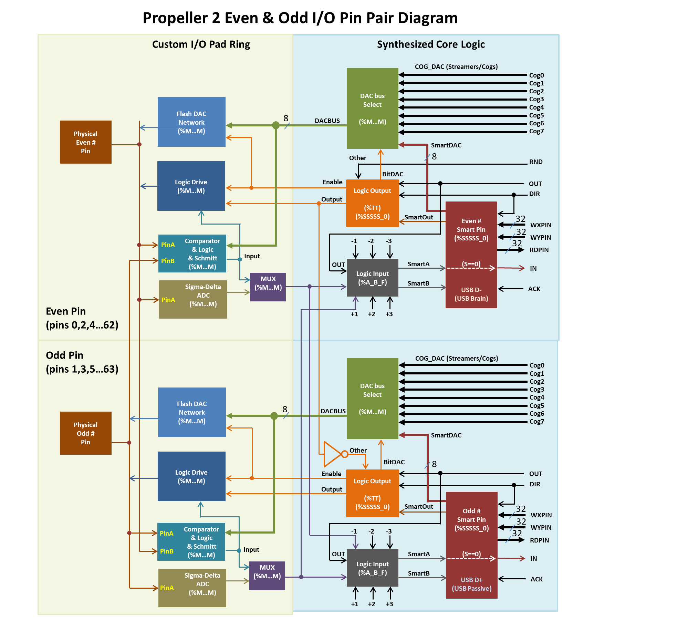
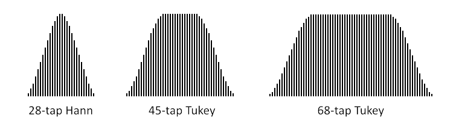

# I/O Pins

**TODO**

Each I/O pin has the following inputs:

 - A DIR signal, produced by logical OR of all cog's corrosponding DIRA/DIRB register bits
 - An OUT signal, produced by logical OR of all cog's corrosponding OUTA/OUTB register bits
 - A mode register writeable through [WRPIN](#wrpin)
 - Two parameter registers writeable through [WXPIN](#wxpin) and [WYPIN](#wypin)

And the following outputs:

 - An IN signal, available in all cog's INA/INB registers
 - A data register readable through [RDPIN](#rdpin) or [RQPIN](#rqpin)

## Pin Fields
{:.anchor}

Many instructions that operate on pins will take a _Pin Field_ for a parameter. A Pin Field is an 11-bit value consisting of a 6-bit base pin number and a 5-bit field length (where 0 means 1 pin). Any pin number 0..63 can be interpreted as a pin field consisting of just that pin. Larger pinfields can be created using an expression like `base_pin + (extra_pins >> 6)` (there also exists a `addpins` infix operator as a shorthand for this).

A pin field may address up to 32 pins, but they can not cross the Port A / Port B boundary between pins 31 and 32 and will instead wraparound inside the base pin's port.

A Pin Field is similar to a Bit Field (Link TODO), but _not_ interchangeable.

Examples:
  - `1 addpins 0` or just `1` refers just to Pin 1
  - `1 addpins 1` refers just to Pins 1 and 2
  - `32 addpins 7` refers to pins 32..39
  - `31 addpins 1` refers to pins 31 and 0 (intra-port wraparound)

## Diagram

<%#=p2pin_diagram commented out because sucks%>

**TODO: Transparent version**

## I/O Instructions
<%=p2instrinfo('drvl')%>
<%=p2instrinfo('drvh')%>
<%=p2instrinfo('drvnot')%>
<%=p2instrinfo('drvrnd')%>
<%=p2instrinfo('drvc')%>
<%=p2instrinfo('drvnc')%>
<%=p2instrinfo('drvz')%>
<%=p2instrinfo('drvnz')%>

<%=p2instrinfo('fltl')%>
<%=p2instrinfo('flth')%>
<%=p2instrinfo('fltnot')%>
<%=p2instrinfo('fltrnd')%>
<%=p2instrinfo('fltc')%>
<%=p2instrinfo('fltnc')%>
<%=p2instrinfo('fltz')%>
<%=p2instrinfo('fltnz')%>

<%=p2instrinfo('outl')%>
<%=p2instrinfo('outh')%>
<%=p2instrinfo('outnot')%>
<%=p2instrinfo('outrnd')%>
<%=p2instrinfo('outc')%>
<%=p2instrinfo('outnc')%>
<%=p2instrinfo('outz')%>
<%=p2instrinfo('outnz')%>

<%=p2instrinfo('dirl')%>
<%=p2instrinfo('dirh')%>
<%=p2instrinfo('dirnot')%>
<%=p2instrinfo('dirrnd')%>
<%=p2instrinfo('dirc')%>
<%=p2instrinfo('dirnc')%>
<%=p2instrinfo('dirz')%>
<%=p2instrinfo('dirnz')%>

<%=p2instrinfo('testp')%>
<%=p2instrinfo('testpn',joinup:true)%>
<%=p2instrinfo('testp-and',joinup:true)%>
<%=p2instrinfo('testpn-and',joinup:true)%>
<%=p2instrinfo('testp-or',joinup:true)%>
<%=p2instrinfo('testpn-or',joinup:true)%>
<%=p2instrinfo('testp-xor',joinup:true)%>
<%=p2instrinfo('testpn-xor',joinup:true)%>

## Smart Pin Instructions

<%=p2instrinfo('wrpin')%>
WRPIN sets the mode register of the pin(s) indicated by **S**ource to the value in **D**estination.

**TODO**

<%=p2instrinfo('wxpin')%>
WXPIN sets the X register of the pin(s) indicated by **S**ource to the value in **D**estination.

**TODO**

<%=p2instrinfo('wypin')%>
WYPIN sets the Y register of the pin(s) indicated by **S**ource to the value in **D**estination.

**TODO**

<%=p2instrinfo('rdpin')%>
<%=p2instrinfo('rqpin')%>

<%=p2instrinfo('akpin')%>
AKPIN is an alias for [WRPIN **#1**,{#}S](#wrpin) **TODO**

## Other Instructions

<%=p2instrinfo('setdacs')%>
<%=p2instrinfo('setscp')%>
<%=p2instrinfo('getscp')%>

<%p2instr_checkall :pin%>

## Smart Pin modes

**TODO all of these**

<%=p2smartinfo('p-normal')%>
Normal operation, without any smart pin functionality.

<%=p2smartinfo('p-repository')%>
Turns the smart pin into a one-long storage space, where WXPIN writes the long and RDPIN / RQPIN can read the long.
**This Only available when not using pin DAC (TODO clarify)**
 - Upon each WXPIN, IN is raised.
 - During reset (DIR=0), IN is low.

<%=p2smartinfo('p-dac-noise')%>
 - **Only available when using pin DAC, otherwise [repository mode](#p-repository) is selected.**
 - Overrides M[7:0] to feed the pin's 8-bit DAC unique pseudo-random data on every clock. M[12:10] must be set to %101 to configure the low-level pin for DAC output.
 - X[15:0] can be set to a sample period, in clock cycles, in case you want to mark time with IN raising at each period completion. If a sample period is not wanted, set X[15:0] to zero (65,536 clocks), in order to maximize the unused sample period, thereby reducing switching power.
 - RDPIN / RQPIN can be used to retrieve the 16-bit ADC accumulation from the last sample period.
 - During reset (DIR=0), IN is low

<%=p2smartinfo('p-dac-dither-rnd')%>
 - **Only available when using pin DAC, otherwise [repository mode](#p-repository) is selected.**
 - Overrides M[7:0] to feed the pin's 8-bit DAC with pseudo-randomly-dithered data on every clock. M[12:10] must be set to %101 to configure the low-level pin for DAC output.
 - X[15:0] establishes the sample period in clock cycles.
 - Y[15:0] establishes the DAC output value which gets captured at each sample period and used for its duration.
 - On completion of each sample period, Y[15:0] is captured for the next output value and IN is raised.
Therefore, you would coordinate updating Y[15:0] with IN going high.
 - Pseudo-random dithering does not require any kind of fixed period, as it randomly dithers the 8-bit DAC between adjacent levels, in order to achieve 16-bit DAC output, averaged over time. So, if you would like to be able to update the output value at any time and have it take immediate effect, set X[15:0] to one (IN will stay high).
 - Y[15:0] values larger than $FF00 are invalid and will be clipped down to $FF00.
 - If OUT is high, the ADC will be enabled and RDPIN / RQPIN can be used to retrieve the 16-bit ADC accumulation from the last sample period. This can be used to measure loading on the DAC pin.
 - During reset (DIR=0), IN is low and Y[15:0] is captured.

<%=p2smartinfo('p-dac-dither-pwm')%>
 - **Only available when using pin DAC, otherwise [repository mode](#p-repository) is selected.**
 - Overrides MP[7:0] to feed the pin's 8-bit DAC with PWM-dithered data on every clock. M[12:10] must be set to %101 to configure the low-level pin for DAC output.
 - X[15:0] establishes the sample period in clock cycles. The sample period must be a multiple of 256 (X[7:0]=0), so that an integral number of 256 steps are afforded the PWM, which dithers the DAC between adjacent 8-bit levels.
 - Y[15:0] establishes the DAC output value which gets captured at each sample period and used for its duration.
 - On completion of each sample period, Y[15:0] is captured for the next output value and IN is raised. Therefore, you would coordinate updating Y[15:0] with IN going high.
 - PWM dithering will give better dynamic range than pseudo-random dithering, since a maximum of only two transitions occur for every 256 clocks. This means, though, that a frequency of Fclock/256 will be present in the output at -48dB.
 - Y[15:0] values larger than $FF00 are invalid and will be clipped down to $FF00.
 - If OUT is high, the ADC will be enabled and RDPIN / RQPIN can be used to retrieve the 16-bit ADC accumulation from the last sample period. This can be used to measure loading on the DAC pin.
 - During reset (DIR=0), IN is low and Y[15:0] is captured.

<%=p2smartinfo('p-pulse')%>
 - Overrides OUT to control the pin output state.
 - X[15:0] establishes a base period in clock cycles which forms the empirical high-time and low-time units.
 - X[31:16] establishes a value to which the base period counter will be compared to on each clock cycle, as it counts from X[15:0] down to 1, before starting over at X[15:0] if decremented Y > 0. On each clock, if the base period counter > X[31:16] and Y > 0, the output will be high (else low).
 - Whenever Y[31:0] is written with a non-zero value, the pin will begin outputting a high pulse or cycles, starting at the next base period. After each pulse, Y is decremented by one, until it reaches zero, at which the output will remain low. Examples:
   - If X[31:16] is set to 0, the output will be high for the duration of Y > 0.
   - If X[15:0] is set to 3 and X[31:16] is set to 2, the output will be 0-0-1 (repeat) for duration of Y > 0.
 - IN will be raised and the pin will revert to low output when the pulse or cycles complete, meaning Y has been decremented to zero.
 - During reset (DIR=0), IN is low, the output is low, and Y is set to zero.

<%=p2smartinfo('p-transition')%>
 - Overrides OUT to control the pin output state.
 - X[15:0] establishes a base period in clock cycles which forms the empirical high-time and low-time units.
 - Whenever Y[31:0] is written with a non-zero value, the pin will begin toggling for Y transitions at each base period, starting at the next base period.
 - IN will be raised when the transitions complete, with the pin remaining in its current output state.
 - During reset (DIR=0), IN is low, the output is low, and Y is set to zero.

<%=p2smartinfo('p-nco-freq')%>
 - Overrides OUT to control the pin output state.
 - X[15:0] establishes a base period in clock cycles which forms the empirical high-time and low-time units.
 - Upon WXPIN, X[31:16] is written to Z[31:16] to allow phase setting.
 - Y[31:0] will be added into Z[31:0] at each base period.
 - The pin output will reflect Z[31].
 - IN will be raised whenever Z overflows.
 - During reset (DIR=0), IN is low, the output is low, and Z is set to zero.

<%=p2smartinfo('p-nco-duty')%>
 - Overrides OUT to control the pin output state.
 - X[15:0] establishes a base period in clock cycles which forms the empirical high-time and low-time units.
 - Upon WXPIN, X[31:16] is written to Z[31:16] to allow phase setting.
 - Y[31:0] will be added into Z[31:0] at each base period.
 - The pin output will reflect Z overflow.
 - IN will be raised whenever Z overflows.
 - During reset (DIR=0), IN is low, the output is low, and Z is set to zero.

<%=p2smartinfo('p-pwm-triangle')%>
 - Overrides OUT to control the pin output state.
 - X[15:0] establishes a base period in clock cycles which forms the empirical high-time and low-time units.
 - X[31:16] establishes a PWM frame period in terms of base periods.
 - Y[15:0] establishes the PWM output value which gets captured at each frame start and used for its duration. It should range from zero to the frame period.
 - A counter, updating at each base period, counts from the frame period down to one, then from one back up to the frame period. Then, Y[15:0] is captured, IN is raised, and the process repeats.
 - At each base period, the captured output value is compared to the counter. If it is equal or greater, a high is output. If it is less, a low is output. Therefore, a zero will always output a low and the frame period value will always output a high.
 - During reset (DIR=0), IN is low, the output is low, and Y[15:0] is captured.

<%=p2smartinfo('p-pwm-sawtooth')%>
 - Overrides OUT to control the pin output state.
 - X[15:0] establishes a base period in clock cycles which forms the empirical high-time and low-time units.
 - X[31:16] establishes a PWM frame period in terms of base periods.
 - Y[15:0] establishes the PWM output value which gets captured at each frame start and used for itsduration. It should range from zero to the frame period.
 - A counter, updating at each base period, counts from one up to the frame period. Then, Y[15:0] iscaptured, IN is raised, and the process repeats.
 - At each base period, the captured output value is compared to the counter. If it is equal or greater, a highis output. If it is less, a low is output. Therefore, a zero will always output a low and the frame period value will always output a high.
 - During reset (DIR=0), IN is low, the output is low, and Y[15:0] is captured.

<%=p2smartinfo('p-pwm-smps')%>
 - Overrides OUT to control the pin output state.
 - X[15:0] establishes a base period in clock cycles which forms the empirical high-time and low-time units.
 - X[31:16] establishes a PWM frame period in terms of base periods.
 - Y[15:0] establishes the PWM output value which gets captured at each frame start and used for its duration. It should range from zero to the frame period.
 - A counter, updating at each base period, counts from one up to the frame period. Then, the 'A' input is sampled at each base period until it reads low. After 'A' reads low, Y[15:0] is captured, IN is raised, and the process repeats.
 - At each base period, the captured output value is compared to the counter. If it is equal or greater, a high is output. If it is less, a low is output. If, at any time during the cycle, the 'B' input goes high, the output will be low for the rest of that cycle.
 - Due to the nature of switch-mode power supplies, it may be appropriate to just set Y[15:0] once and let it repeat indefinitely.
 - During reset (DIR=0), IN is low, the output is low, and Y[15:0] is captured.
   - WXPIN is used to set the base period (X[15:0]) and the PWM frame count (X[31:16]). The base period is the number of clocks which makes a base unit of time. The frame count is the number of base units that make up a PWM cycle.
   - WYPIN is used to set the output value (Y[15:0]), which is internally captured at the start of every PWM frame and compared to the frame counter upon completion of each base unit of time. If the output value is greater than or equal to the frame counter, the pin outputs a high, else a low. This is intended to drive the gate of the switcher FET.
   - The "A" input is the voltage detector for the SMPS output. This could be an adjacent pin using the internal-DAC-comparison mode to observe the center tap of a voltage divider which is fed by the final SMPS output. When "A" is low, a PWM cycle is performed because the final output voltage has sagged below the requirement and it's time to do another pulse.
   - The "B" input is the over-current detector which, if ever high during the PWM cycle, immediately forces the output low for the rest of that PWM cycle. This could be an adjacent pin using the internal-DAC-comparison mode to observe a shunt resistor between GND and the FET source. When the shunt voltage gets too high, too much current is flowing (or the desired amount of current is flowing), so the output goes low to turn off the FET and allow the inductor connected to its drain to shoot high, creating a power pulse to be captured by a diode and dumped into a cap, which is the SMPS final output.

<%=p2smartinfo('p-quadrature')%>
 - X[31:0] establishes a measurement period in clock cycles.
 - If zero is used for the period, the measurement operation will not be periodic, but continuous, like a totalizer, and the current 32-bit quadrature step count can always be read via RDPIN / RQPIN.
 - If a non-zero value is used for the period, quadrature steps will be counted for that many clock cycles and then the result will be placed in Z while the accumulator will be set to the 0/1/-1 value that would have otherwise been added into it. This way, all quadrature steps get counted across measurements. At the end of each period, IN will be raised and RDPIN / RQPIN can be used to retrieve the last 32-bit measurement.
 - It may be useful to configure both 'A' and 'B' smart pins to quadrature mode, with one being continuous (X=0) for absolute position tracking and the other being periodic (x<>0) for velocity measurement.
 - The quadrature encoder can be "zeroed" by pulsing DIR low at any time; no need to do another WXPIN.
 - During reset (DIR=0), IN is low and Z is set to the adder value (0/1/-1).

<%=p2smartinfo('p-reg-up')%>
 - X[31:0] establishes a measurement period in clock cycles.
 - If zero is used for the period, the measurement operation will not be periodic, but continuous, like a totalizer, and the current 32-bit high count can always be read via RDPIN / RQPIN.
 - If a non-zero value is used for the period, events will be counted for that many clock cycles and then the result will be placed in Z, while the accumulator will be set to the 0/1 value that would have otherwise been added into it, beginning a new measurement. This way, all events get counted across measurements. At the end of each period, IN will be raised and RDPIN / RQPIN can be used to retrieve the 32-bit measurement.
 - During reset (DIR=0), IN is low and Z is set to the adder value (0/1).

<%=p2smartinfo('p-reg-up-down')%>
 - X[31:0] establishes a measurement period in clock cycles.
 - If zero is used for the period, the measurement operation will not be periodic, but continuous, like a totalizer, and the current 32-bit high count can always be read via RDPIN / RQPIN.
 - If a non-zero value is used for the period, events will be counted for that many clock cycles and then the result will be placed in Z, while the accumulator will be set to the 0/1/-1 value that would have otherwise been added into it, beginning a new measurement. This way, all events get counted across measurements. At the end of each period, IN will be raised and RDPIN / RQPIN can be used to retrieve the 32-bit measurement.
 - During reset (DIR=0), IN is low and Z is set to the adder value (0/1/-1)

<%=p2smartinfo('p-count-rises')%>
 - X[31:0] establishes a measurement period in clock cycles. Y[0] establishes whether to just count A-input positive edges (=0), or to increment on A-input positive edge and decrement on B-input positive edge (=1).
 - If zero is used for the period, the measurement operation will not be periodic, but continuous, like a totalizer, and the current 32-bit high count can always be read via RDPIN / RQPIN.
 - If a non-zero value is used for the period, events will be counted for that many clock cycles and then the result will be placed in Z, while the accumulator will be set to the 0/1/-1 value that would have otherwise been added into it, beginning a new measurement. This way, all events get counted across measurements. At the end of each period, IN will be raised and RDPIN / RQPIN can be used to retrieve the 32-bit measurement.
 - During reset (DIR=0), IN is low and Z is set to the adder value (0/1/-1).

<%=p2smartinfo('p-count-highs')%>
 - X[31:0] establishes a measurement period in clock cycles. Y[0] establishes whether to just count A-input highs (=0), or to increment on A-input high and decrement on B-input high (=1).
 - If zero is used for the period, the measurement operation will not be periodic, but continuous, like a totalizer, and the current 32-bit high count can always be read via RDPIN / RQPIN.
 - If a non-zero value is used for the period, events will be counted for that many clock cycles and then the result will be placed in Z, while the accumulator will be set to the 0/1/-1 value that would have otherwise been added into it, beginning a new measurement. This way, all events get counted across measurements. At the end of each period, IN will be raised and RDPIN / RQPIN can be used to retrieve the 32-bit measurement.
 - During reset (DIR=0), IN is low and Z is set to the adder value (0/1/-1).

<%=p2smartinfo('p-state-ticks')%>
 - Continuous states are counted in clock cycles.
 - Upon each state change, the prior state is placed in the C-flag buffer, the prior state's duration count is placed in Z, and IN is raised. RDPIN / RQPIN can then be used to retrieve the measurement. Z will be limited to $80000000.
 - If states change faster than the cog is able to retrieve measurements, the measurements will effectively be lost, as old ones will be overwritten with new ones. This may be gotten around by using two smart pins to time highs, with one pin inverting its 'A' input. Then, you could capture both states, as long as the sum of the states' durations didn't exceed the cog's ability to retrieve both results. This would help in cases where one of the states was very short in duration, but the other wasn't.
 - During reset (DIR=0), IN is low and Z is set to $00000001.

<%=p2smartinfo('p-high-ticks')%>
 - Continuous high states are counted in clock cycles.
 - Upon each high-to-low transition, the previous high duration count is placed in Z, and IN is raised. RDPIN/RQPIN can then be used to retrieve the measurement. Z will be limited to $80000000.
 - During reset (DIR=0), IN is low and Z is set to $00000001.

<%=p2smartinfo('p-events-ticks')%>
This mode has 2 sub-modes, selected by bit 2 of the Y register.

#### When Y[2] == 0
 - Time is measured until X A-input highs/rises/edges are accumulated.
 - X[31:0] establishes how many A-input highs/rises/edges are to be accumulated.
 - Y[1:0] establishes A-input high/rise/edge sensitivity:
   - %00 = A-input high
   - %01 = A-input rise
   - %1x = A-input edge
 - Time is measured in clock cycles until X highs/rises/edges are accumulated from the A-input. The measurement is then placed in Z, and IN is raised. RDPIN / RQPIN can then be used to retrieve the measurement. Z will be limited to $80000000.
 - During reset (DIR=0), IN is low and Z is set to $00000001.

#### When Y[2] == 1
 - If no A-input high/rise/edge occurs within X clocks, IN is raised, a new timeout period of X clocks begins, and Z maintains a running count of how many clocks have elapsed since the last A-input high/rise/edge. Z will be limited to $80000000 and can be read any time via RDPIN / RQPIN.
 - If an A-input high/rise/edge does occur within X clocks, a new timeout period of X clocks begins and Z is reset to $00000001.
 - X[31:0] establishes how many clocks before a timeout due to no A-input high/rise/edge occurring.
 - Y[1:0] establishes A-input high/rise/edge sensitivity:
   - %00 = A-input high
   - %01 = A-input rise
   - %1x = A-input edge
 - During reset (DIR=0), IN is low and Z is set to $00000001.

**TODO HW manual split this one, maybe merge again?**

<%=p2smartinfo('p-periods-ticks')%>

<%=p2smartinfo('p-periods-highs')%>
**TODO**

<%=p2smartinfo('p-counter-ticks')%>
**TODO**

<%=p2smartinfo('p-counter-highs')%>
**TODO**

<%=p2smartinfo('p-counter-periods')%>
**TODO**

<%=p2smartinfo('p-adc')%>
<%=p2smartinfo('p-adc-ext',joinup:true)%>
These modes facilitate sampling, SINC filtering, and raw capturing of ADC bitstream data.

For the internally-clocked mode, the A-input will be sampled on every clock and should be a pin configured for ADC operation (M[12:10] = %100). In the externally-clocked mode, the A-input will be sampled on each B-input rise, so that an external delta-sigma ADC may be employed.

[WXPIN](#wxpin) sets the mode to X[5:4] and the sample period to 2X[3:0]. Not all mode and period combinations are useful, or even functional:

| |X[5:4] -> Mode ->|%00 SINC2 Sampling|%01 SINC2 Filtering|%10 SINC3 Filtering|%11 Bitstream capture|
|X[3:0]|Sample Period|Sample Resolution|Post-diff ENOB\*|Post-diff ENOB\*|(LSB = oldest bit)|
|:-----:|:----------:|:---------:|:---------:|:---------:|:---------:|
|`%0000`|1 clock     |impractical|impractical|impractical|1 new bit  |
|`%0001`|2 clocks    |2 bits     |impractical|impractical|2 new bits |
|`%0010`|4 clocks    |3 bits     |impractical|impractical|4 new bits |
|`%0011`|8 clocks    |4 bits     |4          |impractical|8 new bits |
|`%0100`|16 clocks   |5 bits     |5          |8          |16 new bits|
|`%0101`|32 clocks   |6 bits     |6          |10         |32 new bits|
|`%0110`|64 clocks   |7 bits     |7          |12         |overflow   |
|`%0111`|128 clocks  |8 bits     |8          |14         |overflow   |
|`%1000`|256 clocks  |9 bits     |9          |16         |overflow   |
|`%1001`|512 clocks  |10 bits    |10         |18         |overflow   |
|`%1010`|1024 clocks |11 bits    |11         |overflow   |overflow   |
|`%1011`|2048 clocks |12 bits    |12         |overflow   |overflow   |
|`%1100`|4096 clocks |13 bits    |13         |overflow   |overflow   |
|`%1101`|8192 clocks |14 bits    |14         |overflow   |overflow   |
|`%1110`|16384 clocks|overflow   |overflow   |overflow   |overflow   |
|`%1111`|32768 clocks|overflow   |overflow   |overflow   |overflow   |

\* ENOB = Effective Number of Bits, or the sample resolution.

For modes other than SINC2 Sampling (X[5:4] != `%00`), [WYPIN](#wypin) may be used after [WXPIN](#wxpin) to override the initial period established by X[3:0] and replace it with the arbitrary value in Y[13:0]. For example, if you'd like to do SINC3 filtering with a period of 320 clocks, you could follow the WXPIN with a `WYPIN #320,adcpin`.  The smart pin accumulators are 27 bits wide.  This allows up to 227/3 (=512) clocks per decimation in SINC3 filtering mode and up to 227/2 (=11585) clocks in SINC2 filtering mode.

Upon completion of each sample period, the measurement is placed in Z, IN is raised, and a new measurement begins. RDPIN/RQPIN can then be used to retrieve the completed measurement.

<%=p2smartinfo('p-adc-scope')%>

**TODO**

<%=p2smartinfo('p-usb-pair')%>
This mode requires that two adjacent pins be configured together to form a USB pair, whose OUTs will be overridden to control their output states. These pins must be an even/odd pair, having only the LSB of their pin numbers different. For example: pins 0 and 1, pins 2 and 3, and pins 4 and 5 can form USB pairs. They can be configured via WRPIN with identical D data of `%1_11011_0`. Using D data of %0_11011_0 will disable output drive and effectively create a USB 'sniffer'. A new WRPIN can be done to effect such a change without resetting the smart pin.

WXPIN is used on the lower pin to establish the specific USB mode and set the baud rate. D[15] must be 1 for 'host' or 0 for 'device'. D[14] must be 1 for 'full-speed' or 0 for 'low-speed'. D[13:0] sets the baud rate, which is a 16-bit fraction of the system clock, whose two MSBs must be 0, necessitating that the baud rate be less than 1/4th of the system clock frequency. For example, if the main clock is 80MHz and you want a 12MHz baud rate (full-speed), use 12,000,000 / 80,000,000 * $10000 = 9830, or $2666. To use this baud rate and select 'host' mode and 'full-speed', you could do 'WXPIN ##$E666,lowerpin'.

The upper (odd) pin is the DP pin. This pin's IN is raised whenever the output buffer empties, signalling that a new output byte can be written via WYPIN to the lower (even) pin. No WXPIN/WYPIN instructions are used for this pin.

The lower (even) pin is the DM pin. This pin's IN is raised whenever a change of status occurs in the receiver, at which point a RDPIN/RQPIN can be used on this pin to read the 16-bit status word. WXPIN is used on this pin to set the NCO baud rate.

These DP/DM electrical designations can actually be switched by swapping low-speed and full-speed modes, due to USB's complementary line signalling.

To start USB, clear the DIR bits of the intended two pins and configure them each via WRPIN. Use WXPIN on the lower pin to set the mode and baud rate. Then, set the pins' DIR bits. You are now ready to read the receiver status via RDPIN/RQPIN and set output states and send packets via WYPIN, both on the lower pin.

To affect the line states or send a packet, use WYPIN on the lower pin. Here are its D values:

~~~
    0 = output IDLE     - default state, float pins, except possible resistor(s) to 3.3V or GND
    1 = output SE0      - drive both DP and DM low
    2 = output K        - drive K state onto DP and DM (opposite)
    3 = output J        - drive J state onto DP and DM (opposite), like IDLE, but driven
    4 = output EOP      - output end-of-packet: SE0, SE0, J, then IDLE
    $80 = SOP           - output start-of-packet, then bytes, automatic EOP when buffer runs out
~~~

To send a packet, first do a `WYPIN #$80,lowerpin`. Then, after each IN rise on the upper pin, do a `WYPIN byte,lowerpin` to buffer the next byte. The transmitter will automatically send an EOP when you stop giving it bytes. To keep the output buffer from overflowing, you should always verify that the upper pin's IN was raised after each WYPIN, before issuing another WYPIN, even if you are just setting a state. The reason for this is that all output activity is timed to the baud generator and even state changes must wait for the next bit period before being implemented, at which time the output buffer empties.

There are separate state machines for transmitting and receiving. Only the baud generator is common between them. The transmitter was just described above. Below, the receiver is detailed. Note that the receiver receives not just input from another host/device, but all local output, as well.

At any time, a RDPIN/RQPIN can be executed on the lower pin to read the current 16-bit status of the receiver, with the error flag going into C. The lower pin's IN will be raised whenever a change occurs in the receiver's status. This will necessitate A WRPIN/WXPIN/WYPIN/RDPIN/AKPIN before IN can be raised again, to alert of the next change in status. The receiver's status bits are as follows:

~~~
    [31:16] <unused>            - $0000
    [15:8]  byte                - last byte received
    [7]     byte toggle         - cleared on SOP, toggled on each byte received
    [6]     error               - cleared on SOP, set on bit-unstuff error, EOP SE0 > 3 bits, or SE1
    [5]     EOP in              - cleared on SOP or 7+ bits of J or K, set on EOP
    [4]     SOP in              - cleared on EOP or 7+ bits of J or K, set on SOP
    [3]     SE1 in  (illegal)   - cleared on !SE1, set on 1+ bits of SE1
    [2]     SE0 in  (RESET)     - cleared on !SE0, set on 1+ bits of SE0
    [1]     K in    (RESUME)    - cleared on !K, set on 7+ bits of K
    [0]     J in    (IDLE)      - cleared on !J, set on 7+ bits of J
~~~

The result of a RDPIN/RQPIN can be bit-tested for events of interest. It can also be shifted right by 8 bits to LSB-justify the last byte received and get the byte toggle bit into C, in order to determine if you have a new byte. Assume that 'flag' is initially zero:

~~~
       SHR     D,#8    WC      'get byte into D, get toggle bit into C
       CMPX    flag,#1 WZ      'compare toggle bit to flag, new byte if Z
IF_Z   XOR     flag,#1         'if new byte, toggle flag
IF_Z   <use byte>              'if new byte, do something with it
~~~

<%=p2smartinfo('p-sync-tx')%>
**TODO**

<%=p2smartinfo('p-sync-rx')%>
**TODO**

<%=p2smartinfo('p-async-tx')%>
This mode overrides OUT to control the pin output state.

Words from 1 to 32 bits are serially transmitted on the pin at a programmable baud rate, beginning with a low "start" bit and ending with a high "stop" bit.

[WXPIN](#wxpin) is used to configure the baud rate and word length.

X[31:16] establishes the number of clocks in a bit period, and in case X[31:26] is zero, X[15:10] establishes the number of fractional clocks in a bit period. The X bit period value can be simply computed as: (clocks * $1_0000) & $FFFFFC00. For example, 7.5 clocks would be $00078000, and 33.33 clocks would be $00215400.

X[4:0] sets the number of bits, minus 1. For example, a value of 7 will set the word size to 8 bits.

[WYPIN](#wypin) is used to load the output words. The words first go into a single-stage buffer before being advanced to a shifter for output. This buffering mechanism makes it possible to keep the shifter constantly busy, so that gapless transmissions can be achieved. Any time a word is advanced from the buffer to the shifter, IN is raised, indicating that a new word can be loaded.

Here is the internal state sequence:

1. Wait for an output word to be buffered via WYPIN, then set the 'buffer-full' and 'busy' flags.
2. Move the word into the shifter, clear the 'buffer-full' flag, and raise IN.
3. Output a low for one bit period (the START bit).
4. Output the LSB of the shifter for one bit period, shift right, and repeat until all data bits are sent.
5. Output a high for one bit period (the STOP bit).
6. If the 'buffer-full' flag is set due to an intervening WYPIN, loop to (2). Otherwise, clear the 'busy' flag and loop to (1).

[RDPIN](#rdpin)/[RQPIN](#rqpin) with WC always returns the 'busy' flag into C. This is useful for knowing when a transmission has completed. The busy flag can be polled starting three clocks after the WYPIN, which loads the output words:

~~~
       WYPIN   x,#txpin        'load output word
       WAITX   #1              'wait 2+1 clocks before polling busy
wait   RDPIN   x,#txpin  WC    'get busy flag into C
IF_C   JMP     #wait           'loop until C = 0
~~~

During reset (DIR=0) the output is held high.

<%=p2smartinfo('p-async-rx')%>
Words from 1 to 32 bits are serially received on the A input at a programmable baud rate.

[WXPIN](#wxpin) is used to configure the baud rate and word length.

X[31:16] establishes the number of clocks in a bit period, and in case X[31:26] is zero, X[15:10] establishes the number of fractional clocks in a bit period. The X bit period value can be simply computed as: `(clocks * $1_0000) & $FFFFFC00`. For example, 7.5 clocks would be $00078000, and 33.33 clocks would be $00215400.

X[4:0] sets the number of bits, minus 1. For example, a value of 7 will set the word size to 8 bits.

Here is the internal state sequence:

1. Wait for the A input to go high (idle state).
2. Wait for the A input to go low (START bit edge).
3. Delay for half of a bit period.
4. If the A input is no longer low, loop to (2).
5. Delay for one bit period.
6. Right-shift the A input into the shifter and delay for one bit period, repeat until all data bits are received.
7. Capture the shifter into the Z register and raise IN.
8. Loop to (1).

[RDPIN](#rdpin)/[RQPIN](#rqpin) is used to read the received word. The word must be shifted right by 32 minus the word size. For example, to LSB-justify an 8-bit word received, you would do a `SHR D,#32-8`.

